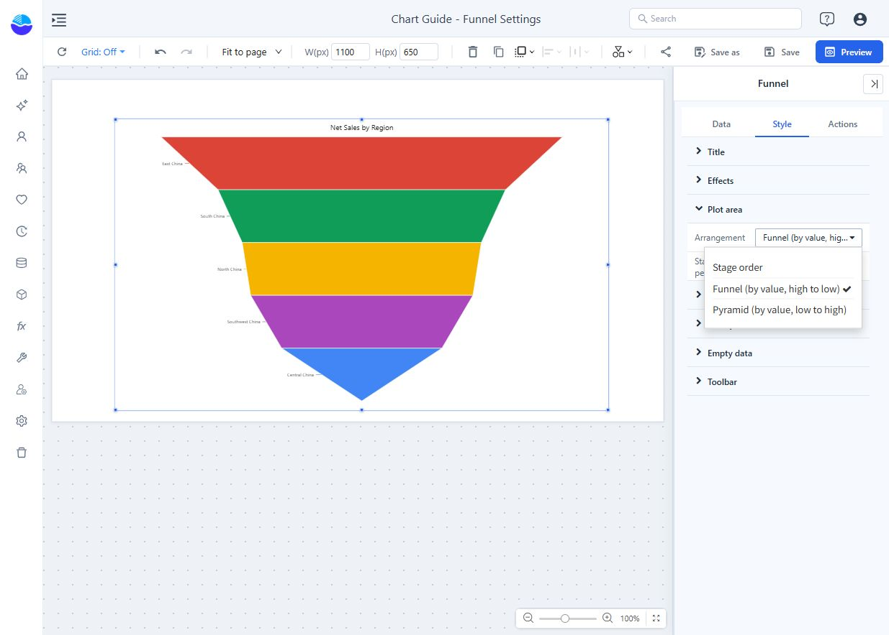

# Funnel

Show values across process stages, such as leads, qualified leads, proposals and wins. A process funnel requires a meaningful stage order and comparable values. A funnel-shaped ranking of unrelated categories does not establish a conversion process.

## Bind the stages

1. Add **Components → Charts → Funnel** and choose an **Analysis model** in **Data**.
2. Put the stage dimension in **Field** and the stage count or amount in **Measures**. For a stage-based model, use one measure such as Opportunity Count.
3. Apply **Filters** for a consistent cohort and period. Confirm that each stage represents the same population moving through the process.
4. Use **Stage order → Adjust** to put stages in business order. Drag or move them in the dialog, then confirm.

If stages are represented by separate measures instead of a dimension, use those measures and check their displayed order and units. Do not mix a count, a rate and a currency amount and then interpret their ratios as conversion.

## Choose arrangement before interpreting percentages

Under **Style → Plot area → Arrangement**:

| Arrangement | Result |
| --- | --- |
| **Stage order** | Preserves the process sequence. Use for conversion analysis. |
| **Funnel (by value, high to low)** | Ranks stages by value. The visual order can differ from the business process. |
| **Pyramid (by value, low to high)** | Reverses the value ranking. Read the direction carefully. |

A value-sorted arrangement can override the stage order you adjusted. Switch to Stage order when the process sequence matters. The adjustment dialog can retain stages not present in the current filtered data; check the **Not in current data** entries rather than treating them as visible zero stages.

This settings example ranks regional sales and uses **No percentages**. Regions are not process stages, so the example is not a conversion funnel.

## Configure stage percentages

**Stage percentages** controls whether ratios are calculated:

- **Auto** checks for incompatible units or percentage/average-like measures. A displayed ratio still requires a business-valid comparison.
- **Always calculate** bypasses that check. Use only when the stages are comparable.
- **No percentages** is appropriate for a ranked-value display without a conversion meaning.

In **Data labels**, choose the name/value and the useful comparisons. **vs previous** compares with the preceding stage; **vs first** compares with the starting stage. For example, stages of 1,000, 600 and 300 give 50% from the second to third stage, but 30% from the first to third. These are different denominators.

## Check the result

Save and open **Preview**. Read stage tooltips in the intended direction and inspect the base behind each percentage. Missing, zero or negative bases can prevent a meaningful ratio; do not replace an unavailable percentage with 0%.

If conversion exceeds 100%, check cohort definitions, repeated entities, stage order and date filters before assuming a product error. Use a bar chart when the purpose is simply to rank unrelated categories.
