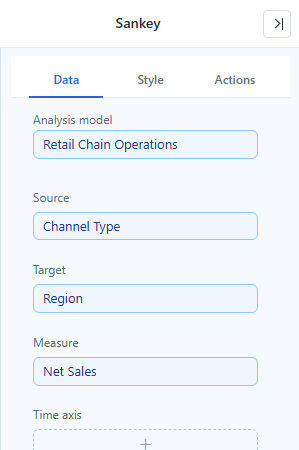
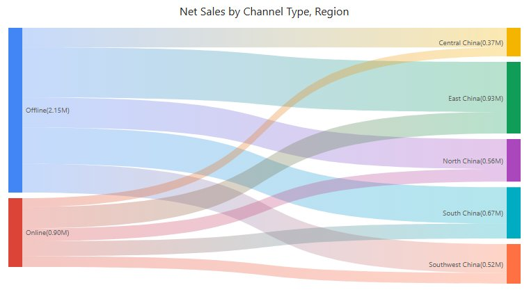

# Sankey

Show how a quantity flows between categories. Link width represents the measure moving from a source to a target. Use it for transitions, allocations or transfers; use a hierarchy chart when the relationship is simply parent and child.

## Prepare source, target and weight

1. Add **Components → Charts → Flow & breakdown → Sankey** (a new Sankey is 480 × 320 px) and choose an **Analysis model** in **Data**.
2. Put the origin dimension in **Source**, the destination dimension in **Target**, and the flow quantity in **Measure**. Each group takes one field.
3. Set **Filters** to the required population and period.
4. Inspect a source-target table with the same measure before relying on the diagram.

To reverse the direction, drag the field from **Source** onto **Target**: the two fields swap and keep their settings.

For example, a channel-transition dataset could contain Previous Channel, Current Channel and Customer Count. These are illustrative field roles; use the equivalent fields in your own model. Each source-target pair needs a meaningful, non-negative weight.

Do not use percentages with different denominators as if they were additive flows. Decide whether one customer can contribute to several links; repeated transitions and unique-customer counts answer different questions.

## Make paths readable

| Option (Style) | Effect | Default |
| --- | --- | --- |
| **Data labels → Show** | Node names. | On |
| **Data labels → Font** | Font of the node names. | |
| **Data labels → Display units**, **Decimal places** | Unit and decimals of the values; see [Display units and decimal places](/documentation/Visualization/Display-Units/). | Auto for new Sankeys; Follow measure format in reports from earlier versions |
| **Tooltip → Show Tooltip** | Hover tooltip with the exact value; see [Tooltips](/documentation/Visualization/Tooltips-for-Chart-Components/). | On |

There are no settings for node width, node gap, orientation or link colors, and nodes are not reordered to reduce crossings. Give the chart enough width for the stages and enough height for the node count. Filter low-value paths or focus on one part of the process when labels and links overlap.

Keep names distinguishable when the same label can occur at different stages. A Source named Other and a Target named Other may be hard to interpret without stage context.

## Hover and click

- **Hover** a link or node to emphasize only that link or node; the rest of the diagram does not fade.
- **Click** a node to fade every node and link not connected to it and filter the other components on the page by it; see [Cross-filtering](/documentation/Analysis/Cross-Filtering/).

## Read the flow

Follow a few paths from left to right and verify that their direction matches the business definition.

Incoming and outgoing amounts need not balance if the dataset covers only part of the process or uses different populations. Investigate the scope before describing missing flow as loss. If the diagram cannot form a useful flow, check self-links, cycles, missing endpoints and negative values, then simplify the model or use a table.

::: details Opening reports made before 10.00
- Hovering no longer fades the other flows, and the hover highlight no longer stays after the pointer leaves the chart.
:::

Use [Funnel](/documentation/Visualization/Funnel/) for a sequential stage-total comparison, [Sunburst](/documentation/Visualization/Sunburst/) for a hierarchy, and [Decomposition tree](/documentation/Visualization/Decomposition-Tree/) for interactive dimensional breakdowns.
