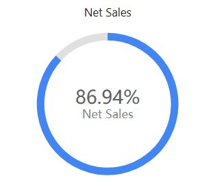

# Ring progress

Show one measure's progress toward a target as a ring. Use it for a completion or achievement question with a meaningful denominator. Use [Gauge](/documentation/Visualization/Gauge/) when readers also need a scale with tick values.

## Set actual and target

1. Add **Components → Charts → Cards & KPI → Ring progress** (a new ring is 260 × 240 px, one ring and a name line) and choose an **Analysis model** in **Data**.
2. Put the actual amount in **Progress measure** and the target in **Target measure**.
3. If you use a fixed target instead of a target measure, enter it in **Style → Plot area → Target value**.
4. Set **Filters** so actual and target cover the same period and population.

For example, 75 completed items against a target of 100 represents 75% achievement. A decimal rate of 0.75 must be compared with a target of 1, not 100. Avoid a zero target: a meaningful progress percentage needs a valid denominator.

The automatic title names only the Progress measure, not the target.

## Make the meaning visible

| Option (Style) | Effect | Default |
| --- | --- | --- |
| **Plot area → Diameter** | Size of the ring, 10–100%. | 95% |
| **Plot area → Ring thickness** | Thickness of the ring, 1–30%. | 10% |
| **Plot area → Inner padding** | Inner padding of the ring, as a percentage of the ring width (−50 to 100%). | 0% |
| **Plot area → Corner radius** | Rounded ends of the progress ring. | Off |
| **Plot area → Ring background** | Color of the unfinished part of the ring. | #E0E0E0 |
| **Plot area → Target value** | Fixed target, used when no Target measure is bound. | Empty |
| **Plot area → Progress direction** | **Clockwise** or **Counterclockwise**. | Clockwise |
| **Data colors → Conditional color** | Ring color by condition; see below. | |
| **Data labels → Label contents** | **Hidden**, **Value** or **Percentage** in the center. | Percentage |
| **Data labels → Percentage precision** | Decimals of the percentage. | 2 |
| **Data labels → Show name**, **Name**, **Name font** | A name line under the value. If **Name** is empty, the Progress measure's name is shown. | Show name on for new rings; off in reports from earlier versions |
| **Data labels → Sub-label**, **Sub-label font** | Adds the Progress measure and/or the Target measure value, so readers can see the amounts behind the percentage. | None |

Use a concise name such as Order completion. The ring has no **Show Tooltip** switch.

**Conditional color** opens a dialog where you choose the **Configuration type**, **Value** or **Percentage**, and add ranges with a **Start value**, an **End value** (blank means −∞ or +∞) and a **Color**. A percentage condition and a value condition are different: check the selected type and test the boundary values. Use conditional colors only when the thresholds have a clear meaning.

## Above target, empty values and clicks

Above 100% the ring is simply full, so it cannot show how far a result exceeds the target. Read the numeric label, and show the amounts with **Sub-label** when that matters.

If the percentage is unexpected, check units, zero or missing targets and whether the target measure repeats at a finer grain.

When the actual value is empty, the ring shows the empty-data message instead of 0.00%, also with a fixed target. **Style → Empty data** only changes the text; see [Empty data and error messages](/documentation/Visualization/Empty-Data-and-Errors/).

Clicking the ring does not filter, drill or highlight anything, but a script under **Actions → Events → Plot area click** runs.

::: details Opening reports made before 10.00
- **Ring background** is now applied. Earlier versions drew the unfinished part in the palette's second color (often red), so such rings look different.
- A ring without an actual value shows the empty-data message instead of 0.00%.
- The automatic title no longer includes the target measure.
:::
