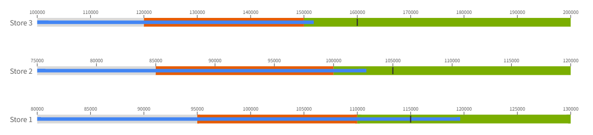

# Bullet Chart

## Overview

A **Bullet Chart** is a high–information-density KPI visualization designed to compare the **Actual** value against a **Target**, while displaying multiple performance thresholds (such as *Satisfactory*, *Good*, *Very Good*, etc.) using segmented background ranges.

As a compact and efficient alternative to gauge charts, bullet charts present rich business insights in a limited space, making them widely used in operational analytics, performance management, and financial dashboards.

### When to Use

- Displaying actual KPI performance  
- Comparing actual vs. target  
- Using ranges to show performance levels (satisfactory / good / excellent)  
- Displaying multiple KPIs simultaneously (e.g., by store, department, product)  
- Replacing bulky gauge charts  

## Components of a Bullet Chart

A bullet chart contains the following elements:

1. **Background Ranges**  
   Represent performance levels from low to high. Typically configured as:
   - Minimum  
   - Normal  
   - Satisfactory  
   - Good  
   - Very Good  
   - Maximum  

2. **Actual Bar**  
   A dark bar that represents the current value of the KPI.

3. **Target Marker**  
   A vertical line indicating the desired target.

4. **Category Label**  
   Used to generate multiple bullet charts (e.g., Store 1, Store 2).

## Data Structure

Bullet charts support binding multiple fields from the data model.

### Required Fields

| Field          | Description                                             |
| -- | - |
| **Actual**     | KPI actual value (e.g., Revenue, Sales)                 |
| **Target**     | Target value; also used as the base for range percent   |

### Optional Fields

| Field                         | Description                                           |
| -- | -- |
| **Category**                  | Dimension for grouping (Store, Department, etc.)      |
| **Min Value**                 | Start of the performance range                        |
| **Normal**                    | End of the first performance range                    |
| **Satisfactory**              | End of the second performance range                   |
| **Good Value**                | End of the third performance range                    |
| **Very Good Value**           | End of the fourth performance range                   |
| **Max Value**                 | End of the overall performance range                  |

### Example Dataset

| Store   | Revenue | Target | Min Revenue | Satisfactory Revenue | Good Revenue | Very Good Revenue |
| - | - |  | -- | -- |  | -- |
| Store 1 | 119645  | 115000 | 80000       | 95000                | 110000       | 130000            |
| Store 2 | 102769  | 105000 | 75000       | 85000                | 100000       | 120000            |
| Store 3 | 151845  | 160000 | 100000      | 120000               | 150000       | 200000            |

# Configuring a Bullet Chart

Bullet chart configuration in Datafor includes **Data**, **Style**, and **Behavior** sections.

# 1. Data

Below is the Data binding panel for the bullet chart:

### **Category**
Used to group the chart and generate multiple bullet charts (e.g., per Store).

### **Actual**
Defines the bar representing the actual KPI value.

### **Target**
Defines the target marker and acts as the base value for percentage-based ranges.

### **Ranges**

If range fields are provided, they determine the boundaries of each performance segment.

| Field            | Description         |
| - | - |
| **Min Value**    | Range starting point |
| **Normal**       | End of the first range |
| **Satisfactory** | End of the second range |
| **Good**         | End of the third range |
| **Very Good**    | End of the fourth range |
| **Max Value**    | Range ending point |

📌 If range fields are not provided, percentage-based ranges can be generated automatically.

# 2. Style

### Orientation
- Horizontal (default)  
- Vertical  

### Color Settings

You can configure colors for:

- Actual value  
- Target marker  
- Minimum range  
- Normal  range
- Satisfactory range
- Good  range
- Very Good  range

## Range Values (Percentage Mode)

When no range fields are bound, the chart can calculate segment boundaries using percentages based on the **Target** value.

For example, with a target of **100,000**:

- Needs Improvement (70%) → 70,000  
- Normal (85%) → 85,000  
- Good (100%) → 100,000  
- Very Good (110%) → 110,000  

### Tooltip Labels

When using percentage mode, you can configure labels for:

| Option                | Description           |
| --------------------- | --------------------- |
| **Target Label**      | Label for the target  |
| **Normal Label**      | Label for the Normal range |
| **Satisfactory Label**| Label for Satisfactory |
| **Good Label**        | Label for Good        |
| **Excellent Label**   | Label for Very Good   |

# Best Practices

- Use **3–4 ranges** for clear performance interpretation  
- Use **color gradients** from lighter → darker to represent improvement  
- Keep the **target marker visually distinct**  
- Hide axis ticks when displaying many categories to reduce clutter  
- If each category has a different target, bind the target as a field  
- If the target is constant, set it directly in the Style → **Values**

