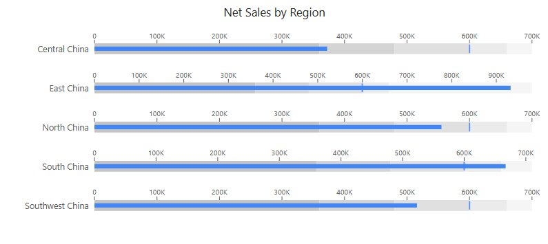

# Bullet

Compare actual performance with a target and qualitative ranges in a compact display. The value bar shows actual performance; a marker identifies the target; background ranges provide context.

## Build actual versus target by region

1. Add **Components → Charts → Cards & KPI → Bullet** (a new bullet is 400 × 240 px) and choose an **Analysis model** in **Data**.
2. Put Region in **Category**, Net Sales in **Value**, and Sales Target in **Target value**.
3. If your model supplies range boundaries, bind **Minimum**, **Normal**, **Satisfactory**, **Good**, **Excellent**, and **Maximum** as needed.
4. Set **Filters** to the same period for actual, target and thresholds.

Thresholds are boundary values, not extra performance bars. Keep them ordered and in the same units as actual and target. A model target repeated for every transaction can aggregate incorrectly; check the returned target per category.

Rows follow the data order from top to bottom; sort the **Category** field to change it. The automatic title names only the **Value** measure.

## Use fixed targets and relative thresholds

If no usable target measure is supplied, **Style → Data values → Target value** provides a fixed target. It is also used for categories whose Target value measure is empty.

Under **Percentage settings (Based on target value)**, enter percentages as whole numbers: **80** means 80% of the target. Each field (**Normal %**, **Satisfactory %**, **Good %**, **Excellent %**, **Minimum %**, **Maximum %**) is used only when the corresponding measure in **Data** is not bound or has no value. Percentage thresholds have no effect without a target.

For a target of 100, illustrative boundaries of 0, 60, 80, 100, 110 and 120 define an increasing set of ranges. Choose boundaries appropriate to your business; the labels Normal, Good and Excellent do not determine the numeric thresholds for you.

## The scale

- **Each row has its own scale range.** Bar lengths are not comparable between rows; compare each bar with its own target and ranges.
- Without a **Maximum** (measure or percentage), a row's scale ends at least 5% above its largest value, rounded up to two significant digits (for example 1,052,565 → 1,200,000), so the target marker never sits on the right edge. The last range extends to the end of the scale.
- Tick labels pick K, M or B automatically from the tick interval, with one unit for the whole chart, chosen from its largest tick; percent-formatted measures get percentage ticks. Chinese interfaces use `万` and `亿`.
- The number of ticks follows the component's width. To reduce crowded ticks, widen the component or hide the scale.

## Format the comparison

| Option (Style) | Effect | Default |
| --- | --- | --- |
| **Direction** | **Horizontal** or **Vertical** bullets. | Horizontal |
| **Colors → Value color**, **Target value color** | Actual bar and target marker. | Blue (#4285F4) |
| **Colors → Minimum color** … **Excellent color** | One color per range. | Greys from dark to light for new bullets; grey, red, orange, green and dark green in reports from earlier versions |
| **Scale → Show scale** | Scale ticks and values. | On |
| **Scale → Scale color** | Font size, color and family of the scale text. | 10 px, grey |
| **Category labels** | **Show labels**, font, and **Label width** (maximum width of a category name). | On, 12 px, 70 |
| **Tooltip labels** | Names used in the tooltip for each threshold, the target and the value, in business terms. | |
| **Tooltip → Show Tooltip** | Hover tooltip; see [Tooltips](/documentation/Visualization/Tooltips-for-Chart-Components/). | On |

Keep the actual bar and target marker easy to see against the ranges. In horizontal bullets the right margin grows so that the last tick label, such as *100%*, is not cut off, unless you set the right padding yourself.

## When ranges or the target look wrong

Check that a higher value really is better for the chosen metric; range labels should not imply success for rising defect counts.

If ranges look wrong, inspect the data-bound threshold first, then the fallback percentage. If the target marker is missing, check for a missing or zero target.

::: details Opening reports made before 10.00
- Rows are drawn in data order; earlier versions put the first row at the bottom.
- Without a Maximum, the scale now ends just above the largest value, so bars and the target marker move.
- Tick labels use K, M or B and one unit for the chart instead of long raw numbers.
:::
