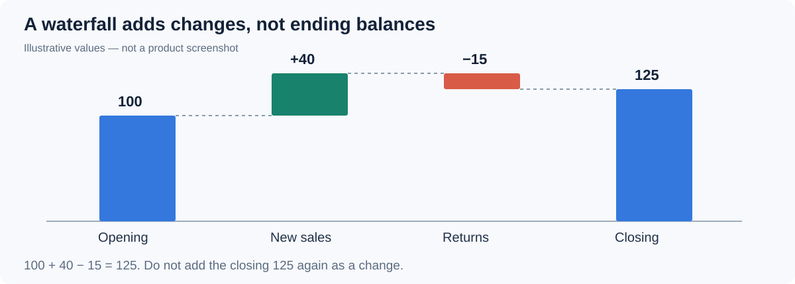

# Waterfall

Show how a sequence of signed changes builds a running total. Use it for a revenue bridge, inventory movements or a cost breakdown. Positive steps increase the running value; negative steps decrease it.

## Bind additive changes

1. Add **Components → Charts → Column & bar → Waterfall** (a new waterfall is 400 × 300 px) and select an **Analysis model** in **Data**.
2. Put the ordered step dimension in **Field** and the signed amount in **Measure**.
3. Sort the Field by process step or time: hover the field, click **⋮** and use **Sort**. Values accumulate in member order.
4. Set **Filters** to a consistent period and scope.

An illustrative bridge of Opening 100, New sales +40 and Returns −15 ends at 125. Bind signed changes; do not supply 100, 140 and 125 as though they were separate changes, because those values would accumulate again.

Each bar spans from the running total before the step to the total after it, so negative steps, steps that cross zero and a negative total are drawn at their true positions. The value axis always covers 0 and both ends of every bar.

With **Show items with no data** on the Field, a member without a value draws no bar and leaves the running total unchanged; 0 is still a real step. See [Show items with no data](/documentation/Analysis/Show-Items-with-No-Data/).

## Show the total and movement

| Option (Style) | Effect | Default |
| --- | --- | --- |
| **Bar → Space (%)** | Gap between bars, as a percentage of the category width. | 20 |
| **Bar → Round corners** | Rounds the bar corners. | |
| **Bar → Connector lines** | Thin lines from the end of each step to the start of the next. They skip empty members. | Off |
| **Accumulated value → Show accumulated value** | Adds a total bar at the end. | Off |
| **Accumulated value → Label** | Name of the total bar. | *Total* |
| **Accumulated value → Accumulated value color** | Color of the total bar. | #096DD9 |
| **Data colors → Positive color**, **Negative color** | Colors of increases and decreases. | Palette colors 1 and 2 |
| **Legend → Show** | Lists *Increase*, *Decrease* and the total (named by **Label**), only the types present in the chart. Items cannot be clicked to hide bars. | Off |
| **Data labels → Show**, **Font** | Value labels on the bars. | On |
| **Data labels → Position** | **Top**, **Inside top**, **Center** or **Inside bottom**. With **Top**, a decrease is labelled at its lower end so it does not run into the previous label. | Top |
| **Data labels → Compact numbers** | K, M, B or T, chosen from the largest value in the chart. Percentages are not converted; the tooltip keeps the full value. | Off |
| **Data labels → Auto label contrast** | For labels inside bars, dark or light text by contrast with the bar, with an outline in the bar color. | On for new waterfalls; off in reports from earlier versions |
| **Tooltip → Show Tooltip** | Hover tooltip; see below. | On |

The waterfall has no **Display units** setting; use **Compact numbers**. Labels on the highest bars are not cut off at the top.

The total bar shows the **model's aggregate** of the measure, not the running total. For an additive measure (an amount, a quantity, a change) the two are equal; for a ratio or an average they differ. Use an additive measure for an ordinary bridge.

## Tooltip and arithmetic

Hover a bar to check the arithmetic:

- A step shows **Before**, the step value and **After** (the running total around the step).
- The total bar shows its value as *‹measure› (model total)*. When the model total differs from the sum of the steps, it adds a **Sum of steps** row.

Running totals are calculated in the browser and formatted like the step values (prefix, suffix, decimals, thousands separators, percent).

- Wrong sequence: sort by business step or time, not by the size of the change.
- Unexpected final total: check whether the measure is additive and whether an opening or closing total was also included as a change.
- Wrong sign: verify how reductions are represented in the source.

The **Analytics** tab adds constant lines, bands and vertical lines at a category; statistic lines are not available. See [Reference lines](/documentation/Analysis/Chart-Reference-Lines/).

::: details Opening reports made before 10.00
- Negative, zero-crossing and negative-total steps are redrawn at their true positions, and empty members no longer restart the running total at 0.
- In English, a total bar whose label was never stored is now called *Total* instead of *Accumulated value*. A label you typed is kept.
- Saved positive and negative colors are kept when the report is reopened.
:::

Use a [Line](/documentation/Visualization/Line-Chart/) chart for a series of ending balances and a [Stacked column](/documentation/Visualization/Stacked-Column-Chart/) for contributions that do not need a running sequence.
