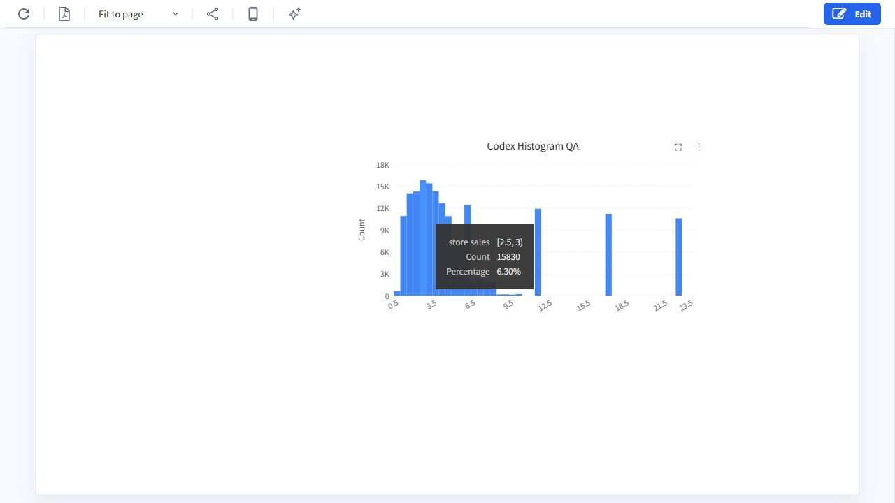
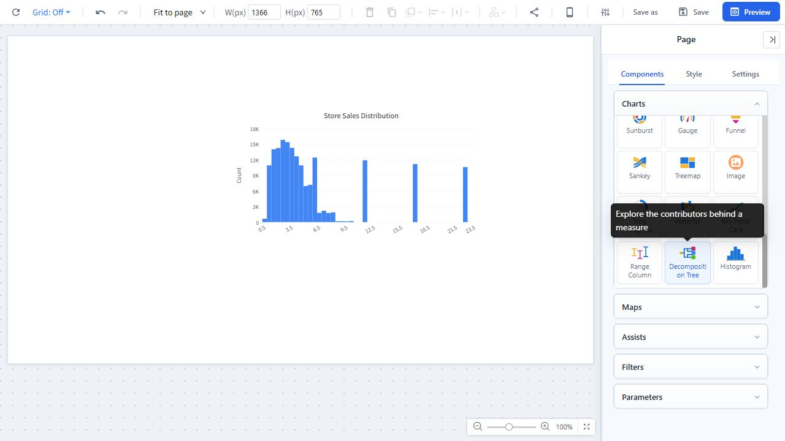
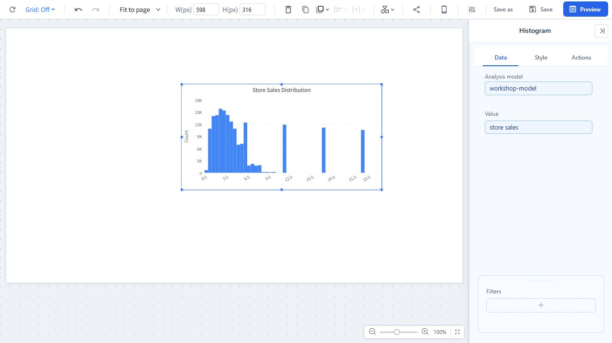
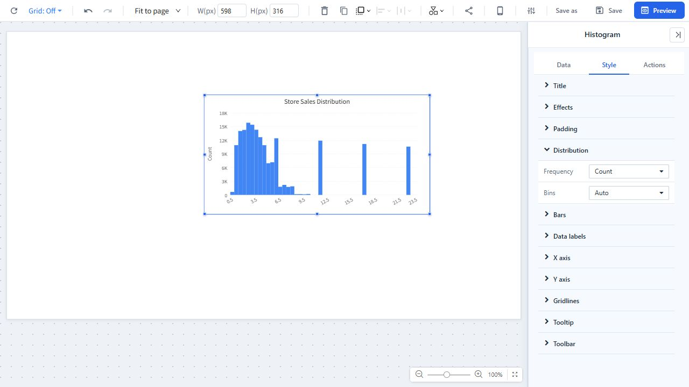
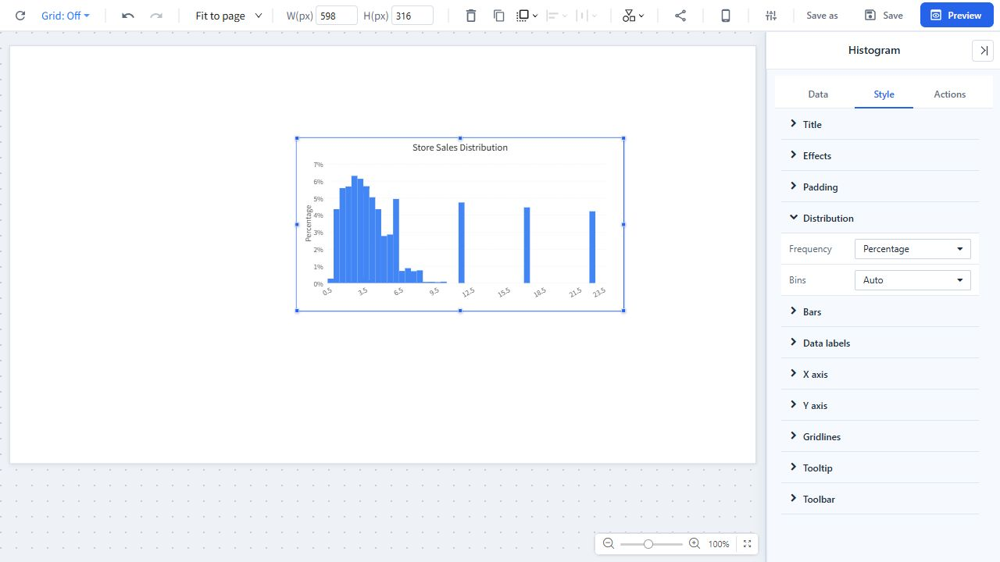
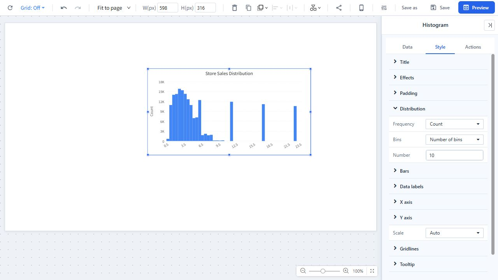

# Histogram Chart

## Overview

A **Histogram Chart** groups numeric observations into continuous ranges, called **bins**, and shows how the observations are distributed.

- The **X axis** represents numeric value ranges.
- The **Y axis** shows either the number of observations (**Count**) or their share of all valid observations (**Percentage**).
- Each bar represents one numeric range, not a category.

Histograms are useful for seeing the shape of a distribution, including concentration, spread, skew, gaps, and possible outliers.

### When to use a histogram

Use a histogram when you need to:

- Understand how a continuous numeric field is distributed.
- Find common value ranges and sparse ranges.
- Identify skew, gaps, clusters, or possible outliers.
- Compare distributions after applying report or component filters.
- Show frequencies as counts or percentages.

Use a column or bar chart instead when you need to compare named categories. Use a line chart when the order of individual observations or a time trend is important.

## 1. Add a Histogram component

1. Open a report in edit mode.
2. Click a blank area of the report canvas.
3. In the right panel, open **Components > Charts**.
4. Scroll to **Histogram**.
5. Click the Histogram icon and then click the canvas, or drag the icon onto the canvas.
6. Resize and position the component as needed.

## 2. Configure the data

Select the Histogram component, then open the **Data** tab.

| Setting | Required | Description |
| --- | --- | --- |
| **Analysis model** | Yes | Select the model that contains the numeric field to analyze. |
| **Value** | Yes | Select exactly one histogram-eligible numeric field. |
| **Filters** | No | Add filters to limit the observations included in the distribution. |

### Value field requirements

The **Value** field must be numeric. You can use:

- A quantitative field.
- A numeric physical measure.

Calculated measures, non-numeric measures, and measures without a physical source expression are not supported.

The histogram calculation respects the current report filters, component filters, and data-access permissions. Null values are excluded.

## 3. Configure the distribution

Select the Histogram, open **Style**, and expand **Distribution**.

### Frequency

| Option | Description |
| --- | --- |
| **Count** | Shows the number of valid observations in each bin. This is the default. |
| **Percentage** | Shows each bin as a percentage of all valid observations after filters are applied. |

In Percentage mode, the Y axis is formatted as a percentage and the standard Y-axis scale-unit control is hidden.

### Bins

| Option | Additional setting | Description |
| --- | --- | --- |
| **Auto** | None | Automatically chooses readable bins from the number and range of valid observations. This is the default. |
| **Number of bins** | **Number**, from 2 to 100; default 10 | Divides the distribution into the specified number of bins. |
| **Bin width** | **Width**, greater than 0; default 1 | Uses a fixed interval width in the source field's units. The UI changes the value in steps of 0.1. |

Start with **Auto** for exploration. Use **Number of bins** when charts should use a consistent level of detail, or **Bin width** when the business has a meaningful interval such as 5 years, 10 units, or 100 currency units.

### How bin boundaries work

Normal bins include the lower boundary and exclude the upper boundary: `[lower, upper)`. The final bin includes its upper boundary so that the maximum value is not lost: `[lower, upper]`.

Empty bins are retained. On narrow components, Datafor may show fewer X-axis tick labels for readability, but the bins themselves are not removed.

## 4. Format the chart

The Histogram **Style** tab includes the following groups:

| Group | Main settings |
| --- | --- |
| **Title** | Show or hide the title; set text, alignment, font, size, style, and background. |
| **Effects** | Configure the component frame, background, border, corner radius, and shadow. |
| **Padding** | Set spacing between the component frame and chart area. |
| **Bars** | Choose one color for all bins and set bar **Spacing** from 0 to 5 pixels. |
| **Data labels** | Show or hide labels, format their font, and display **Frequency** or **Percentage**. |
| **X axis** | Configure the axis line, range labels, label font, width, rotation, and axis name. |
| **Y axis** | Configure the axis line, labels, font, scale unit, axis name, and maximum value. |
| **Gridlines** | Show and format chart gridlines. |
| **Tooltip** | Show or hide hover details. |
| **Toolbar** | Configure the component toolbar. |

The Histogram Y-axis minimum is always 0.

## 5. Read and interact with the Histogram

### Read a bin

Hover over a bar to see:

- The selected field and numeric range.
- **Count**.
- **Percentage**.

The tooltip always provides both Count and Percentage, regardless of the selected Frequency mode.

### Filter linked components

The Histogram supports component linkage:

1. Open the Histogram's **Actions** tab and configure linkage to the target components.
2. In preview or report view, click a bin to apply its numeric range as a filter.
3. Ctrl-click additional bins to select multiple ranges. Selected ranges from the same Histogram are combined with **OR**.
4. Filters from different components are combined with **AND**.
5. Clear the selection to remove the Histogram's range filter.

Filtering uses the original numeric boundaries, even when the displayed boundary labels are rounded.

## 6. Preview and save

1. Click **Preview** and verify the binning, labels, tooltip, filters, and linked-component behavior.
2. Return to edit mode if changes are needed.
3. Click **Save** when the Histogram is ready.

Check the chart again after changing the model, Value field, or filters because these changes can alter the data range and the bins selected by Auto mode.

## 7. Troubleshooting

| Message or symptom | What to do |
| --- | --- |
| **Add a numeric field to show its distribution.** | Select an eligible field under **Value**. |
| **Histogram requires a numeric field.** | Replace the current Value with a quantitative field or numeric physical measure. |
| **The selected field cannot be binned and aggregated by the server.** | Use a supported physical numeric field. Calculated measures are not supported. |
| **The number of bins must be between 2 and 100.** | Enter a whole number from 2 through 100. |
| **Bin width must be greater than 0.** | Enter a positive Width value. |
| **Binning parameters must be valid numbers.** | Correct the Number or Width setting and try again. |
| The chart has no bars after filtering | Clear restrictive filters and confirm that the selected field contains non-null numeric values. |
| A field is unavailable or access is denied | Confirm the user's model and field permissions. |
| **This analysis model does not support histogram pushdown.** | Use a model and numeric field that support server-side histogram calculation, or contact an administrator. |
| **The histogram query failed.** | Verify the model, field, filters, and server connection, then refresh the component. |

## Best practices

- Start with **Auto** bins, then use a fixed Number or Width only when there is a clear analytical reason.
- Avoid too many bins; excessive detail makes the distribution harder to read.
- Use Count to communicate sample size and Percentage to compare distributions with different totals.
- Choose a fixed Bin width that has a natural business meaning.
- Keep bar Spacing low so adjacent intervals still read as one continuous distribution.
- Use a clear title and axis names that identify the numeric field and unit.
- Review the distribution after filters change, especially when the filtered sample is small.
