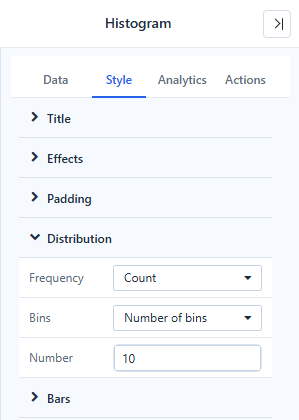
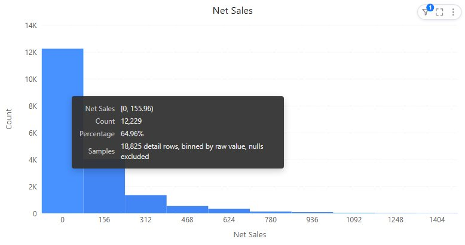

# Histogram

Show how numeric observations are distributed across intervals. Use it to inspect common values, spread, skew and unusual tails—for example, the distribution of transaction amounts. Use a bar chart for totals by named category.

## Bind row-level values

1. Add **Components → Charts → Distribution & correlation → Histogram** (a new histogram is 400 × 300 px) and choose an **Analysis model** in **Data**.
2. Put one eligible physical numeric field, such as transaction amount, in **Value**.
3. Set **Filters** to the population and period you want to inspect.
4. Start with **Style → Distribution → Bins → Auto** and inspect the result before choosing a fixed interval.

Each detail row is a sample. Its raw numeric value is binned without aggregation; nulls are excluded. This is not a histogram of already grouped regional totals. A calculated aggregate measure is not a substitute for row-level observations.

The automatic title and the X-axis name are the **Value** field's name.

## Choose bins and frequency

| Setting (Style → Distribution) | Effect | Default |
| --- | --- | --- |
| **Frequency → Count** | Number of valid observations in each bin. | Count |
| **Frequency → Percentage** | Share of the valid observations after filtering. | |
| **Bins → Auto** | Chooses the intervals automatically, at most 100 bins. | Auto |
| **Bins → Number of bins** | Set **Number** from 2 to 100. More bins reveal detail but can make the result noisy. | 10 |
| **Bins → Bin width** | Set **Width**, greater than 0, in the Value field's units. Useful for consistent business intervals. | 1 |

For amounts measured in dollars, a width of 100 means intervals of 100 dollars, not 100 observations. A width that would produce more than 100 bins is rejected; see the messages below. Hover bars to read their actual interval boundaries rather than assuming where the first bin begins.

Changing bins can reveal or hide apparent peaks. Compare populations using the same bin settings and filters; use percentages when the population sizes differ and the question concerns shape rather than count.

Bin counts respect component filters, report filters and cross-filtering from other components. Percentages may add up to slightly more or less than 100% because of rounding.

If one extreme value compresses the rest, inspect it before filtering it out. If all observations fall into one interval, check the width, the numeric type and the actual data range.

## Format

| Option (Style) | Effect | Default |
| --- | --- | --- |
| **Bars → Color** | One color for all bins. | First palette color |
| **Bars → Spacing** | Gap between adjacent bins, 0–5 px. 0 keeps the bars connected. | 0 px |
| **Data labels → Show**, **Font** | Labels on the bars. | Off |
| **Data labels → Value** | **Frequency** or **Percentage** on the labels. | Frequency |
| **X axis**, **Y axis** | **X axis** describes the value intervals, **Y axis** the frequency. X labels are rotated only when the labels shown do not fit flat, unless you set a rotation yourself. | |
| **Tooltip → Show Tooltip** | Hover tooltip; see below. | On |

The tooltip shows the interval, the count and the percentage, and a last row *Samples: N detail rows, binned by raw value, nulls excluded*. A non-zero share too small to round shows two significant digits in the tooltip (for example *0.0032%*) and `<0.1%` as a bar label. The histogram has no **Display units** setting.

The **Analytics** tab adds reference lines and bands; statistics are estimated from the bins and marked "≈". See [Reference lines](/documentation/Analysis/Chart-Reference-Lines/).

## Messages

| Message | Cause |
| --- | --- |
| *Bin width must be greater than 0.* | **Width** is 0 or negative. |
| *The number of bins must be between 2 and 100.* | The width is so small that it would produce more than 100 bins. |
| *Histogram requires a numeric field.* | The Value field is not numeric. |
| *The selected field cannot be binned and aggregated by the server.* | The field is calculated or aggregated, not a physical numeric column. |
| *This analysis model does not support histogram pushdown.* | The model's data source cannot run the binning query. |
| *No data* | No rows, or every bin count is 0. See [Empty data and error messages](/documentation/Visualization/Empty-Data-and-Errors/). |

::: details Opening reports made before 10.00
- Bin counts under filters and cross-filtering are now correct. Earlier versions could show 0 or too few rows for filtered bins.
- A histogram whose title was never set shows the field name instead of *Untitled*.
- X labels are no longer rotated when they fit flat.
:::
