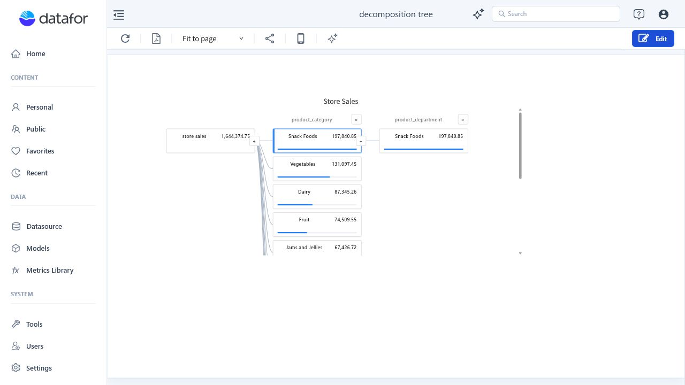
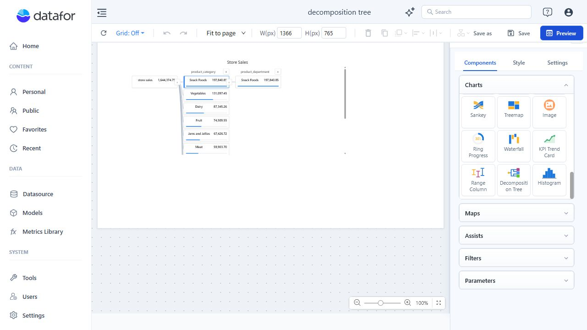
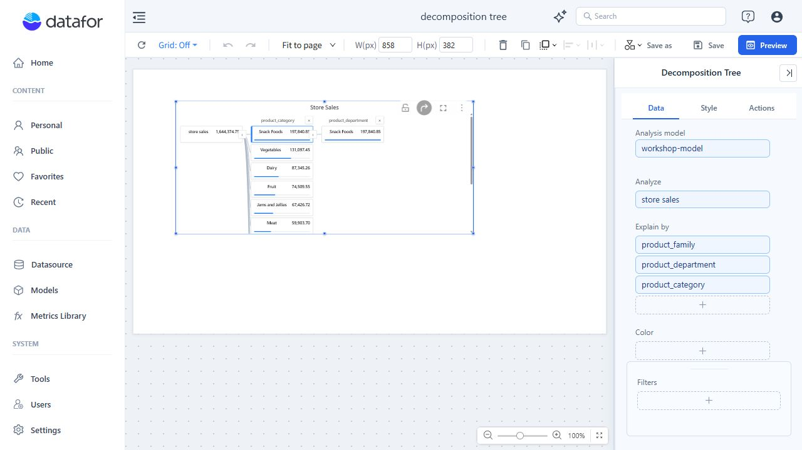
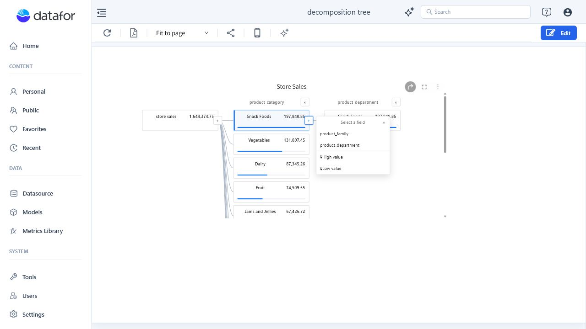
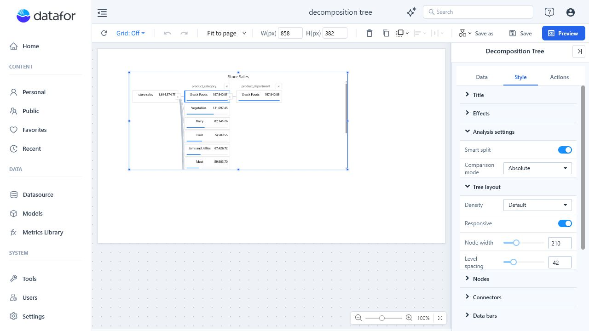
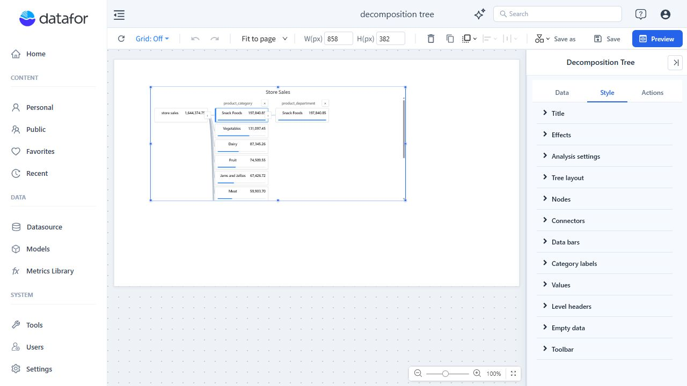

# Decomposition Tree

## Overview

A **Decomposition Tree** helps you understand what contributes to a measure by breaking the total down step by step across multiple dimensions.

The first node shows the total value of the selected measure. Each new level divides the selected node by a dimension, so you can move from a high-level result to the categories and members behind it. You can choose each split manually or use **Smart split** to find a high-value or low-value contributor.

### When to use a Decomposition Tree

Use a Decomposition Tree when you need to:

- Investigate the drivers behind a total, variance, or KPI.
- Explore several possible dimensions without displaying every combination at once.
- Follow a selected path from an overall value to increasingly specific contributors.
- Compare manual analysis with data-driven high-value or low-value recommendations.
- Pass the selected path to linked report components.

Use a Treemap when you want to compare all parts of a hierarchy in one fixed view. Use a Decomposition Tree when users should choose the next analytical path interactively.

## 1. Add a Decomposition Tree component

1. Open a report in edit mode.
2. Click a blank area of the report canvas.
3. In the right panel, open **Components > Charts**.
4. Scroll to **Decomposition Tree**.
5. Click the Decomposition Tree icon and then click the canvas, or drag the icon onto the canvas.
6. Resize and position the component as needed.

## 2. Configure the data

Select the Decomposition Tree component, then open the **Data** tab.

| Setting | Required | Description |
| --- | --- | --- |
| **Analysis model** | Yes | Select the model that contains the measure and dimensions for the analysis. |
| **Analyze** | Yes | Select exactly one measure. Its total becomes the root value of the tree. |
| **Explain by** | Yes | Add one or more dimensions that users can choose as split levels. You can reorder and rename these fields. |
| **Filters** | No | Limit the data included in the root value and subsequent splits. |

### Explain by fields

Add at least one **Explain by** dimension. The component supports up to 50 dimensions and queries each selected dimension independently rather than creating one large cross-join.

Arrange the fields in a useful order. The order controls how they appear in the manual split menu and is also used as a deterministic tie-breaker when Smart split candidates have the same score.

The current report and component filters remain in effect. Each deeper level also applies the members selected earlier in the path.

## 3. Build and explore the tree

The root node displays the total of the **Analyze** measure. To add a level:

1. Select the **+** button on the root node or on the active member node.
2. Choose an unused **Explain by** dimension for a manual split.
3. Select a member in the new level.
4. Select its **+** button to continue the analysis.

The split menu also includes **High value** and **Low value** when Smart split is enabled.

### Read the tree

- The root shows the overall measure value.
- Each level header identifies the dimension used for that split.
- Each node shows a dimension member and its measure value.
- The data bar inside a node makes values easier to compare visually.
- The highlighted nodes and connectors show the active analysis path.
- Up to 10 members are displayed in each visible level.

### Change or remove a level

Select the remove action in a level header to remove that level and every level that follows it. You can then select a different dimension from the preceding node.

Use **Drill Reset** on the component toolbar to restore the decomposition path saved with the report. Resetting the drill path also clears the tree's current selections from linked target components.

## 4. Use Smart split

**Smart split** is enabled by default. It evaluates the unused **Explain by** dimensions and recommends the next contributor using deterministic data queries and scoring.

| Option | What it does |
| --- | --- |
| **High value** | Selects the candidate dimension and member with the highest contribution. |
| **Low value** | Selects the candidate dimension and member with the lowest contribution. |

Smart split provides two comparison modes:

| Comparison mode | Description |
| --- | --- |
| **Absolute** | Compares the member values directly across candidate dimensions. This is the default. |
| **Relative** | Compares a member with the average value for its candidate dimension. Use this when dimensions have different value distributions. |

Only unused **Explain by** dimensions are considered. A smart level is identified by a **High value** or **Low value** subtitle. If a candidate dimension exceeds the supported member limit or cannot return a complete result, Datafor skips that candidate instead of estimating it.

Disabling Smart split keeps existing smart levels as manual levels. Changing the comparison mode recalculates the current smart levels.

## 5. Format the component

Open the **Style** tab to format the tree.

| Group | Main settings |
| --- | --- |
| **Title** | Show or hide the title and format its text. |
| **Effects** | Configure the component background, border, corner radius, and shadow. |
| **Analysis settings** | Enable Smart split and choose Absolute or Relative comparison. |
| **Tree layout** | Choose Compact, Default, or Spacious density; enable responsive layout; set node width and level spacing. |
| **Nodes** | Set normal, hover, and selected backgrounds; borders; corner radius; and shadow. |
| **Connectors** | Choose Curved, Straight, or Elbow lines; set width and colors; and show smart paths as dashed lines. |
| **Data bars** | Show or hide bars; choose their scale, height, track color, positive and negative colors, and conditional coloring. |
| **Category labels** | Format member labels and enable label wrapping. |
| **Values** | Show or hide measure values and format their font. |
| **Level headers** | Format dimension titles and the optional Smart split subtitle. |
| **Empty data** | Configure how the component appears when no data is available. |
| **Toolbar** | Configure the component toolbar. |

### Layout settings

- **Node width** can be set from 160 to 320 pixels.
- **Level spacing** can be set from 24 to 96 pixels.
- With **Responsive** enabled, a narrow component automatically uses a more compact layout.

### Data bar scale

Choose the reference used to size the bars:

- **Level maximum** compares nodes within the same level.
- **Parent value** compares each child with the value of its parent node.
- **Visible tree maximum** compares nodes against the largest value currently visible in the tree.

## 6. Link the tree to other components

Configure linkage and other interactions on the **Actions** tab.

In report view:

1. Select a member node to publish the active dimension path to linked components.
2. Ctrl-click additional nodes when the target interaction supports multiple selections.
3. Select the root node to clear the current tree selection.
4. Use **Drill Reset** to restore the saved path and clear linked targets.

Drill-through and jump actions receive the complete selected path, not only the last node.

## 7. Preview and save

1. In edit mode, build the path that should appear when users first open the report.
2. Click **Preview** and test manual splits, Smart split, node selection, scrolling, and linked components.
3. Return to edit mode if changes are needed.
4. Click **Save** when the component is ready.

The active decomposition path is saved as the default state when the report is edited and saved. Exploration in read-only report view does not overwrite that saved path.

## 8. Troubleshooting

| Message or symptom | What to do |
| --- | --- |
| The component asks you to configure its data | Add exactly one measure to **Analyze** and at least one dimension to **Explain by**. |
| **No eligible dimensions remain.** | All available dimensions are already used in the active path. Remove a later level or add another Explain by dimension. |
| **Skipped _field_: more than _limit_ members.** | Choose another dimension or apply filters that reduce its number of members. |
| **The decomposition tree supports up to 50 levels.** | Remove a level before adding another one. |
| A saved level or member is unavailable | Confirm that the field still exists and that the user has permission to access it. Datafor truncates an invalid saved path at the first unavailable item. |
| The component shows no data | Review the report and component filters, then confirm that the Analyze measure returns numeric values. Null and nonnumeric values are excluded; zero remains a valid value. |
| **Query failed.** | Verify the model, measure, dimensions, filters, permissions, and server connection, then refresh the component. |
| A Smart split option is skipped | Try another Explain by dimension, narrow the data with filters, or use a manual split. Relative comparison also skips candidates whose average is zero. |

## Best practices

- Use a measure whose meaning remains clear at every level of the tree.
- Add only dimensions that help explain the business question.
- Put the most useful manual split choices first in **Explain by**.
- Start with Absolute comparison; use Relative when candidate dimensions need to be judged against their own distributions.
- Keep the saved default path short so users can see the starting point and choose their own route.
- Use filters to keep high-cardinality dimensions focused and easier to interpret.
- Enable responsive layout when the report may be viewed at different widths.
- Use data bars and selected-path colors with enough contrast to make the active route easy to follow.
- Test linkage, Drill Reset, and Smart split in Preview before saving the report.
