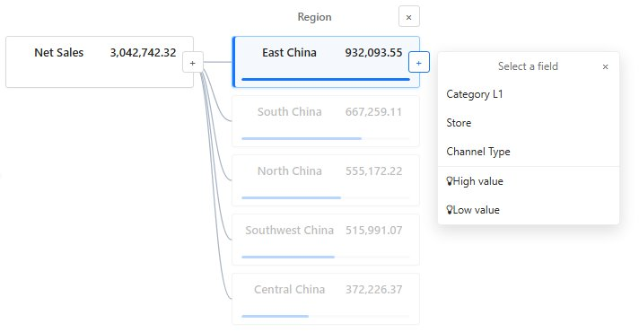
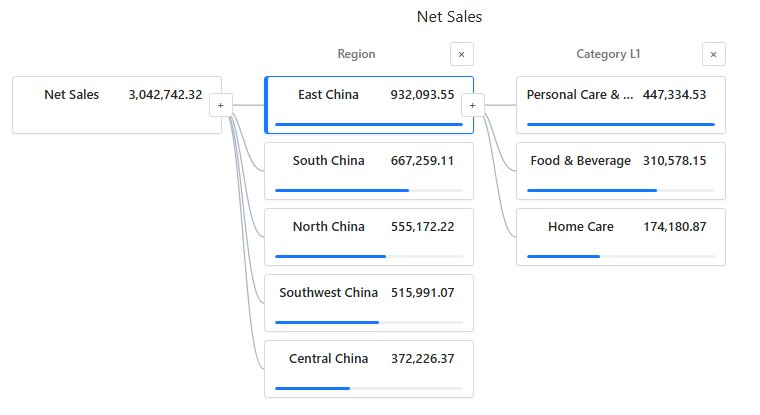
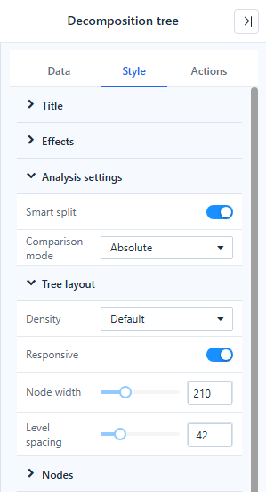

# Decomposition tree

Explore one measure by splitting it across dimensions. Use it to investigate where a result is concentrated, such as which regions, stores or product categories contribute to sales. A split shows a breakdown, not a causal explanation.

## Configure the analysis

1. Add **Components → Charts → Flow & breakdown → Decomposition tree** (a new tree is 600 × 320 px) and choose an **Analysis model** in **Data**.
2. Put Net Sales in **Analyze**.
3. Add Region, Store and Product Category to **Explain by**. These are the dimensions users can choose when expanding nodes.
4. Set **Filters** to the population and period to investigate. Add **Color**, **Tooltips**, or **Icon** only when useful for node context.
5. Check the root value against a table with the same measure and filters.

| Field group | Holds |
| --- | --- |
| **Analyze** | One measure. The root node shows its total. |
| **Explain by** | The dimensions offered when a node is split, in the order listed. Each level queries one of them. |
| **Color**, **Tooltips**, **Icon** | Optional extra fields for the nodes. |
| **Time axis** | Optional date field for a page **Date** filter that filters by time axis. |
| **Filters** | Component filters. |

Start with a small, useful set of dimensions. Very high-cardinality fields can create more branches than users can inspect, and Smart split skips a field with too many members (the tree then shows *Skipped {field}: more than {limit} members.*).

## Follow a path

1. Click **+** on the root node and choose Region.
2. Click a region to select it, then click **+** on that node and choose Store.
3. Add another available dimension to investigate the selected subset.
4. To choose a different path, click **×** in a level's header (**Remove level**). It removes that level and every level after it.

If a dimension is missing from the **+** menu, check **Explain by**, the dimensions already used in the path and the current data result.

Every level inherits the selections above it. A Store value under East China is not a store total for all regions. Recheck the path after changing a report filter.

The path you build in the editor is saved with the report and is what readers see first. Readers can build their own path in view mode; it is not saved, and reopening the report shows the saved path again. A tree can have up to 50 levels and 5,000 data points.

## Selection and cross-filtering

| Action | Result |
| --- | --- |
| Click a node | Selects the path to that node and cross-filters the linked components. |
| Click the selected node again | Deselects it and removes the filter it applied. |
| Click the root node (tooltip **Clear selection**) | Clears the selection and every filter the tree applied to other components. |

Which components are filtered is set in **Actions**; see [Cross-filtering](/documentation/Analysis/Cross-Filtering/).

## Use Smart split deliberately

With **Style → Analysis settings → Smart split** on (default), the **+** menu also offers **High value** and **Low value**: the tree evaluates the unused **Explain by** dimensions, splits by the one whose member scores highest (or lowest) and selects that member. The recommendation is deterministic; no LLM is used. **Comparison mode** sets how members are scored and appears only while Smart split is on.

| **Comparison mode** | How it compares candidates |
| --- | --- |
| **Absolute** (default) | Compares member values directly. Useful for finding the largest or smallest result. |
| **Relative** | Compares a member value with the absolute average of its candidate dimension. Useful for finding a value that stands out within that dimension. |

On a tie the field listed first in **Explain by** wins. In **Relative** mode a field whose average is 0 is skipped.

A relative recommendation need not have the largest absolute sales. A high/low recommendation also does not mean good/bad performance. Use a manual split when the business question specifies a dimension or a candidate is unavailable under the current filters. When you add a manual level below High value or Low value levels, those levels are fixed to the dimension they picked.

## Set a meaningful bar scale

In **Style → Data bars → Scale to**:

- **Level maximum** compares peers within a level.
- **Parent value** compares children with their parent.
- **Visible tree maximum** uses a common reference across the visible tree.

These choices change bar lengths, not the measure values. For ratios, averages and distinct counts, child values may not add up to their parent; do not read every bar as an additive contribution. **Data bars** also has **Positive bar**, **Negative bar** and **Conditional color**, which overrides both; see [Conditional colors](/documentation/Visualization/Conditional-Colors/).

Use **Tree layout**, **Nodes**, **Connectors**, **Category labels**, **Values**, and **Level headers** to keep the path readable. Leave enough width for category names; a level with more nodes than fit scrolls inside the component.
