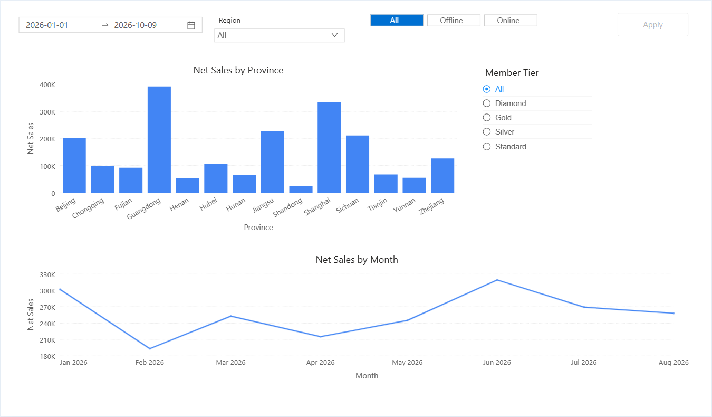
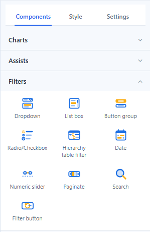
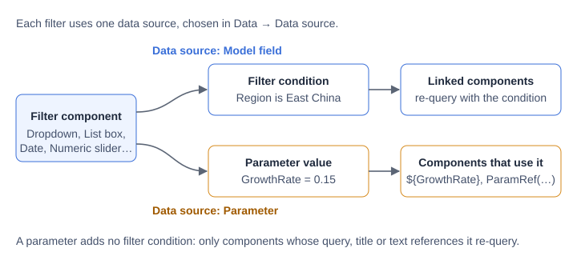
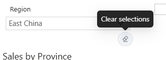
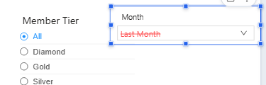

# Filters

Filter components let readers change what a report shows. A filter either **filters linked components by a model field** (for example, Region is East China) or **sets a parameter** that formulas, titles and text read (for example, GrowthRate = 0.15).

## Choose a filter

All filters are in **Components → Filters**.

| Component | Use it for | Can bind a parameter |
| --- | --- | --- |
| **Dropdown** | A compact single or multiple selection, with search. | Yes |
| **List box** | A list that stays visible, with search and keyboard navigation. | Yes |
| **Button group** | A few values shown as buttons, such as Online / Offline. | Yes |
| **Radio/Checkbox** | A few values as radio buttons or check boxes. | Yes |
| **Hierarchy table filter** | Selecting members in a hierarchy, such as Category › Subcategory › Product. | No |
| **Date** | A single period or a date range, fixed or relative. | Yes, with **Filter by → Field** |
| **Numeric slider** | A range of a numeric field, or a numeric what-if input. | Yes |
| **Paginate** | Stepping through members one at a time with arrows. | No |
| **Search** | Typing a keyword to match member names. | No |
| **Filter button** | Resetting or clearing all filters, or applying several changes at once. | – |

Older reports can still contain the separate parameter controllers, range filter and date components of earlier versions. They keep working; new filters use the components above.

## Model field or parameter

Every list filter, the Date component and the Numeric slider start with **Data → Data source**: **Model field** or **Parameter**.

- **Model field** filters the components listed under **Actions → Interactions → Linked components**. The filter adds a condition to their queries.
- **Parameter** writes the selection into a report or global parameter. It adds no filter condition; only components whose query, title or text uses the parameter re-query. See [Bind Filters to Parameters](/documentation/Analysis/Parameter-Controllers/).

## Add a filter

1. In **Components → Filters**, click a tile and then click the canvas, or double-click the tile to place the filter at the next free position. A new filter uses the analysis model you used last on the page.
2. In **Data**, keep **Data source → Model field**, then choose the **Field** (or **Time field** for Date).
3. Set the **Default value**, **Multiple selection** and **Show 'All'** (list filters).
4. In **Actions → Interactions**, check the targets under **Linked components**. Turn on **Cascade other filters** if the other filters on the same model should show only the values that remain available.
5. Click **Preview** and test a selection, an empty result and the way back to the full data.

## Default values

| Default value | Available in | Behaviour |
| --- | --- | --- |
| **Fixed** | List filters, Hierarchy table filter, Paginate, Date | The members or dates you pick. Pick nothing to start with All. |
| **Relative** | List filters, Date | On a year, quarter, month, week or day field: a period such as *Last Month*, computed from the viewer's current date every time the report opens (see [Relative Date Filtering](/documentation/Analysis/Relative-Date-Filtering/)). On other fields: the **First** or **Last** member. |
| **All (no filter)** | Date | No date condition. New Date components start with it. |
| **Parameter** | List filters, Date | The current value of a parameter. |

When a filter ends up with no selection, for example because a cascading filter removed its last value, it filters the way it looks: a multiple selection or a filter with **Show 'All'** filters nothing; a required single selection takes its first item.

## What readers can do

| Action | Where | Effect |
| --- | --- | --- |
| **Clear selections** | Filter toolbar (eraser icon), shown on hover | Sets the filter to All. Not offered for a required single selection. |
| **Reset to default** | Date toolbar, in view mode | Returns the date to its value when the page opened. |
| **×** | Inside a Dropdown | Clears the selection. |
| **Refresh** | Report toolbar | Restores every filter to its opening value and clears links and drill-downs. |
| **Reset filters** / **Clear filters** / **Apply** | [Filter button](/documentation/Visualization/Filter-Button/) | Resets or clears all filters, or applies several changes at once. |
| **Conditions** | Chart toolbar (funnel icon with a count) | Lists the link, filter and passed-in conditions applied to that chart. |

A value passed in the report URL as `default_<component title or id>=value1;value2` is applied on the first load and wins over Relative, First and Last defaults. **Refresh** returns to it.

## Large member lists

Dropdown, List box, Button group and Radio/Checkbox load at most **1,000 members**: the first 1,000, or the most recent 1,000 for time fields and **Last** defaults. The list ends with *Showing the first 1,000 of 10,181 items. Type to search all*. In a Dropdown or List box, typing searches all members on the server (respecting the other filters) and shows up to 1,000 matches. The limit cannot be changed.

The Hierarchy table filter loads 1,000 members per level and adds **Show more** at the end of a level.

## Values that are no longer in the data

When a saved selection or default no longer exists in the data, the filter keeps it, still applies it, and shows it in red with a strikethrough. The tooltip reads *No longer among the available values, but still applied as a filter*. Untick it to remove it. A relative period with no data, such as last month before the month has been loaded, is shown the same way.

## Layout

- **Style → Title → Position**: **Top** or **Left**, on Dropdown, Button group, Radio/Checkbox, Search, Date and Paginate. List box, Hierarchy table filter and Numeric slider always show the title on top. A left title takes at most half the width and shows an ellipsis when it is longer.
- Dropdown and Date have an input box of fixed height (from the font size) that no longer stretches with the component. **Style → Content → Content alignment** (Top / Middle / Bottom) places it in a taller component, and **Control size** (Compact / Standard / Spacious) sets its padding. In the editor these components cannot be made shorter than the input box.
- New filters start with the title on top and Content alignment **Top**. Filters from reports made before 10.00 keep a left title, and their box stays where the text was: Middle for a single-selection Dropdown and for Date, Top for a multiple-selection Dropdown.
- New filters get a size that fits their type, for example Dropdown 240×60, Date 320×48, List box 200×240 and Filter button 120×40.

## Troubleshooting

| Symptom | Check |
| --- | --- |
| A chart does not react to the filter. | The chart must be checked under the filter's **Linked components**, and use the same analysis model, or a model that has the filtered field. |
| A chart shows *No data under the current filters*. | Click **View conditions** to see every condition. A relative date default may point to a period with no data. |
| The filter lists only part of the members. | The list is limited to 1,000. Type to search, or add an upstream filter. |
| A parameter is greyed out in the parameter list. | Hover it for the reason; list filters need a List or SQL parameter, Numeric slider a Numeric parameter with Any value, and Date a Date parameter with Any value. |
| Changing a filter does not refresh the charts until a button is clicked. | The page has a [Filter button](/documentation/Visualization/Filter-Button/) with **Action → Apply**. |

## Related

- [Dropdown, List Box, Button Group and Radio/Checkbox](/documentation/Visualization/List-Box/)
- [Date](/documentation/Visualization/Datepicker/) · [Numeric Slider](/documentation/Visualization/Number-Range-Filter/) · [Hierarchy Table Filter](/documentation/Visualization/Hierarchy-Table-Filter/) · [Search and Paginate](/documentation/Visualization/Search-and-Paginate/) · [Filter Button](/documentation/Visualization/Filter-Button/)
- [Linking and Cascading Filters](/documentation/Visualization/Filter-Subscriptions/)
- [Component-Level Filtering](/documentation/Analysis/Component-Level-Filtering/) for conditions that belong to one chart
