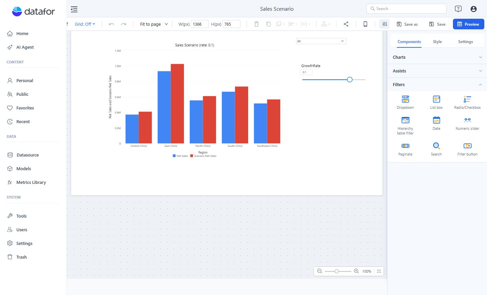

# Filter Components

Add a filter to let readers choose which data a report displays. Add a component-level filter when the condition should be fixed on one chart instead.

## Choose a control

Open **Components → Filters**.

| Component | Use it for |
| --- | --- |
| Dropdown | A compact selection list |
| List box | Choices that should remain visible |
| Radio/Checkbox | Explicit single or multiple choices |
| Hierarchy table filter | Selection through a hierarchy |
| Date | A single time period or a range |
| Search | Text-based selection |
| Numeric slider | A numeric model-field range or a numeric parameter value |
| Paginate | Paging controls |
| Filter button | A button-based filter interface |

## Bind a field and targets

1. Add the control and select it.
2. In **Data**, choose its analysis model and field. For Numeric slider, choose **Data source → Model field** or **Parameter** first. Other parameter-backed controls offer compatible parameters in their picker.
3. Set the selection mode and default value offered by that control.
4. Open **Actions → Interactions → Linked components**, where available, and check the intended targets.
5. Preview the report. Test a selection, an empty result, and the way readers return to the full data set.

A parameter control changes a value used by report logic; it does not become a dimension filter simply because it is on the canvas. See [Parameter Controllers](/documentation/Analysis/Parameter-Controllers/).
