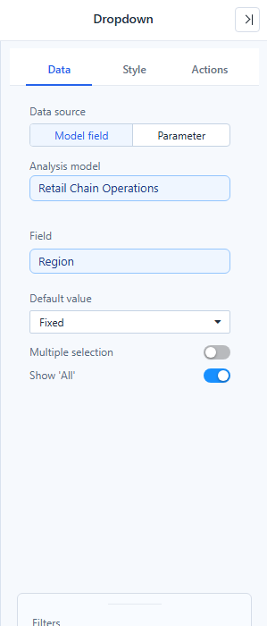
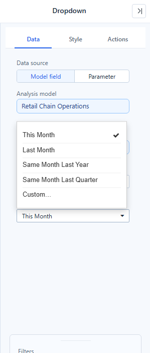
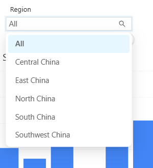
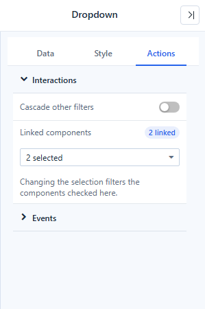

# Dropdown, List Box, Button Group and Radio/Checkbox

The four list filters show the members of one field and filter their linked components by the selection. They share the same **Data** settings and differ in how the members are displayed.

| Component | Shows members as | Search | Typical use |
| --- | --- | --- | --- |
| **Dropdown** | A drop-down box | Yes | Region, product, store: many members, little space. |
| **List box** | A scrolling list | Yes | A list readers should always see, such as Member Tier. |
| **Button group** | A row of buttons | No | Two to six values, such as Online / Offline. |
| **Radio/Checkbox** | Radio buttons or check boxes | No | A few values with a clear on/off look. |

## Set up the data

1. Add the filter from **Components → Filters**.
2. In **Data**, keep **Data source → Model field**, check the **Analysis model** and choose the **Field**.
3. Choose the **Default value** (below), and whether readers can pick several values (**Multiple selection**) and an **All** item (**Show 'All'**).
4. In **Actions → Interactions**, check the components under **Linked components**. The badge shows how many are linked, for example **2 linked**.

To make the filter set a parameter instead of filtering by a field, choose **Data source → Parameter**. See [Bind Filters to Parameters](/documentation/Analysis/Parameter-Controllers/).

## Default value

| Type | On a time field (year, quarter, month, week, day) | On any other field |
| --- | --- | --- |
| **Fixed** | The members you pick. | The members you pick; pick none to start with All. |
| **Relative** | A period such as *This Month*, *Last Month* or *Same Month Last Year*, or a **Custom…** rule. | **First** or **Last** member. |
| **Parameter** | The current value of a parameter (**Parameter name**). | Same. |

A relative period is recalculated from the viewer's current date every time the report opens or is refreshed. Linked components get a date range, even when the member list has not been loaded.

The relative choices follow the field's level:

| Level | Choices |
| --- | --- |
| Year | This Year, Last Year, The Year Before Last |
| Quarter | This Quarter, Last Quarter, Same Quarter Last Year |
| Month | This Month, Last Month, Same Month Last Year, Same Month Last Quarter |
| Week | This Week, Last 1 Week |
| Day | Today, Yesterday |

Every list ends with **Custom…**, where you set **Current** / **Back** / **Ahead**, a number and a unit, for example *12 months back* for the same month last year.

If the computed period has no member in the data, the filter still applies it, the charts show no data, and the period appears in red with a strikethrough: *No member for this period in the current data; the period is still applied as a filter*.

## Selection rules

- **Multiple selection** off: one value at a time. With **Show 'All'** off the filter always has a value; when it is emptied it takes the first item.
- **Multiple selection** on: ticking every member collapses to **All** when **Show 'All'** is on.
- Members are sorted numerically where they are numbers, so months read 1, 2 … 12 rather than 1, 10, 11, 12, 2.
- Date-time members are shown without the `00:00:00.0` part.

## Search and long lists

Dropdown and List box can show a search box (**Style → Search**). The list loads at most 1,000 members. When it is cut, the footer says *Showing the first 1,000 of 10,181 items. Type to search all*, and typing searches all members on the server, taking the other filters into account. Search stays available on a cut list even if the search box is turned off.

In a List box, the search filters as you type (it waits while an input method is composing), and the result scrolls to the top.

## Interactions and events

| Setting | Where | What it does |
| --- | --- | --- |
| **Linked components** | Actions → Interactions | The components this filter filters. |
| **Cascade other filters** | Actions → Interactions | One switch that adds every other filter on the same model to Linked components (loops and parameter-bound filters are skipped). See [Linking and Cascading Filters](/documentation/Visualization/Filter-Subscriptions/). |
| **Value changed** | Actions (Dropdown, List box) | A script function `changedEvent(value, old)` that runs after the selection changes. An empty array means All. |

## Component-specific settings

**Dropdown**
- The **×** in the box clears the selection (when clearing is allowed).
- **Content alignment** and **Control size** keep the box at a fixed height when you resize the component.

**List box**
- **Style → List box → Selected background color** (default transparent) and **Selected text color**.
- Keyboard: the list is one Tab stop; the arrow keys, Home and End move the focus; rows that are not loaded yet are loaded as you move.
- On open, the list scrolls to the selected value, for example a relative default of *Yesterday* far down a day list.

**Button group**
- New button groups use **Same size**: equal widths, up to six buttons per row. Long names can be cut; widen the component or use a Dropdown.

**Radio/Checkbox**
- A tooltip with the full name appears only when a name is cut off.

## Troubleshooting

| Symptom | Check |
| --- | --- |
| The chart still shows every value. | The chart is not in **Linked components**, or it uses another model without the field. |
| A relative default shows in red. | The period has no data yet (for example, last month before the data load). The filter is still applied. |
| A value saved earlier shows in red with a strikethrough. | The member no longer exists in the data. Untick it. |
| A member beyond the first 1,000 cannot be found by scrolling. | Type in the search box to search all members. |

Related: [Filters](/documentation/Visualization/Filters/) · [Date](/documentation/Visualization/Datepicker/) · [Relative Date Filtering](/documentation/Analysis/Relative-Date-Filtering/)
