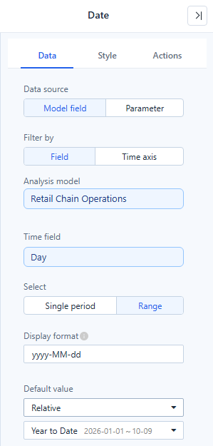
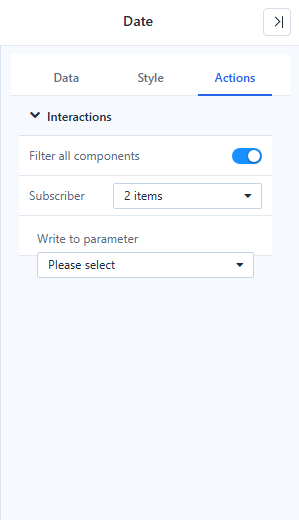

# Date

The **Date** component filters by a single period or a date range. It replaces the four separate date components of earlier versions; those still work in older reports.

## Set up the data

| Setting | Options | Notes |
| --- | --- | --- |
| **Data source** | **Model field**, **Parameter** | Parameter writes the date into a parameter instead of filtering. Only with **Filter by → Field**. |
| **Filter by** | **Field**, **Time axis** | *Field*: pick an **Analysis model** and a **Time field**. *Time axis*: pick a **Granularity** (Day, Week, Month, Quarter, Year) and filter every component through its **Time axis** field. |
| **Select** | **Single period**, **Range** | One day, week, month… or a start and end. |
| **Display format** | Formats of the chosen granularity | Shown as an example in your language. Time-of-day formats are not offered. |
| **Default value** | **All (no filter)**, **Relative**, **Fixed**, **Parameter** | New Date components start with **All (no filter)**. |

Changing **Filter by** or **Select** converts the component in place: it keeps its links and references, converts the default value, and can be undone in one step.

Until a time field is chosen, the component shows **Choose a date field** in edit mode and nothing in view mode.

## Filter by time axis

With **Filter by → Time axis**, the Date component is not tied to one model field. It filters each component through that component's own **Time axis** field (**Data → Time axis**), so one Date can filter charts built on different date fields, such as Sales Date and Purchase Date, or on different time levels.

The selected period is applied to each time axis at its own level, provided that level is as detailed as the Date's **Granularity** or more. For example, with **Granularity → Year** and 1998 selected:

| Component's time axis | Condition applied |
| --- | --- |
| Sales Month | January 1998 to December 1998 |
| Purchase Year | 1998 |

A less detailed time axis is not filtered: with **Granularity → Month**, a component whose time axis is a Year field is listed greyed in [Interactions](#interactions) as *Time axis less detailed than the date – not filtered yet*.

## Default values

- **All (no filter)**: no date condition. The box shows **All dates** and has a clear button; **Reset to default** returns to no filter.
- **Fixed**: the dates in the box below. Picking a date on the canvas while editing also sets a fixed default, rounded to the granularity. A reader's choice in view or preview mode never changes the saved default, so **Refresh** and **Reset to default** return to it.
- **Relative**: a period computed from the viewer's date every time the report opens. The list is grouped into **Current period**, **Previous period**, **Recent** and **Custom**, and each entry shows the range it resolves to today.
- **Parameter**: the value of the parameter chosen in **Parameter name**. When the parameter has no value, the current period is used.

*Last N days*, *Last N months* and *Last N years* include today: *Last 7 Days* on 9 October 2026 is 3–9 October.

### Custom rules

**Custom…** at the end of the relative list builds a rule from a direction (**Last**, **Next**, **This**, or **Current**, **Back**, **Ahead** for a single period), a number and unit, **Rolling** or **Calendar**, **Include today** or **Exclude today**, and **More → Shift back**. See [Custom rules](/documentation/Analysis/Relative-Date-Filtering/#custom-rules) for each part and examples.

## Interactions

- **Filter all components** (on by default) filters every component that can be filtered by the date, including components added later. Turn it off and check components in **Subscriber** to choose them yourself.
- Components that cannot be filtered yet are listed greyed, for example *No time axis – not filtered yet* or *Time axis less detailed than the date – not filtered yet*. You can still check them.
- With **Filter by → Field**, components that use another model can be filtered too; they are listed separately.
- **Write to parameter** also writes the selected date to a report or global parameter: `YYYY-MM-DD` for a single date, `["start","end"]` for a range.

## Bind the Date component to a parameter

With **Data source → Parameter** and a **Date** parameter with **Any value**, the component sets the parameter instead of filtering. See [Bind Filters to Parameters](/documentation/Analysis/Parameter-Controllers/).

## Style

| Group | Styles |
| --- | --- |
| **Title** | **Show** and **Position** (Top or Left). |
| **Content** | **Content alignment** (where the input box sits in a taller component) and **Control size** (Compact, Standard or Spacious padding). |
| **Component frame** | Background, border, radius and shadow of the whole component. Transparent by default, so the page theme shows through. |
| **Input box** | Background, border, radius and shadow of the date box itself. Settings made in the *Effects* group before 10.00 are kept here. |

## Weeks

*This Week*, *Last Week* and week ranges start on the day set in **Settings › General › System configuration › Modeling › First day of the week** (Monday by default). Match it to the week definition of your model.

## Troubleshooting

| Symptom | Check |
| --- | --- |
| The charts show *No data under the current filters*. | The relative period may lie after the last loaded date. Use **View conditions** on the chart to see the date range. |
| A component is not filtered. | In Time axis mode it needs a **Time axis** field at the Date's granularity or finer; see [Filter by time axis](#filter-by-time-axis). |
| *Last 7 Days* differs from an older report by one day. | Since 10.00 the *Last N* presets include today. |

Related: [Filters](/documentation/Visualization/Filters/) · [Relative Date Filtering](/documentation/Analysis/Relative-Date-Filtering/) · [Time Semantics and Default Time Settings](/documentation/Model/Time-Dimensions-and-Time-Intelligence/)
