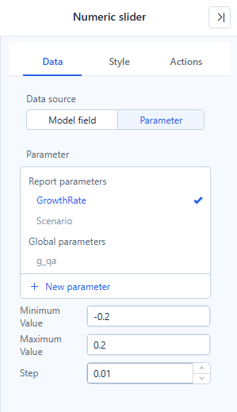

# Numeric Slider

**Numeric slider** has two jobs, chosen in **Data → Data source**:

| Data source | Job | Handles | Filters linked components |
| --- | --- | --- | --- |
| **Model field** | Filter by a range of a numeric field, such as order value. (This was the *Range filter* in earlier versions.) | Two, or one for ≤ / ≥ | Yes |
| **Parameter** | Change a numeric input that formulas read, such as a growth rate. | One | No |

## Filter by a numeric field

1. Add **Components → Filters → Numeric slider**.
2. In **Data**, keep **Data source → Model field**, choose the **Analysis model** and a **Numeric field**.
3. In **Style → Options → Style**, choose **Range**, **Less than or equal** or **Greater than or equal**.
4. In **Actions → Interactions**, check the **Linked components**.

The **Numeric field** list contains only dimension fields that the model defines as numeric (quantitative). Measures such as amounts cannot be range-filtered here; the list says **Empty** when the model has no such field. To filter by a measure value, use a [component filter](/documentation/Analysis/Component-Level-Filtering/) with a condition instead.

**Less than or equal** and **Greater than or equal** filter by the chosen end only. Values beyond the data range seen when you set the filter, for example larger orders loaded later, are included.

The step is derived from the data range, and the input boxes show thousands separators. **Clear selections** in the toolbar returns to the full range.

## Drive a parameter

Choose **Data source → Parameter** and a **Numeric** parameter with **Any value**, for example `GrowthRate` with default `0.1`; binding rules are in [Bind Filters to Parameters](/documentation/Analysis/Parameter-Controllers/). Then set **Minimum value**, **Maximum value** and **Step**, for example `-0.2`, `0.2` and `0.01`.

If you leave the range empty, it is derived from the parameter's default: a positive value *v* gives 0 to 2*v*, a negative value 2*v* to 0, and 0 gives 0 to 20. The step follows the default's decimals (0.1 → 0.1, 0.05 → 0.01, an integer → 1).

For a worked example, see [What-if Analysis](/documentation/Analysis/What-if-Analysis/).

Related: [Filters](/documentation/Visualization/Filters/) · [Bind Filters to Parameters](/documentation/Analysis/Parameter-Controllers/)
