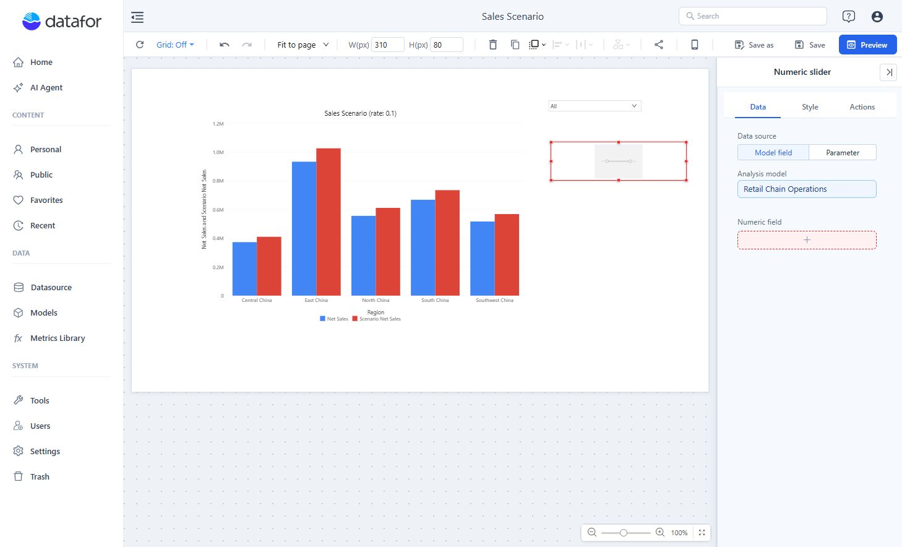

# Numeric slider

Use **Numeric slider** to filter a numeric model field or change a numeric parameter. Choose the data source before configuring the control.

## Filter a model field

1. Add **Components → Filters → Numeric slider**.
2. In **Data**, select **Data source → Model field**, then choose an **Analysis model** and a **Numeric field**.
3. In **Style**, configure **Layout**, **Options**, **Input box**, and **Slider**.
4. Open **Actions → Interactions → Linked components** and select the intended targets.
5. Preview and test both endpoints, an empty result, and the unrestricted range.

Use the numeric field’s unit in the title, for example **Order value ($)**. Verify the target components use a compatible field.

## Change a parameter

Select **Data source → Parameter**, choose a Numeric parameter, and set **Minimum Value**, **Maximum Value**, and **Step** in **Data**. A parameter affects the formulas or other logic that reference it.

Follow [Parameter Controllers](/documentation/Analysis/Parameter-Controllers/) for binding instructions and [What-if Analysis](/documentation/Analysis/What-if-Analysis/) for a working example.
