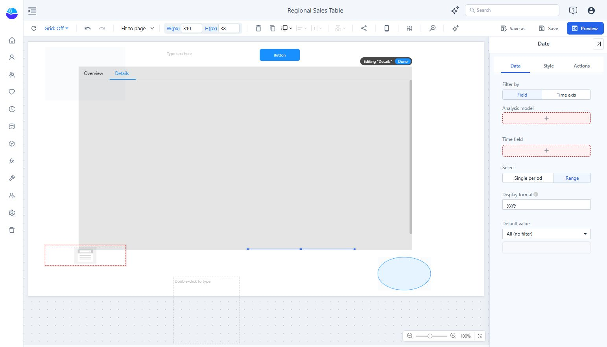

# Date Filter

Use **Components → Filters → Date** for a single time period or a date range.

## Configure the date field

1. Place the Date component and select it.
2. In **Data**, choose **Filter by → Field** to select an analysis model and **Time field**. Use **Time axis** when the report is configured to use that mechanism.
3. Choose **Single period** or **Range**.
4. Set **Display format** to match the granularity of the selected field.
5. Choose a **Default value**: **All (no filter)**, **Relative**, **Fixed**, or **Parameter**.
6. Configure linked components under **Actions → Interactions** and test the report in Preview.

The available periods depend on the time field's metadata. A year field cannot provide the same selection detail as a day field.

Use **Fixed** for a reproducible historical report. Use **Relative** for a moving reporting window, and verify its reference time and calendar boundaries. See [Relative Date Filtering](/documentation/Analysis/Relative-Date-Filtering/).

If the control says **Choose a date field**, complete its field binding before adjusting appearance or testing targets.
