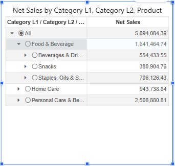
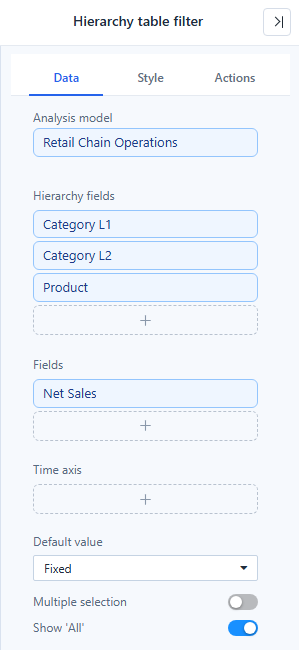

# Hierarchy Table Filter

The **Hierarchy table filter** shows a hierarchy as an expandable tree, optionally with measure columns, and filters linked components by the node the reader selects, for example *Food & Beverage › Snacks*.

## Set up

1. Add **Components → Filters → Hierarchy table filter**.
2. In **Data**, put the levels in **Hierarchy fields** from top to bottom, for example **Category L1**, **Category L2**, **Product**.
3. Optionally add measures to **Fields**; they are shown as columns next to the tree.
4. Choose the **Default value**, **Multiple selection** and **Show 'All'**.
5. In **Actions → Interactions**, check the **Linked components**.

The tree column header lists every level, joined with " / ": *Category L1 / Category L2 / Product*.

## Long levels: Show more

When **Style → Default expand level** is **None**, the first level and each expanded node load **1,000 members at a time**. A **Show more (1,000 of 3,452 shown)** row at the end loads the next batch. A parent whose children are not all loaded is not shown as fully selected. Exports are not limited.

## Style

| Setting | Where | Notes |
| --- | --- | --- |
| **Show** | Style → Header | Show or hide the header row. |
| **Fit columns to width** | Style → Grid | On for new filters: columns widen to fill the component; columns you resized keep their width. |
| **Default expand level** | Style | How many levels are expanded when the report opens. |
| Row height, fonts, colours | Style → Grid, Content | As in the [Tree table](/documentation/Visualization/Hierarchy-Table/). |

## Reader actions

- Click a node to select it; click **All** to clear. **Clear selections** in the filter toolbar does the same.
- **Reset filters** on a [Filter button](/documentation/Visualization/Filter-Button/) and **Refresh** return to the default value.
- The Hierarchy table filter does not take values from the URL, and it has no **Cascade other filters** switch.

Related: [Filters](/documentation/Visualization/Filters/) · [Creating Hierarchies](/documentation/Model/Creating-Hierarchy/)
