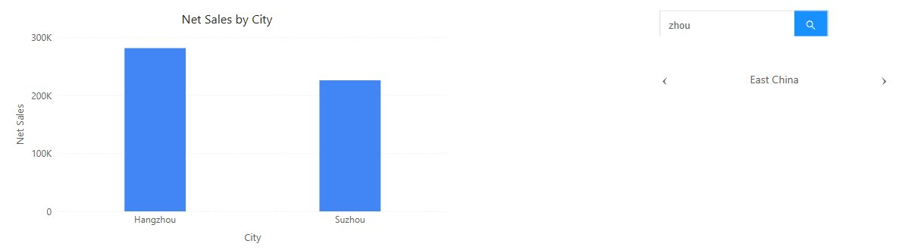

# Search and Paginate

## Search

**Search** filters linked components to the members whose name contains the keyword the reader types, for example *Shang* for Shanghai.

1. Add **Components → Filters → Search**.
2. In **Data**, choose the **Analysis model** and the **Search Field**, for example **City**.
3. In **Actions → Interactions**, check the **Linked components**. **Cascade other filters** is available here too.

Readers type a keyword and press Enter or click the search button. Special characters are matched literally. The keyword is kept when another filter changes, and **Clear selections** in the toolbar removes it.

## Paginate

**Paginate** shows one member at a time with **‹** and **›** arrows, for example to step through regions in a presentation.

1. Add **Components → Filters → Paginate**.
2. In **Data**, choose the **Analysis model**, the **Field** and, optionally, a **Default** member.
3. Check the **Linked components**.

With no selection the control shows **All**. From the first member, **‹** returns to **All**; **›** stops at the last member and does not wrap around. Paging also works in edit mode, where it sets the default and marks the report as changed. Paginate has no **Clear selections** button and no relative defaults.

Related: [Filters](/documentation/Visualization/Filters/) · [Linking and Cascading Filters](/documentation/Visualization/Filter-Subscriptions/)
