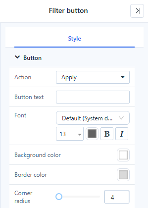
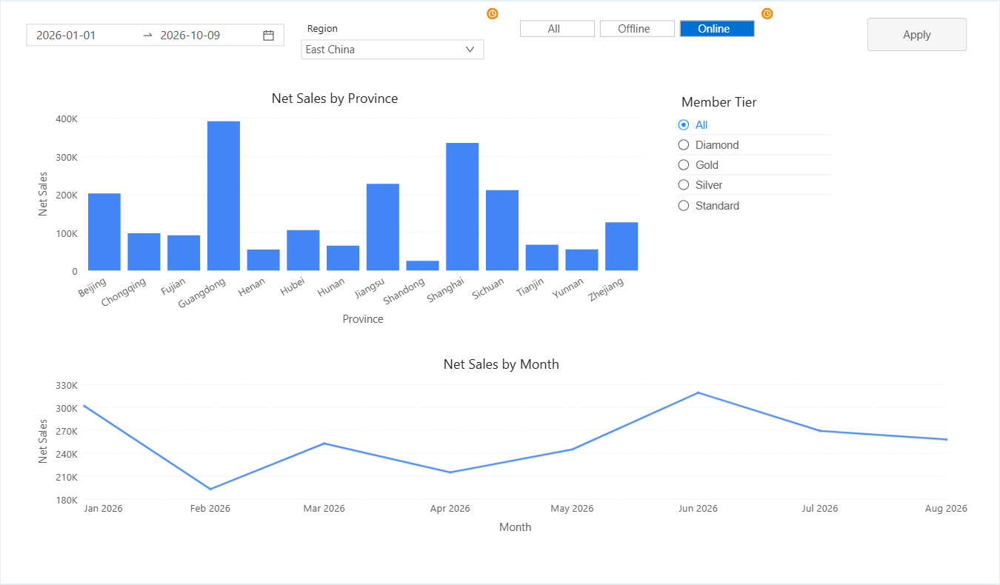
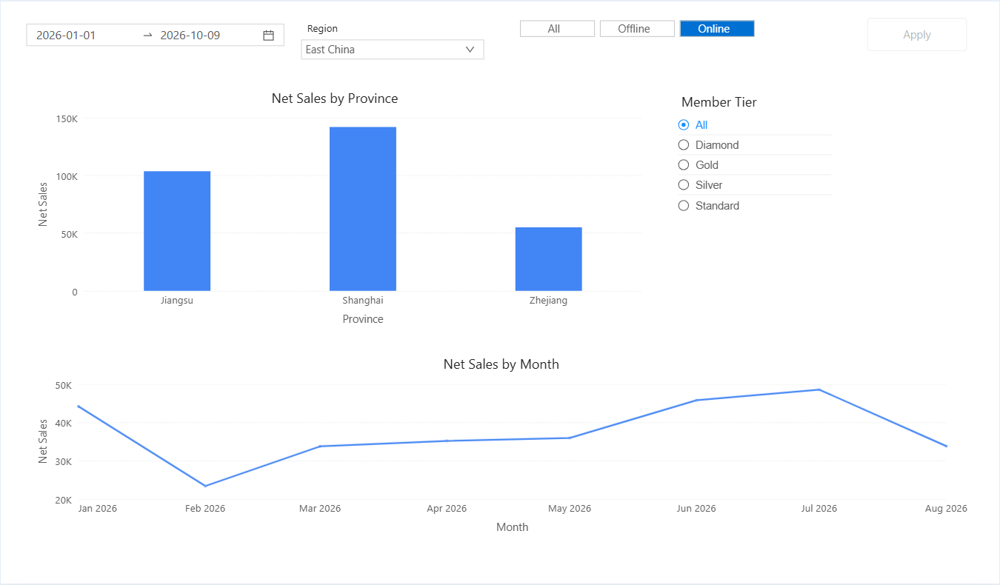

# Filter Button

A **Filter button** acts on all filters of the page at once. Choose what it does in **Style → Button → Action**:

| Action | Default text | Effect |
| --- | --- | --- |
| **Reset** | Reset filters | Returns every filter to the value it had when the page opened (including values passed in the URL) and clears cross-filtering between charts. Drill-downs are kept. |
| **Clear** | Clear filters | Sets every filter that can be cleared to **All**. Required single selections and Date components return to their default. |
| **Apply** | Apply | Turns the page into apply-on-demand mode: readers change several filters, and the charts query once, when they click **Apply**. |

The button also has **Button text**, **Font**, **Background color**, **Border color** and **Corner radius**. It only works when the report is opened or previewed; in edit mode it is faded with the tip *Available when the report is opened or previewed*. It is also faded when there is nothing to do, for example *All filters are at their initial values; nothing to reset*.

## Apply-on-demand mode

Put a Filter button with **Action → Apply** on the page when queries are expensive or readers usually change several filters together.

1. Add **Components → Filters → Filter button** and set **Action → Apply**.
2. Save and open the report.
3. Change one or more filters. The charts do not refresh yet; each changed filter shows an orange clock badge, and the button becomes active: *Filters have changed. Click to update the visuals*.
4. Click **Apply**. Each affected component queries once.

While changes are pending:

- Filters that cascade from a changed filter still update their own member lists.
- Cross-filtering by clicking a chart, drilling, paging and tab switches stay immediate, and use the last applied filter values.
- **Reset** and **Clear** buttons on the same page also apply pending changes; the report **Refresh** discards them.
- Changing a filter and changing it back leaves nothing to apply.

To return to immediate filtering, delete the Apply button.

## Notes

- Only filter components are affected. Filters bound to a parameter, and parameter controllers in older reports, are not reset, cleared or deferred.
- **Reset** does not clear the server cache; the report **Refresh** does.

Related: [Filters](/documentation/Visualization/Filters/)
