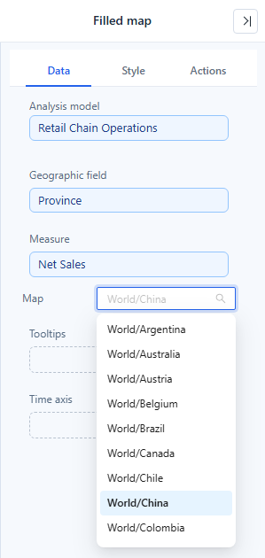

# Filled map

Colour geographic regions such as countries, provinces or states by a measure. It uses the GeoJSON maps maintained in [GeoJSON Map](/documentation/Tools/GeoJSON/) and needs no online map service.

Large regions draw attention regardless of their value. Decide whether an absolute total or a normalised measure (per head, per store, a rate) answers the question. To show values as sized markers instead, use [Marker map](/documentation/Visualization/GeoJSON-marked-map/).

## Bind regions and choose the map

1. Add **Components → Charts → Maps → Filled map** (480 × 360 px) and choose an **Analysis model**.
2. Bind **Geographic field** and **Measure**.
3. Choose **Map** in Data. The list is searchable; the initial selection is **World**. Changing the map resets the saved centre and zoom.
4. Add supporting **Tooltips**, a **Time axis** and any **Filters**.
5. Check a few known regions against the source data.

## How region values are matched

Each value of the Geographic field is looked up among the regions of the selected map, first among all region names, then among all codes, then among all aliases:

1. the region name (`name` in the GeoJSON),
2. the administrative code (`adcode`, the 6-digit code of Chinese administrative divisions, for example 110000 for Beijing),
3. the region aliases (`aliases`, maintained in the GeoJSON Map tool).

The first match is used. Matching is exact, including letter case and spaces. An empty value matches nothing.

- **Several spellings, one region**: rows that resolve to the same region (for example `广东`, `粤` and `广东省`) and have the same other members are merged into one data point. Their values are **summed**, the tooltip lists all spellings and cross-filtering uses the first row's member. Averages and ratios are summed too, so keep one spelling per region when the measure is not additive.
- **Colour scale**: its minimum and maximum come only from regions that match the map, so a misspelt row does not stretch the scale. If nothing matches, all rows are used.
- **Unmatched regions**: in edit mode a yellow box at the top left reads *{count} of {total} regions do not match the current map*; hover it for the names (up to 30). It is not shown in view mode or when everything matches. A value that matches a different region is not reported: on the World map "Georgia" is the country and "CA" is Canada. Choose the map that fits the data.
- **No data**: when the query returns no rows, the grey map stays and the [empty-data message](/documentation/Visualization/Empty-Data-and-Errors/) is drawn over it. The map can still be zoomed and panned, and the component menu (including going back after a drill) stays usable.

::: details Opening reports made before 10.00
- Region codes now match the right province. Before, some codes coloured a different province (110000 coloured Liaoning instead of Beijing, for example).
- A region's colour and tooltip could disagree when rows used several spellings; they now agree.
:::

## Data picker (colour bar)

**Style → Data picker** controls the colour bar.

| Option | Effect | Default |
| --- | --- | --- |
| **Range selector** | Shows the colour bar. Drag its round handles to limit the coloured value range. | On |
| **Layout orientation** | **Horizontal** or **Vertical**. | Vertical |
| **Position** | Top left, Top center, Top right, Left center, Right center, Bottom left, Bottom center, Bottom right. | Bottom left |
| **Show end text** | Text at both ends of the bar. | On |
| **High end text** / **Low end text** | Your own end texts; leave empty to show "High" / "Low". | Empty |
| **Show values** | Values next to the handles. | On |
| **Display units** | **Follow measure format**, **Auto** or a fixed unit ([Display Units](/documentation/Visualization/Display-Units/)). | New maps: Auto. Earlier reports: Follow measure format |
| **Decimal places** | **Auto** or 0–4. | Auto |
| **Font** | Font of the end texts and values. | 12 px, #333, report font |

- **Follow measure format** uses the measure's own format, including units, decimals, prefix and suffix.
- With colour rules (below) there are no end texts; each rule's range is labelled instead, using **Display units** and **Decimal places**.
- In edit mode, dragging a handle moves the handle, not the component.

::: details Opening reports made before 10.00
- The old horizontal and vertical position settings become **Position**: a bar that was centred in the middle of the map moves to Bottom center; an unset position becomes Bottom left.
- The bar's text changes to the report's default font, and the end texts sit a little further from the bar so they no longer overlap the handles.
:::

## Colour rules

**Style → Data colors → Color** colours the regions with a gradient by default. In rule mode it uses the shared rules editor ([Conditional Formatting](/documentation/Visualization/Conditional-Colors/)). On the map:

- When rules overlap, the earlier rule wins. A partly covered rule shows only its remaining range in the colour bar; a fully covered rule has no entry.
- 0 is a real boundary; an empty boundary means no limit; text that is not a number matches nothing.
- Greater than, at least, less than and at most are applied exactly; "less than 100" does not include 100. Percent boundaries are taken between the colour scale's minimum and maximum.
- Regions that match no rule get **Color for other values** when it is on, otherwise **Default fill color**.
- Turning colour rules off restores the gradient at once.

## Region, roam and tooltip

| Group | Option | Effect | Default |
| --- | --- | --- | --- |
| **Region** | **Show region name** | Draws region names. | Off |
| | **Font** | Font of the region names. | — |
| | **Default fill color** | Fill of regions without data. | — |
| | **Border** | Region border. | 1 px, white, solid |
| **Roam** | **Roam** | **Close**, **Zoom**, **Move** or **Zoom and move** for readers. | Zoom and move |
| **Tooltip** | **Show Tooltip** | Data tooltip on hover ([Tooltips](/documentation/Visualization/Tooltips-for-Chart-Components/)). The tooltip closes when the pointer leaves the map. | On |

Pan and zoom the map in edit mode and save the report to keep that view.

**Mouse wheel in the editor**: when **Roam** includes zooming, the wheel scrolls the report page; hold **Ctrl** (**⌘** on Mac) and scroll, or pinch on a touchpad, to zoom the map. A hint, *Hold Ctrl and scroll to zoom the map*, appears for 1.5 s. In view mode and in the enlarged view the wheel zooms the map.

Maps added in this version keep the shape of the GeoJSON map inside the component instead of being stretched to the component's proportions.

## China map

On the China map the South China Sea islands are drawn at a smaller scale in a framed inset at the bottom right of the map. The inset is labelled `南海诸岛` in every interface language and does not react to the pointer. The islands in the inset take the colour of Hainan. Because the islands no longer extend the map area to the south, the mainland is drawn larger in a component of the same size.

::: details Opening reports made before 10.00
- If a China map was panned or zoomed and that view was saved, it looks different after the upgrade: the map appears larger and may be partly cut off. Open the report in edit mode, adjust the position and zoom of the map, and save it again. Maps without a saved view are not affected.
:::

## Drill down and switching

- [Drill down](/documentation/Analysis/Drill-down/) from a region to its sub-regions needs a sub-map for that region in the GeoJSON Map tool. Without one the map shows *No GeoJSON map available for this region*.
- **Chart switch** lists Marker map first; the fields and the selected map carry over.
- Clicking a region can [cross-filter](/documentation/Analysis/Cross-Filtering/) other components.
