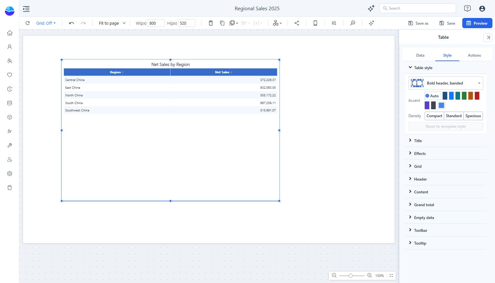
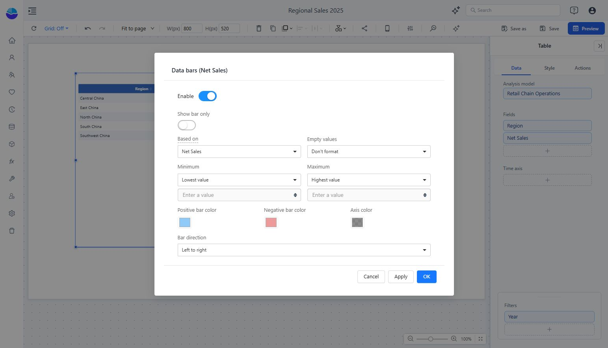

# Table

Use **Table** for a flat list of categories and measures. Use a **Pivot table** when a dimension must also run across columns.

## Build a table

1. Add **Components → Charts → Tables → Table**.
2. Select an **Analysis model** in **Data**.
3. Add the required dimensions and measures to **Fields**. For example, use **Region** and **Net Sales**.
4. Arrange the fields in the order readers should see them. Add conditions under **Filters** if needed.

The example groups Net Sales by Region. A table does not automatically mean raw source rows: its dimensions and measure aggregation determine the query result.

## Apply a complete style

Open **Style → Table style**. Choose a preset, then an **Accent** and **Density**. Presets include Minimal, Banded rows, Bold header, Grid, Three-line, and dark variants.

**Page default** follows the page's table style. Appearance settings changed individually can override a preset. **Reset to template style** clears those appearance overrides; its help text states that conditional formatting, column widths, and alignment are retained.

Use **Header**, **Content**, **Grid**, and **Grand total** for more specific changes.

## Format a field

In **Data → Fields**, hover a field and open **More function**. For a measure, the menu includes **Format**, **Font color**, **Background color**, **Data bars**, and **Icons**.

To add data bars:

1. Open the measure's **Data bars** dialog and turn on **Enable**.
2. Choose the **Based on** field and how to handle empty values.
3. Set the minimum and maximum, positive and negative colors, and bar direction.
4. Click **Apply** to inspect the result or **OK** to apply and close.

Keep numeric text visible when readers need exact values; use **Show bar only** only when the bar itself is sufficient.

## Check the result

Confirm sorting, number formats, and totals. A ratio or distinct count can have a valid total that differs from the sum of visible rows. Check the measure definition rather than forcing a sum.
