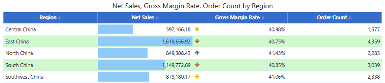
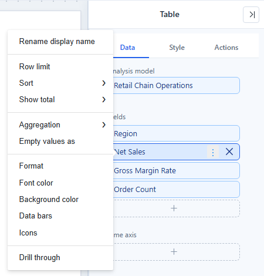

# Table

A **Table** shows the fields in **Fields** as columns, with one row for each combination of dimension members. Use a [Pivot table](/documentation/Visualization/Pivot-Table/) when a dimension must also run across the columns, and a [Tree table](/documentation/Visualization/Hierarchy-Table/) when rows should expand level by level.

## Build a table

1. In **Components → Charts → Tables**, click **Table**, then click the canvas. A new table is 480 × 300 px.
2. On **Data**, choose the **Analysis model**.
3. Add fields to **Fields** in the order the columns should appear, for example *Region, Net Sales, Gross Margin Rate, Order Count*. Dimensions and measures can be mixed.
4. Add **Filters** if the table should show only part of the data.

Rows are aggregated: each row is one combination of the dimension members, and each measure uses its own aggregation. The table lists single records only if its dimensions identify them.

The title defaults to *{measures} by {dimensions}* and follows your field changes until you edit it.

## Field menu

Hover a field in **Fields** and click **⋮**. A measure offers:

| Item | What it does |
| --- | --- |
| **Rename display name** | Changes the column header. |
| **Row limit** | Keeps the top or bottom N rows by a measure. On a dimension, **Group the rest as "Others"** adds one row for the remaining members. |
| **Sort** | Sorts by the column. Readers can also click the header. |
| **Show total** | **Shown** or **Hidden**: whether the measure appears in the total row. |
| **Aggregation** | Changes the aggregation, for example *Avg* instead of *Sum*. |
| **Empty values as** | Shows a placeholder, such as `-`, in empty cells. A real 0 is not empty. |
| **Format** | Sets the number format of the column. |
| **Font color**, **Background color**, **Data bars**, **Icons** | Conditional formatting. See [Conditional Formatting](/documentation/Visualization/Conditional-Colors/). |
| **Drill through** | Opens another report or a URL from a cell. |

A sliders icon on a field means it has data settings, such as a changed aggregation, a row limit or **Empty values as**; hover it to see them.

## Style

The **Style** tab starts with **Table style**, which sets the whole look in one click. See [Table Styles](/documentation/Visualization/Table-Styles/). The other groups change single parts:

| Group | Main settings |
| --- | --- |
| **Grid** | **Grid line direction** (All, Horizontal only, Vertical only, None), **Top and bottom rules**, odd and even row background, hover colour, **Row height**, **Column size**, **Fit columns to width** |
| **Header** | **Headers alignment**, background, font, **Header divider**, **Text wrap** |
| **Content** | Font, **Text wrap**, **Column alignment**, **Row number**, **Freeze columns** |
| **Grand total** | **Grand total** on or off, **Caption** (default *Grand total*), background, font, **Total divider** |
| **Empty data** | The message shown when the query returns no rows |
| **Tooltip** | **Show full text on hover**: shows the complete cell text when it is cut off |

Layout behaviour worth knowing:

- **Fit columns to width** (on for new tables) widens the columns you have not resized so the table fills the component. Columns you dragged keep their width. Tables wider than the component are not changed.
- **Freeze columns** (0–20) keeps the first columns in place when readers scroll sideways. If the number is larger than the columns that can be frozen, or the component is too narrow, fewer columns are frozen.
- **Column alignment** lists each column with its full header path. Columns hidden by the current filter keep their saved alignment.
- When the rows do not fill the component, the total row sits directly under the last row; otherwise it stays at the bottom.
- Style changes keep the scroll position.
- Cell text is shown as plain text: HTML in data values is not rendered.

## Totals and limits

- **Totals.** A ratio or distinct count is recalculated for the total row, so it does not equal the sum of the rows. That is correct; check the measure definition.
- **Truncated results.** If the page's **Max query records** cuts the result, a warning icon in the bottom-right corner shows *Showing the first … of … rows*. Add a filter or a row limit.
- **Number format.** Set the format on the field or in the model; *Empty values as* placeholders are not exported.

Related: [Table Styles](/documentation/Visualization/Table-Styles/) · [Conditional Formatting](/documentation/Visualization/Conditional-Colors/) · [Export](/documentation/Visualization/Export/)
