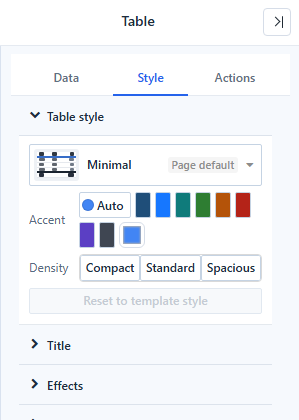
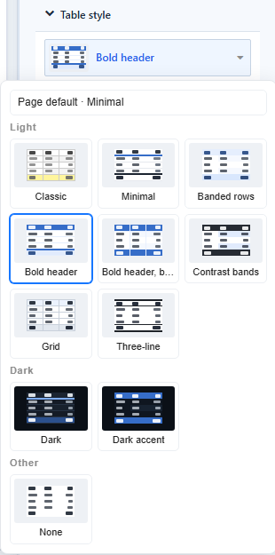

# Table Styles

A table style sets the header, banding, grid lines, subtotal and total colours and row height of a table in one step. It is available on **Table**, **Pivot table**, **Tree table** and **Parent-child table**, in **Style → Table style**.

## Choose a template

Click the template button to open the gallery.

| Group | Template | Look |
| --- | --- | --- |
| Light | **Classic** | The appearance of tables before 9.04.6. |
| | **Minimal** | Plain header with an accent line, horizontal lines only. |
| | **Banded rows** | Tinted header and alternating tinted rows, no grid lines. |
| | **Bold header** | Solid accent header with white text, horizontal lines. |
| | **Bold header, banded** | Solid accent header, banded rows, vertical lines. |
| | **Contrast bands** | Dark header and total, strong bands. |
| | **Grid** | All grid lines, light grey dimension columns. |
| | **Three-line** | Academic style: rules above, below and under the header only. |
| Dark | **Dark**, **Dark accent** | Dark component background with light text. |
| Other | **None** | Transparent, bold header only. |

**Accent** colours the template: **Auto** uses the first colour of the report's colour scheme, or pick one of eight presets or **Custom color**. Classic, Three-line and None have no accent. On solid accent fills the text switches between white and dark so it stays readable.

**Density** sets the row height: **Compact**, **Standard** or **Spacious** (22, 28 or 36 px for most templates).

## Templates and your own settings

- A setting you change on the table, such as the header font colour, overrides the template. The control shows **↺** after its label; click it to go back to the template value.
- Changing the template keeps the settings you changed.
- **Reset to template style** clears all appearance changes. Conditional formatting, column widths and alignment are kept.
- Templates never change font size, font family, column widths, alignment or conditional formatting.

## Page default

A table without its own template follows the report's default template, shown as **Page default** in the picker.

- New reports use **Minimal** as the page default. The first item in the gallery, **Page default · Minimal**, removes the table's own template.
- Reports created before 9.04.6 have no page default, so their tables, including tables you add later, use **Classic**.

## Related settings

The templates use four settings that you can also change yourself:

| Setting | Where |
| --- | --- |
| **Grid line direction**: All, Horizontal only, Vertical only, None | Style → Grid |
| **Top and bottom rules** (0–4 px) | Style → Grid |
| **Header divider** (0–4 px) | Style → Header |
| **Total divider** (0–4 px) | Style → Grand total |

**Export as Excel** writes the table style into the workbook. See [Export](/documentation/Visualization/Export/).

Related: [Table](/documentation/Visualization/Table/) · [Pivot table](/documentation/Visualization/Pivot-Table/) · [Conditional Formatting](/documentation/Visualization/Conditional-Colors/)
