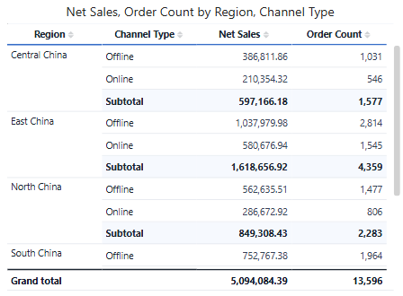
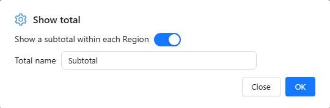

# Pivot table

A **Pivot table** shows measures at the intersection of row fields and column fields, for example Net Sales by Region down the side and Year across the top.

## Build a pivot table

1. In **Components → Charts → Tables**, click **Pivot table**, then click the canvas.
2. On **Data**, choose the **Analysis model**.
3. Add fields to **Rows**, **Columns** and **Measures**. Example: *Region* and *Channel Type* in Rows, *Net Sales* and *Order Count* in Measures.
4. Drag a field between **Rows** and **Columns** to pivot it.

Start with one row field and one column field, check the numbers, then add detail. A Pivot table without column fields looks like a [Table](/documentation/Visualization/Table/) but keeps pivot features such as subtotals and merged row headers.

## Subtotals and grand total

**Subtotals** are set per row or column field: hover the field, click **⋮ → Show total**.

| Field | Dialog | Default name |
| --- | --- | --- |
| First field on the axis (for example *Region*) | **Enable** | *Total of {field}* |
| Inner field (for example *Channel Type*) | **Show a subtotal within each {parent}** | *Subtotal* |

Type a **Total name** to replace the default.

Then, on **Style**:

- **Sub total → Subtotal at**: **Top** or **Bottom** of each group, plus background and font.
- **Grand total → Grand total** turns the overall total row on; **Caption** defaults to *Grand total*.

Clicking a subtotal or total cell does not filter other components. Row numbers skip subtotal and total rows.

::: tip Two different "Show total" items
On a **row or column field**, **Show total** adds a subtotal. On a **measure**, **Show total → Hidden** leaves that measure blank in all subtotal and total rows, which is useful for measures that must not be added up.
:::

## Layout

| Setting | Where | Notes |
| --- | --- | --- |
| **Merge rows** | Style → Content | Shows a repeated outer row value once per group. |
| **Row headers**, **Row headers background** | Style → Content | Font and fill of the row-field columns. The background can be transparent. |
| **Row number** | Style → Content | Adds a numbering column (60 px wide). |
| **Column size**, **Row height** | Style → Grid | Default widths; drag a header border to resize one column. |
| **Column alignment** | Style → Content | Per column, listed with the full header path such as *2025 › Net Sales*. |

The row-field columns stay frozen while readers scroll sideways, as long as they fit in the component. **Fit columns to width** is not available on Pivot tables.

Templates, conditional formatting, data bars and icons work as on the Table. See [Table Styles](/documentation/Visualization/Table-Styles/) and [Conditional Formatting](/documentation/Visualization/Conditional-Colors/).

## Totals and known issues

- A ratio or distinct count in a subtotal is recalculated, not summed.
- Do not turn on **Show total** for the first row field while **Grand total** is on: both produce the same overall total row.
- Known issue in 10.00: with a subtotal on an inner **column** field and two or more measures, the subtotal columns do not show every measure. Put that field on Rows, or use one measure.

Related: [Table](/documentation/Visualization/Table/) · [Tree table](/documentation/Visualization/Hierarchy-Table/) · [Export](/documentation/Visualization/Export/)
