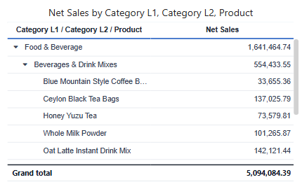

# Tree table

A **Tree table** puts the levels of a hierarchy into one indented column that readers expand level by level, with measures or other fields in the columns next to it. Each level is queried when it is expanded, so large hierarchies stay fast.

## Build a tree table

1. In **Components → Charts → Tables**, click **Tree table**, then click the canvas.
2. On **Data**, choose the **Analysis model**.
3. Add the levels to **Hierarchy fields**, from the broadest to the most detailed, for example *Category L1*, *Category L2*, *Product*.
4. Add measures or other fields to **Fields**.
5. Set **Style → Content → Default expand level** to choose how many levels are open when the report loads.

The tree column header lists the levels, such as *Category L1 / Category L2 / Product*.

## Style

Tree tables use the same [Table Styles](/documentation/Visualization/Table-Styles/), **Grid**, **Header** and **Grand total** settings as the Table. **Fit columns to width** is on for new tree tables. Most style changes keep expanded nodes open; settings that re-query the data, such as turning on **Grand total**, collapse the tree again.

Not available on Tree tables: **Font color**, **Background color**, **Data bars**, **Icons** and **Empty values as** on measures, **Freeze columns**, **Row number** and **Column size**. Use a [Table](/documentation/Visualization/Table/) or [Pivot table](/documentation/Visualization/Pivot-Table/) when you need them.

## Export

**Export as Excel** writes one indented tree column with Excel outline groups, so readers can collapse levels in Excel. See [Export](/documentation/Visualization/Export/).

## Tree table or parent-child table

| Your data | Use |
| --- | --- |
| Separate level columns: category, subcategory, product | **Tree table** |
| One ID column and one parent ID column: employee and manager, account and parent account | [Parent-child table](/documentation/Visualization/Parent-Child-Table/) |

To let readers filter other components by picking nodes of a hierarchy, use the [Hierarchy table filter](/documentation/Visualization/Hierarchy-Table-Filter/).

Related: [Table](/documentation/Visualization/Table/) · [Creating Hierarchies](/documentation/Model/Creating-Hierarchy/)
