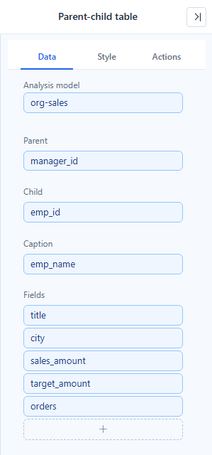
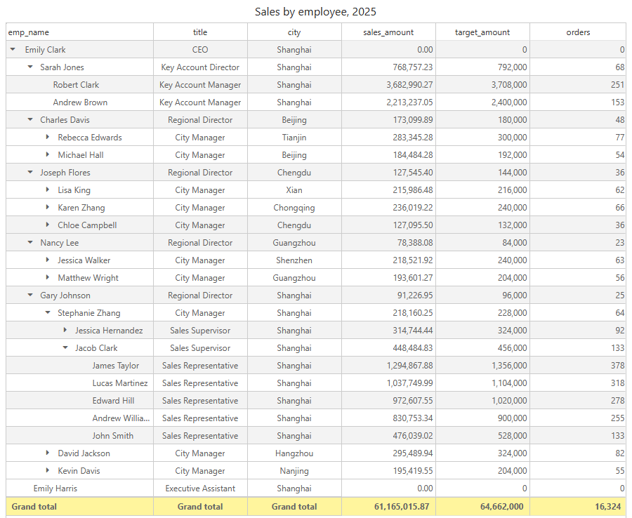
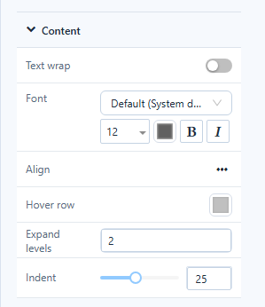

# Parent-child table

A **Parent-child table** builds a tree from records that point to their parent: an employee and their manager, an account and its parent account, a department and the department above it. The depth comes from the data, so it does not need to be known in advance, and different branches can have different depths.

## Tree table or parent-child table

If your hierarchy is stored as separate level columns (category, subcategory, product), use the [Tree table](/documentation/Visualization/Hierarchy-Table/) instead.

## Build a parent-child table

1. In **Components → Charts → Tables**, click **Parent-child table**, then click the canvas.
2. On **Data**, choose the **Analysis model** and fill the fields. **Parent**, **Child** and **Caption** take one dimension each; the table stays empty until all three are filled.

| Field | Put here | Example |
| --- | --- | --- |
| **Parent** | The parent's ID | `manager_id` |
| **Child** | The record's own ID | `emp_id` |
| **Caption** | The text shown in the tree column | `emp_name` |
| **Fields** | Measures and other attributes shown as columns | `title`, `sales_amount` |

3. Optional: set **Style → Content → Expand levels** to choose how much of the tree is open when the report loads.

Readers open and close branches with the arrow in front of each name.

## Example: a sales organisation

The *org-sales* model holds one row per employee per month for 2025: `emp_id`, `manager_id` (empty for the CEO), `emp_name`, `title`, `department`, `city`, `month`, and the measures `sales_amount`, `target_amount` and `orders`. There are 80 employees in five levels, from the CEO down to sales representatives.

Bind **Parent** to `manager_id`, **Child** to `emp_id`, **Caption** to `emp_name`, and put `title`, `city`, `sales_amount`, `target_amount` and `orders` in **Fields**:

The CEO, Emily Clark, has no manager and becomes the only top-level row. With **Expand levels** set to 2 and two more branches opened by hand, the table looks like this:

Use `month` as a filter, not in **Fields**. See [Fields with several values per record](#fields-with-several-values-per-record).

## How values are shown

- **A parent row shows its own record.** The table does not add up the values of the rows below it. Gary Johnson, a regional director, shows 91,226.95: his own sales, not those of the 24 people in his branch. The CEO shows 0.00 because her own rows hold 0.
- **Grand total** (**Style → Grand total**, off by default) is the total of all data under the current filters, calculated by the server. In the example it is 61,165,015.87, although the top-level row shows 0.00.
- Measures are aggregated per record over the current filters: without a filter, each employee's row is the sum of their 12 months.
- Rows under the same parent are listed in order of their **Child** ID (E1016, E1026, E1029 … under the CEO). There is no sort option, and clicking a column header does not sort.
- The same name can appear in several rows. Records are told apart by their **Child** ID, so the two employees called John Smith are two separate rows.

### Which rows become top-level rows

The **Parent** value of each row is compared, as text, with the **Child** values of the other rows. A row becomes a top-level row when its parent is empty, equals its own ID, or is not found among the rows the query returned.

- **Filters** can therefore move rows to the top. Filter `department` to *East Region*: the CEO's row is filtered out, so Gary Johnson becomes the top-level row of the East Region tree.
- **A record with two parent rows** appears under each parent, each time with the values of its own row.
- **A cycle** (A is the parent of B and B is the parent of A) does not empty the table: one record of the cycle becomes a top-level row and the others are shown below it. Which one depends on the order in which the query returns the rows.
- If no row ends up with a row below it, the table shows *No row has a parent: check that the parent ID and child ID fields use the same set of IDs. For an ordinary level hierarchy use the Tree Table instead*. Check that **Parent** and **Child** hold the same kind of ID, for example both employee numbers, not a number and a name.

### Fields with several values per record

Each field in **Fields** must have one value per record, as `title` and `city` do. A field with several values per record, such as `month`, splits the record into several query rows, and the tree keeps only the first of them. With `month` in **Fields**, every employee shows January only, while **Grand total** still shows the whole year. To look at one month, add `month` under **Filters** or use a filter component on the page.

## Expand levels

**Style → Content → Expand levels** counts the levels below the top-level rows that are open when the report loads:

| Expand levels | Visible in the org-sales example |
| --- | --- |
| 0 | The top-level row only, closed (1 row) |
| 1 (default) | The CEO and her six direct reports (7 rows) |
| 2 | Three levels (19 rows) |
| 3 | Four levels (35 rows) |
| 4 or more | The whole tree (80 rows) |
| Empty | The whole tree. Clearing the box takes effect the next time the table loads. |

**Indent**, in the same group, sets the indent per level in pixels (5–50, default 25).

## Clicking a row

Clicking a name or a measure cell filters the components set in **Actions → Interactions → Linked components** to that one record. Clicking Gary Johnson's sales filters a monthly sales table to his own monthly sales, not to his branch. Click the cell again to clear the filter. Clicking a dimension column from **Fields**, such as `title`, does not filter. See [Cross-Filtering](/documentation/Analysis/Cross-Filtering/).

## Style and field options

- The **Style** tab has the Table groups **Table style** (see [Table Styles](/documentation/Visualization/Table-Styles/)), **Grid** (including **Row height** and **Fit columns to width**), **Header** and **Grand total**. **Content** has **Text wrap**, **Font**, **Align**, **Hover row**, **Expand levels** and **Indent**. Column size, row numbers and frozen columns are not available.
- Field menus (**⋮** on a field) offer less than on a Table:

| Field | Menu items |
| --- | --- |
| **Parent**, **Child** | **Show items with no data** |
| **Caption**, dimensions in **Fields** | **Rename display name**, **Row limit** |
| Measures in **Fields** | **Rename display name**, **Row limit**, **Format** |

Sorting, aggregation, **Empty values as**, conditional formatting (font and background colour, data bars, icons) and drill-through are not available.

## Data, export and limits

- The table loads all its rows at once, without paging, and builds the tree in the browser. For a large hierarchy, add filters so that only the part you need is loaded.
- **Data preview** (component **⋮**) lists the query rows flat: one row per record, with the **Parent**, **Child** and **Caption** fields as the first columns.
- **Export as Excel** and **Export as csv** (component **⋮ → Export**) also write the flat query rows, not the indented tree. See [Export](/documentation/Visualization/Export/).

Related: [Tree table](/documentation/Visualization/Hierarchy-Table/) · [Table](/documentation/Visualization/Table/) · [Cross-Filtering](/documentation/Analysis/Cross-Filtering/)
