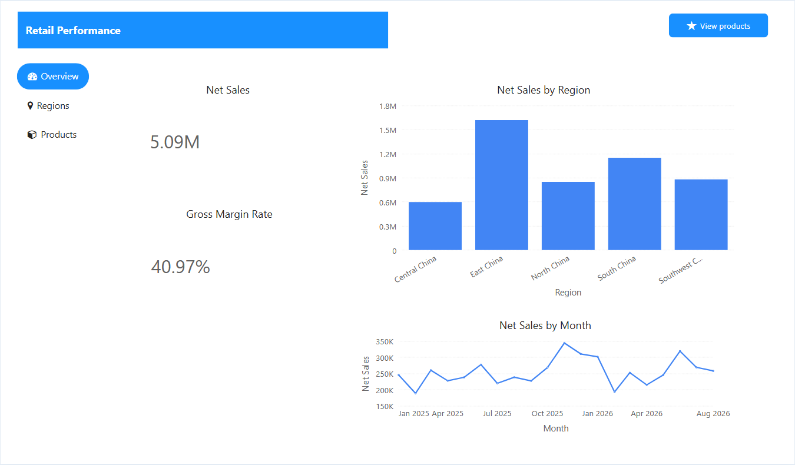
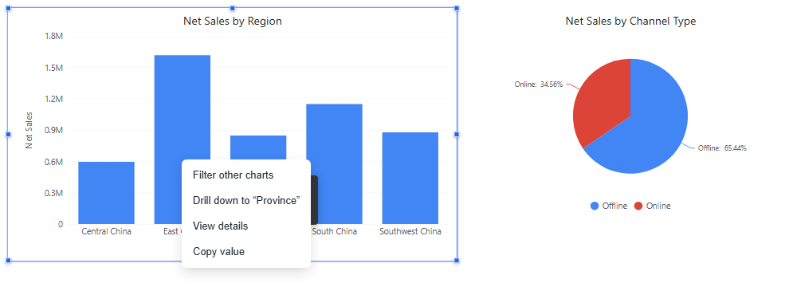
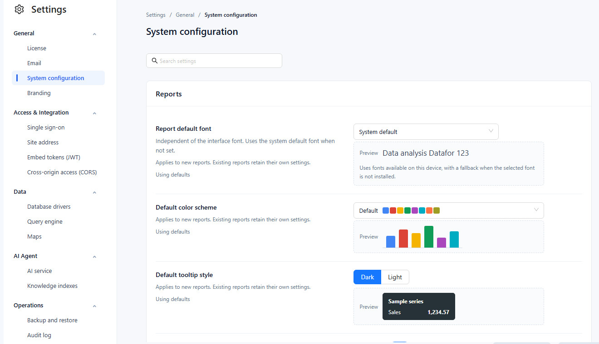
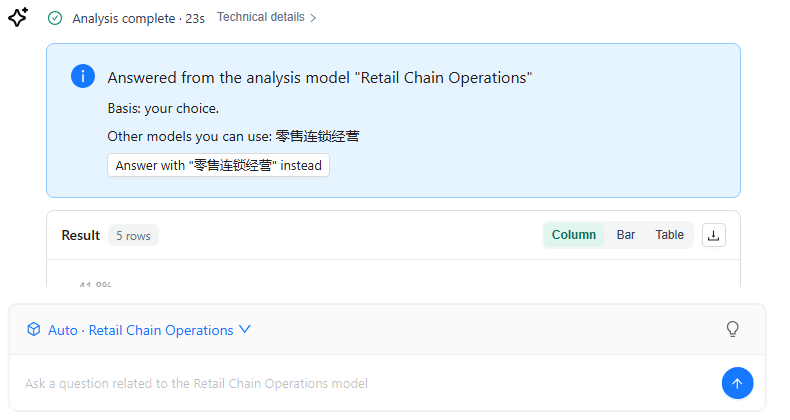

# **v10.00 Release Notes**

**Release date:** October 2026. 10.00 is the first release after **9.04** (September 2026). This note covers every change since 9.04, including those in the 9.04.x update packages.

10.00 is mainly a report-designer release. Filters were rebuilt around a single Date component, parameter binding and a Filter button that can hold back queries until the reader clicks **Apply**. Tables gained style templates and cell elements (font and background colour, data bars, icons) that survive Excel export. Tabs and the assist components were redesigned. Display units, colour schemes, legends and tooltips now behave the same across charts, and readers get a drill path, a data point menu and a list of the conditions that filter each component. The console adds a **System configuration** page and a reorganised Settings area. Metrics can be generated from an existing analysis model, and the AI Agent can choose the model by itself and explain why a number changed.

The release also fixes several permission and data-isolation defects. **We recommend upgrading every installation**, and reading [Upgrade notes](#upgrade-notes) before you do.

## Highlights

### 1. Filters, rebuilt

- **One Date component.** The four date components are now a single **Date** tile. Switch **Filter by** (Field / Time axis) and **Select** (Single period / Range) in place; subscriptions and references are kept. The Time axis gains a **Quarter** granularity. New Date components start with **All (no filter)**.
- **Relative dates that say what they mean.** Presets were renamed so one name means one range (*This Month* vs *Month to Date*, *Last 3 Calendar Months* vs *Last 365 Days*), wrong ranges were fixed, and **Last N days/months/years now include today**. Every relative list ends with **Custom…**: direction, N, unit, rolling or calendar, include or exclude the current period, and an optional shift back (for example, the last 7 days one year ago).
- **Relative defaults on list filters.** Dropdown, List box, Button group and Radio/Checkbox bound to a year, quarter, month, week or day field can default to a relative period (This Month, Last Month, Same Month Last Year…), computed from the viewer's date each time the report opens.
- **Filter button** (new). **Reset** returns every filter to its opening value, **Clear** sets clearable filters to All, and **Apply** turns the page into apply-on-demand mode: readers change several filters and the charts query once, when they click **Apply**.
- **Bind a filter to a parameter.** Dropdown, List box, Button group, Radio/Checkbox, Numeric slider and Date have **Data → Data source: Model field | Parameter**. The panel lists the report and global parameters; the ones a control cannot use are greyed out with the reason. The separate parameter controllers left the palette (old reports keep working), and **Range filter** merged into **Numeric slider**.
- **Large member lists.** List-type filters load the first 1,000 members and search all members on the server as you type. The Hierarchy table filter loads 1,000 members per level with **Show more**.
- **Cascading keeps valid choices.** When an upstream filter changes, downstream selections that still exist are kept. **Actions → Interactions → Cascade other filters** links all filters on the same model in one switch.
- **Filter layout.** **Title → Position** (Top or Left) on Dropdown, Button group, Radio/Checkbox, Search, Date and Paginate. Dropdown and Date have an input box of fixed height with **Content alignment** and **Control size** instead of a box stretched to the component, and Date styles the **Component frame** and the **Input box** separately.
- **Refresh** in view mode restores every filter to its opening value, and a reader's date choice no longer overwrites the saved default. The Dropdown **Value changed** script now runs. **Less than or equal** and **Greater than or equal** on the Numeric slider filter by one end only.
- Saved values that no longer exist in the data are shown in red with a strikethrough and still applied. Filter toolbars add **Clear selections** and, for Date, **Reset to default**. The first day of the week now comes from System configuration.

[Filters](/documentation/Visualization/Filters/) · [Date](/documentation/Visualization/Datepicker/) · [Numeric slider](/documentation/Visualization/Number-Range-Filter/) · [Relative Date Filtering](/documentation/Analysis/Relative-Date-Filtering/) · [Parameter Controllers](/documentation/Analysis/Parameter-Controllers/)

### 2. Tables: style templates, cell elements, and Excel export that keeps the formatting

- **Table style** (first group of Style) for Table, Pivot table, Tree table and Parent-child table: 11 templates (Classic · Minimal · Banded rows · Bold header · Bold header, banded · Contrast bands · Grid · Three-line · Dark · Dark accent · None), an **Accent** that follows the report's colour scheme or one of 8 presets, and three densities. Changed settings show ↺ to return to the template value. New reports start with **Minimal**; existing reports keep **Classic**.
- **Cell elements** on Table and Pivot table measures (field menu): **Font color**, **Background color**, **Data bars** and **Icons**, in one dialog layout. Gradients get a middle colour, presets and fixed ends; rules get per-boundary Number/Percent, Move up/down, an overlap warning and **Color for other values**. **Scope → Whole row** colours the entire row when a rule matches. **Apply to** chooses values, totals or both; **Empty values** can be left alone, treated as zero or given a colour.
- **Export as Excel** now writes the page styles (template fills, fonts, grid lines, row heights, column widths, alignment, frozen panes), conditional font and background colours, and native Excel data bars. Tree tables export as one indented, outline-grouped column.
- **Fit columns to width** (on for new tables), more reliable **Freeze columns**, the total row directly under the last row, **Grand total** as the default caption (no more "#Total"), **Empty values as** that now works in tables, **Subtotal** naming for inner pivot fields, and **Show full text on hover** (renamed). Style changes keep the scroll position and expanded nodes.

[Table](/documentation/Visualization/Table/) · [Table Styles](/documentation/Visualization/Table-Styles/) · [Pivot table](/documentation/Visualization/Pivot-Table/) · [Conditional Formatting](/documentation/Visualization/Conditional-Colors/) · [Export](/documentation/Visualization/Export/)

### 3. Tabs and assist components

- **Tabs**: the tab bar can sit on any side (vertical on the left and right); five styles (**Underline**, **Card**, **Pill**, **Button group**, **Text only**) driven by colour settings instead of three themes; Small/Medium/Large/Custom sizes; **Tab width** Auto/Fill equally/Fixed; **When tabs overflow** Scroll/Wrap. Each tab can have an icon and a tooltip, be hidden in preview, or be the default tab. Components move into and out of tabs by clicking, dragging, or right-click **Move to tab / Move out to page**, with undo. **Hide tab header** keeps the bar visible but faded while you edit.
- **Assists** palette: Text, Rich text, Image, Icon, Shape, Action button, Web page, AI insight, Tabs.
  - **Action button** (was Image button) works without data, has Fill/Outline/Text/Image styles with Default/Hover/Pressed/Disabled states and icons, a **Disable condition**, and click actions such as opening a report page or link, switching tabs, resetting or clearing filters, exporting PDF, full screen and **Open AI insight**.
  - **Shape** replaces Rectangle, Line and Ellipse: 13 types including arrows, star and callout, style presets, gradient fills, text with dynamic values, and click actions. Old shapes show **Convert to shape**.
  - **Rich text** toolbar: headings, strikethrough, highlight, links, indent, divider, clear formatting, dynamic values and value blocks that match the surrounding text.
  - **Icon** merges font icons and SVG: an 862-icon library, uploaded SVG, scaling with the component, rotation, flip and background shapes.
  - **Web page**: dynamic values in the URL, **Auto refresh**, **Allow full screen** and **Click through**.
  - **AI insight**: analyse the **Whole page**, the **Current tab page** or **Selected components**.
- **Visibility** for every assist component: Always, Hidden in preview, or by report parameter, current user or current role. **Dynamic values** share one syntax everywhere: `{{param.name}}`, `{{filter.name}}`, `{{date:YYYY-MM-DD}}`, `{{user.name}}`, `{{page.title}}`.

[Tabs](/documentation/Visualization/Multi-Tabbed-Page/) · [Assist Components](/documentation/Visualization/Assist-Components/) · [Action button](/documentation/Visualization/Action-Button/) · [Shapes](/documentation/Visualization/Shapes/) · [Rich text](/documentation/Visualization/TextBox/) · [Icon](/documentation/Visualization/Icon/) · [Click Actions and Visibility](/documentation/Visualization/Click-Actions-and-Visibility/) · [Dynamic Values](/documentation/Visualization/Dynamic-Values/) · [AI insight](/documentation/AI-Agent/Insight-Component/)

### 4. Formatting that works the same in every chart

- **Display units** and **Decimal places** for data labels on 15 chart types, Measure card values, Gauge values and ticks, reference-line labels and the Filled map picker. **Auto** keeps a unit already set in the measure format, otherwise picks K/M/B (万/亿 in Chinese and Japanese). New components use Auto; existing reports keep **Follow measure format**.
- **Page → Style → Chart palette**: six colour schemes (Default, Classic, Colorblind-friendly, Pastel, Paired, Dark) and **Consistent member colors**, so a member keeps its colour in every chart and after filtering or sorting (on for new reports).
- **Legends** remember hidden series, isolate a series on double-click and can wrap instead of paging. **Tooltips** can sort by value, show the total and each share, and highlight the hovered series. **Page → Style → Tooltip** sets a Dark or Light tooltip style for the whole page.
- **Report default font** is independent of the interface font; new reports take it from System configuration.
- The **Analytics** tab (reference lines and bands) is now also on Area, Stacked area, Combo, Waterfall, Range column and Histogram. The median line is a true median, and fixed lines can extend the axis.
- Default titles read "Net Sales, Order Count by Region, Store Type" and follow renamed fields. New components get a size that fits their type instead of 200×200.

[Display Units](/documentation/Visualization/Display-Units/) · [Colors and Color Schemes](/documentation/Visualization/Colors/) · [Tooltips](/documentation/Visualization/Tooltips-for-Chart-Components/) · [Legends](/documentation/Visualization/Legends/) · [Page Settings](/documentation/Visualization/Size-Display/) · [Chart Reference Lines](/documentation/Analysis/Chart-Reference-Lines/)

### 5. Exploring data

- **Drill path**: after drilling, the component shows *All › member › member* at the top left; go up one level or jump back to any level.
- **Right-click a data point**: **Filter other charts**, **Drill down to "level"**, **Drill up one level**, **View details** (a finest-level table for that point, when the author enables it in Actions → Interactions), **Jump** and **Copy value**.
- **Conditions** button in the component toolbar: lists every condition that filters the component, grouped as Link, Filter, Passed in and Own, with **Clear** for link conditions. An empty component says whether links or filters left it empty.
- **Row limit → Group the rest as "Others"** adds one re-aggregated item after the top N.
- **Quick measures → Along the rows**: Running total, Moving average, Rank, Difference from previous row, Change from previous row (%).
- Errors now say why: the query timed out, no permission, a field no longer exists, or the data failed to load, with **Retry**; authors also get **Details**. A warning icon appears when **Max query records** cut the result.
- A plain click on a chart now replaces the link conditions from other charts; **Ctrl+click** adds to them.

[Exploratory Analysis](/documentation/Analysis/Exploratory%20Analysis/) · [Drill Down](/documentation/Analysis/Drill-down/) · [Cross-Filtering](/documentation/Analysis/Cross-Filtering/) · [Drill through](/documentation/Analysis/Drill-through/) · [Row Limit](/documentation/Analysis/Top-Bottom-N/) · [Quick Calculated Measures](/documentation/Analysis/Quick-Calculated-Measures/) · [Empty Data and Error Messages](/documentation/Visualization/Empty-Data-and-Errors/)

### 6. System configuration and a reorganised Settings area

- **Settings › General › System configuration** (new) collects tenant-wide defaults with search, a **Default** hint and **Restore default** per row, and a conflict check when two administrators save at the same time. Changes are audited.
  - **Reports** (applied to new reports): Report default font, Default color scheme, Default tooltip style, Empty data message.
  - **Modeling**: Default measure format, Default model cache expiration, First day of the week.
  - **Queries and refresh** (all reports): Default chart query row limit (5,000), Minimum auto-refresh interval (2 s).
  - **AI Agent**: **Auto-build knowledge index** after a model is saved, copied or imported (on by default).
- Settings is grouped as **General**, **Access & Integration**, **Data**, **AI Agent** and **Operations**. LDAP, OAuth 2.0, SAML 2.0 and CAS share one **Single sign-on** page with status cards; White label is now **Branding** with a single **Save**; vector indexes are **Knowledge indexes** with their refresh schedules.
- **Home** lists the 8 most recent reports and analysis models, and **AI Agent** moved from the top bar to the left navigation. Reports created from Home are saved to **Personal** by default, and the Save dialog opens much faster.
- After you grant access to a model, report or folder, the console tells you which users and roles still lack read permission on the models and data sources behind it.
- The interface is available in **Traditional Chinese** and **Japanese**, for nine languages in total.

[Settings Overview](/documentation/System/Settings-Overview/) · [System Configuration](/documentation/System/System-Configuration/) · [Query Engine](/documentation/System/Query-Engine/) · [Permission Evaluation Overview](/documentation/System/Permission-Evaluation-Overview/) · [Quick Tour of the Console](/documentation/Console/Quick-Tour-of-the-Console/)

### 7. Metrics Library: generate metrics from a model

In the Modeler, **Metric bindings → Generate metrics from this model** lists the measures that are not yet bound and pre-fills a draft metric for each one from the model: name, synonyms, definition, unit, direction and the calculation relation read from the formula. Choose **Create a metric** or **Bind to existing**, generate, and save the model. Generated metrics carry a **From model** tag and can stay drafts without a definition or unit; certifying a metric requires both. The library list no longer pages.

**Compare definition** now judges only what the model shows: which measures a formula combines, how they are aggregated, what it divides by and what it excludes. Each measure is assumed to hold what its name and description say, and exclusions count only when the definition states them. **Not enough evidence** is reserved for an implementation that cannot be read, so base metrics with a scoped definition no longer always end there, and ratios are no longer flagged for exclusions the definition never mentioned.

[Metrics Library](/documentation/Metrics-Library/Metrics-Library/)

### 8. AI Agent

- **Ask without choosing a model.** With **Auto-select model**, Datafor picks the model from the Metrics Library bindings of the metrics you name, then from each model's knowledge index. The answer card says which model answered and why, and offers **Answer with "…" instead** for the other candidates. Administrators assign one new LLM stage, **Model Resolution**.
- **"Why did it change?"** Questions such as *why did sales drop* or *which stores caused it* are answered with a bounded breakdown: up to three dimensions, the share of the change each member explains, how much the top members explain, and whether contributions offset each other. Ratio metrics are split into a mix effect and a rate effect; metrics declared as A × B or A − B can be split by factor. Long investigations stop at a time limit and return a partial answer.
- **Answers come in the interface language**, whatever language the question is in; ask for another language in the question.
- Ratio metrics are queried from their numerator and denominator, so year-over-year comparisons of a rate are exact, and grouped period comparisons such as *year-over-year growth by region* are answered completely. Rankings return members that tie with the last place, ignore rows with no dimension value, can rank by change, and no longer stop at 10 by default. ∞ and NaN values are kept and disclosed. Missing permissions are reported as such.
- **Clearer results.** Comparison columns are named after what they hold: *(Y-1)*, *(Δ vs M-1)*, *(Δ% vs Y-1)*, *(YTD)*, and only rates show as percentages. A pie chart with more than six categories shows the top five and **Other (N)**. An empty result shows a **No matching data** card with the conditions that were used. **Technical details → Query model** shows the request sent to Datafor.
- **Suggested questions** can be regenerated with **Regenerate**; up to four configured Common Questions come first. Follow-up suggestions start from the findings in the answer and appear sooner.
- The Agent reads the **Sample values**, **Recommended dimensions** and the model's **Default time dimension** set in the Modeler, and recognises members of fields with numeric keys.
- **Knowledge indexes**: build progress advances per batch, **Mark as failed** stops a running build, and **Delete** is refused while a build runs.
- **Connect AI** in the AI Agent page gives the MCP address and ready-to-copy setups for Claude Desktop, Claude Code, Codex, JSON clients and any MCP-capable agent, signed in with a personal token (when the administrator enables them) or the user's password. External clients get data by default and write their own analysis; they keep working after Datafor restarts.
- Model API keys are no longer sent to the browser; the AI Agent fetches them with a shared secret.

[AI Assistant](/documentation/AI-Agent/AI-Chat/) · [Connect AI Clients (MCP)](/documentation/AI-Agent/Connect-AI-Clients/) · [LLM Configuration](/documentation/AI-Agent/LLM-Configuration/) · [AI Agent Shared Secret](/documentation/AI-Agent/Agent-Shared-Secret/) · [Improving Answer Quality](/documentation/AI-Agent/Improving-Answer-Quality/)

### 9. Security fixes

- **System variables use the identity of the user who runs the query.** A query that used `#{system.username}` or another system variable in model SQL or a row access condition could be filtered with the identity of another signed-in user, because the engine reuses its threads. Every query now evaluates system variables with its own user's identity.
- **Data connections and custom SQL.** Ordinary users cannot create connections on the database server that holds the Datafor repository, and on sensitive connections (that server with an account that can reach the repository, engines running inside Datafor such as DuckDB, JNDI) they cannot write custom SQL: SQL views, conditions, column expressions or row access conditions. Raw SQL that calls functions which read server files, reach other databases or block the server (`dblink`, `pg_read_file`, `load_file`, `sleep`, `xp_cmdshell` …) is rejected. Legacy data-permission and query-configuration APIs need Full control on the connection.
- **Delete now needs Delete permission.** Edit (read and write) on a folder no longer lets a user move other people's reports to the Trash; Delete or Full control is required, including through inherited folder permissions.
- **Hiding a whole table no longer removes the row filter.** When a Table & column access policy hid an entire table on which the user also had a row access policy, the row filter was dropped and the user saw all rows. The table is now kept as a hidden join so the row filter still applies.
- **Query cache isolation.** Cached results are no longer shared between users whose row policies use system variables, or between different report parameter values.
- **Model permissions.** A model created through the API without permissions is visible only to its creator; publishing a model or changing its data source requires Read permission on that data source; failed model deletions are reported instead of shown as success.
- **Policy saves no longer break later writes.** After a data policy was saved, later changes such as disabling a user could be silently lost. They now persist.
- **LLM API keys** are returned only to administrators, or to the AI Agent when it presents the shared secret.
- Report text, links, icon tooltips and web page addresses written by authors, and field names, are sanitised before they are shown; data values in tables are always displayed as text.
- Global parameters can be changed only by administrators, and parameter SQL previews accept a single `SELECT` and return at most 1,000 rows.

[Data Security](/documentation/Datasource/Data-Security/) · [Permission Evaluation Overview](/documentation/System/Permission-Evaluation-Overview/) · [Creating SQL Views](/documentation/Model/Creating-SQL-Views/)

## Charts and maps

- **Column and bar**: the automatic value axis now starts at 0; stacked charts size the axis by positive and negative sums; percent measures show a percent axis. Stacked column and Stacked bar add **Show total** and **Hide labels below (%)**. Labels that do not fit inside a bar are hidden. Axis labels rotate as needed and K/M/B ticks no longer mix units.
- **Line and area**: labels sit above the points and stay inside the plot; isolated points are drawn; a missing value in a stacked area counts as 0 so the areas no longer break; **Area transparency** is adjustable; the hovered line can be highlighted in the tooltip.
- **Combo** (was *Column&Line*): **Stacked** is back, **Data labels on** chooses All, Columns or Lines, the dual axes align their zero lines, and the axis names, ranges and units swap correctly when the line axis changes side.
- **Pie and Grouped donuts**: **Merge small slices** (below a threshold, into "Others"), **Sort slices by value**, **Percentage decimal places**, outer labels that fit instead of breaking, and correct shares for negative values. New pies show *Name & percentage*. In Grouped donuts the same slice has the same colour in every ring.
- **Funnel**: **Arrangement → Stage order** (the default for new funnels) keeps the stages in member or measure order, and **Data → Stage order → Adjust** reorders them. **Stage percentages** (Auto, Always calculate, No percentages) skips ratios for averages, percentages and mixed units. **Label contents** are four checkboxes (Name, Value, vs previous, vs first), labels get a colour setting and a layout that fits, and colours follow the stages.
- **Gauge**: the target is a line across the arc with its label outside; the automatic range includes the target and handles negative values; Display units for the value, the target and the ticks; an invalid minimum/maximum is reported.
- **Measure card and KPI trend card**: comparison colours follow the measure's direction in the model; the KPI trend card shows the previous value and change, formats the target like the headline value, and keeps its settings when reopened.
- **Calendar chart**: **Color by value**, square cells, zero values drawn, and a legend for colour fields. **Treemap** and **Sunburst**: **Color by parent**. **Radar**: **Value scale**. **Bullet**: one tick unit per chart and rows in data order.
- **Waterfall**: correct bars for negative, cross-zero and negative totals; empty members no longer reset the running total; tooltips show the value before and after each step; **Compact numbers**, **Auto label contrast**, **Connector lines** and a legend; the total is labelled "Total".
- **Range column** (**Cap width**, wider bars), **Histogram** (title from the field, empty-data message), **Scatter** (labels avoid other bubbles), **Sankey** (hover highlights only the flow), **Word cloud** (stable layout that fills the component) and **Decomposition tree** (click a selected node again to clear the link) were refined.
- **Heat matrix** and **Box plot** were added (both in Distribution & correlation).
- **Maps**: the South China Sea islands appear in an inset; region names match by feature name, then administrative code, then alias; rows for the same region are summed; unmatched regions are reported in edit mode; the Filled map data picker gains label, unit and font options; GIS maps follow the page zoom and default to the system base map; Mapbox/Amap maps fit to the data when created; geocoding errors no longer expose the provider's message or the server address.

## Report editor

- The component palette has three sections: **Charts** (9 groups: Tables, Cards & KPI, Column & bar, Line & area, Proportion, Distribution & correlation, Flow & breakdown, Maps, Other), **Assists** and **Filters**, with new icons and a one-line description per tile. Double-click a tile to place it at the next free position.
- Drag fields between groups in the Data panel (for example X-axis ↔ Legend, Rows ↔ Columns, column ↔ line measures); settings travel with the field.
- New calculated measures default to `#,##0.00`; rate and share quick measures default to a percentage format.
- **Add to page** from the AI Agent inserts a Combo chart for column-and-line answers.
- Drill-through to a URL can use `{{field}}`, `{{value}}` and `{{formatted}}` placeholders.
- **Save as image file** no longer captures the selection frame or toolbar, and Data preview shows formatted, right-aligned measures.
- Undo keeps the last 100 steps. Hover tooltips across the editor and console share one timing (0.5 s, then immediate while you move between controls).
- Notifications no longer cover **Save as**, **Save** and **Preview**. Chart spacing was unified, and canvas scrollbars are always visible.

[Report Editor Basics](/documentation/Start/Basic-Operations-for-Report-Design/) · [Adding Components](/documentation/Visualization/Adding-Charts/) · [Empty Data and Error Messages](/documentation/Visualization/Empty-Data-and-Errors/)

## Modeling, data sources and console

- **Modeler canvas**: clicking a table card selects the Dimensions and Measure Group built on it, and clicking a field selects its Attribute or Measure; unmodeled tables and fields show a read-only properties pane. Key columns show a **PK** badge after the name.
- **Metric bindings**: a successful **Compare definition** moves the binding to the metric's current version, and saving a model writes the measure's **Effective grain** into the bindings it creates.
- **Connection pooling**: the **Pooling** rows of a new connection start switched off and show the server defaults from `pentaho.xml` (maxActive 20, maxIdle 2, minIdle 1, maxWait 100 ms); only rows you switch on are saved. Ordinary users with Read can now use local connections and engines running inside Datafor, such as DuckDB.
- **User profile system variables**: `system.name`, `system.company`, `system.dept`, `system.title`, `system.email`, `system.mobile`, `system.dob` and `system.description` can be used in calculated measures, dynamic values and model SQL.
- **Interface font** (Branding): fonts are grouped by language, drawn in their own typeface and labelled **Built into Windows**, **Built into macOS** or **Needs installing**, with a full fallback list. The font applies only while Branding is enabled.
- Five interface languages (Italian, German, French, Spanish, Portuguese) no longer show key names or leftover English, and non-Chinese interfaces no longer show Chinese column names in the model and user lists.

[Working with Tables and the Canvas](/documentation/Model/Working-with-Tables-and-the-Canvas/) · [Configuring MySQL Data Source](/documentation/Datasource/Configuring-MySQL-Data-Source/) · [Creating Parameters](/documentation/Analysis/Creating-Parameters/) · [Fonts](/documentation/Console/Fonts/)

## Performance

- Switching tabs in the Style panel took 255–617 ms; it now takes 5–8 ms, and controls no longer flash empty.
- Selecting an option in a List box in the editor took 0.4–1 s; it now takes about 0.1 s.
- Re-querying a GIS map with 2,871 points blocked the page for 9.5 s; it now takes 0.9 s.
- Chart data conversion no longer slows down quadratically with the number of rows: a combo chart with 12,161 rows went from 15.3 s to 0.6 s, and a parent-child table with 3,000 nodes from 16 s to 0.5 s.
- Table row-height measurement, legend layout and axis calculation run with far less work per render.
- Detail tables took 20–30 s for a page of 300 rows because duplicate cell requests were matched slowly; they now load in a fraction of that.
- Year-over-year by group issued one SQL statement per day (242 statements for store type × year); it now needs 6. Sequential comparisons share one evaluation of the filter (63 → 13 statements), and generated rows over a filtered list are summed in memory (109 → 3).

## Query engine

- New functions for calculations along the displayed rows: `FilteredRunningTotal`, `FilteredMovingAvg`, `FilteredRank` and `FilteredPrev` (used by the *Along the rows* quick measures).
- Period comparisons (year-over-year and similar) use each cell's own period when there is no date filter, and return an empty value instead of 0.00% or a wrong number when there is no comparable period.
- With a date range filter and months (or another finer level) on rows, each row is compared with its own shifted period; in 9.04 every row got the shifted total of the whole range. Sequential and period-over-period templates look back by the window's length instead of forward, and whole months compare with whole months (February with all of January, not January 1–28).
- `TopCount` and `BottomCount` accept `WITH_TIES`, which the AI Agent uses for tied rankings. Bottom N in AI answers skips empty values, and AI date conditions on time levels compare dates instead of names.
- When all SQL threads are busy, further statements wait instead of failing the query; the new property `mondrian.rolap.maxSqlThreadsPerQuery` limits the threads one query can take.
- Derived time levels on text and timestamp columns (formats such as `yyyy"Q"q`, `yyyyMM` or `yyyyMMdd`) convert correctly on PostgreSQL, MySQL, Oracle, SQL Server, ClickHouse, DuckDB, BigQuery, Snowflake and Vertica.
- Multi-fact models: sorting by a measure with paging, Top N across fact tables and their total rows work correctly; 4.1-format models no longer double-count a measure through another fact table.
- **Median** works on PostgreSQL; plain DuckDB statements no longer fail; minimum and maximum of a time level are chronological.
- `${parameter}` can be used in calculated measure and calculated member formulas.
- Histogram bin counts are correct when filters are applied.

## Upgrade notes

**Install all components of the update package together.** Several features need matching browser and server parts: Excel export with styles, Row limit "Others", the *Along the rows* quick measures, PostgreSQL median, tied rankings in the AI Agent, the system-variable identity fix (engine and modeler plugin) and scroll loading in tables (the new datafor plugin does not work with an older engine).

**Customers upgrading from the 9.04 package of 8 September 2026** also get two features that the [9.04 release notes](/release/9.04/) already describe but that first shipped in the 9.04.5 update: free-text values and system variables in row access conditions, and hidden tables inside a join path.

**Reports that may look different after the upgrade**
- Column, bar and area value axes start at 0 unless you turned zero alignment off earlier.
- Chart spacing, the default dark tooltip (now with rounded corners and a shadow) and the empty-data message (now grey) change in existing reports.
- Reports that never stored a font, or that followed the interface font, now use **System default**. Set **Page → Style → Report default font** if you need another font.
- Calendar cells are square. Gauges use the new automatic range and target line.
- **China maps**: the South China Sea islands are now shown in an inset at the bottom right, so the mainland is drawn larger. If a China map in a report was panned or zoomed and that view was saved, it will look different after the upgrade (the map appears larger and may be partly cut off). Open the report in edit mode, adjust the position and zoom of the map, and save it again. Maps without a saved view are not affected.
- Tables show **Grand total** instead of "#Total"; Waterfall totals are labelled "Total".
- *Last 7 Days* and the other *Last N* presets now include today and cover one day less than before.
- A filter emptied by cascading now filters as All (or its first item for a required single selection) instead of the last item.
- Average reference lines ignore empty values and median lines are true medians, so both can move.
- Year-over-year, month-over-month and sequential values in reports with a date range filter can change (see [Query engine](#query-engine)). The new values are correct.
- **Component filters with a relative date** (*Data → Filters → Relative*) were ignored in 9.04 and now filter, so charts that showed all periods show only that period.
- Dropdown and Date input boxes no longer stretch to the component height; tall filters show a standard-height box where the text was. Earlier filters keep a left title.
- Funnel labels are dark grey instead of the stage colour. Funnels whose stages are averages or percentages, or mix currencies, stop showing stage percentages; set **Stage percentages → Always calculate** to show them.

**Behaviour**
- A plain click on a chart replaces the link conditions set by clicks on other charts. Use **Ctrl+click** to combine them.
- Undo history is limited to 100 steps. Filter candidate lists show up to 1,000 members; readers search to find the rest.
- **Refresh** in view mode resets every filter type to its opening value.
- Dropdown **Value changed** scripts saved earlier never ran; they run now, so review them.
- Numeric slider **Less than or equal** / **Greater than or equal** no longer stop at the data range seen when the filter was set, so values outside it are included.
- A relative default on Range date or Range time axis that an earlier version turned into a fixed range stays fixed; choose the relative default again and save.
- Paginate no longer loads its arrow icons from the internet, which matters for offline installations.
- **New connections get smaller pools**: they run on the `pentaho.xml` defaults (maxActive 20) instead of saving maxActive 200. For busy data sources, switch the pool rows on and set them, or change `dbcp-defaults`. Existing connections are unchanged.
- Statements beyond the engine's SQL threads now wait instead of failing; `mondrian.rolap.maxSqlThreadsPerQuery` (default: half of `mondrian.rolap.maxSqlThreads`) can be set in `bi-server/pentaho-solutions/system/datafor/mondrian.properties`.
- Profile-based system variables are cached for the session: an administrator's change to a user's profile applies at that user's next sign-in.
- With Branding switched off, the Branding interface font is no longer applied.

**Permissions** (see [Security fixes](#_9-security-fixes))
- Users who deleted content with only Edit permission now need **Delete** or **Full control**.
- Publishing a model, or changing its data source, requires Read permission on the data source.
- Users with a row policy on a table that a Table & column policy hides now see only their permitted rows. Models saved in an older format refuse such queries until the model is saved again in the Modeler.
- Disabling users or switching policies after saving a data policy could be lost in earlier versions. After upgrading, check that the users you disabled are still disabled.
- Models that contain JavaScript formatter scripts can be saved only when model scripting is enabled on the server.
- Ordinary users with Read on a local connection or on an engine running inside Datafor could not use it in 9.04; they can now. Review those ACLs.
- Non-administrator authors who write SQL views, conditions, expressions or row access conditions on a connection to the repository's database server get `SQL_FRAGMENT_FORBIDDEN` / `SQL_EXECUTE_FORBIDDEN` when the connection's account can reach the repository. Use a reporting account without those rights, or have an administrator do the work.
- Integrations that call the legacy data-permission (`/api/auth/*`) or query-configuration (`/api/query/update`, `/api/query/delete`) endpoints with non-administrator accounts need Full control on the connection; `/api/auth/copy` is administrator-only.

**AI Agent**
- Datafor gives LLM API keys to the AI Agent only when both sides use the same shared secret. On a standard installation the AI Agent launcher creates it and writes it to Datafor's settings; if the AI Agent runs on another server, configure it on both sides. Without it, AI features that use a language model configured in Datafor fail for users who are not administrators. See [AI Agent Shared Secret](/documentation/AI-Agent/Agent-Shared-Secret/).
- Assign a model to the new **Model Resolution** stage in **AI Agent → LLM → Assignments**; until then the assignment page cannot be saved and the stage uses the Workflow Routing model.
- Knowledge indexes are now rebuilt in the background when a model is saved, copied or imported. Turn off **Auto-build knowledge index** in System configuration if you schedule index builds yourself.
- Answers follow the interface language. Users who ask in another language get answers in their interface language unless they ask for another one.
- Comparison and running-total columns have new names in results and exports, for example *(Y-1)*, *(Δ vs M-1)*, *(Δ% vs Y-1)* and *(YTD)* instead of *(%)*. Update anything that reads these headers.
- Run **Compare all** again in each model's **Metric bindings**. Verdicts stored under the old rules stay until then, and users see them as notes in answers.
- Let each model's knowledge index build or sync once (save the model, run **Prep data for AI**, or wait for its schedule) so that members of numeric-keyed fields are recognised. Indexes can get more entries.
- A follow-up in a conversation started before the upgrade may not continue a hierarchy from the earlier turn; start **New Chat**.
- A running knowledge-index build can no longer be deleted directly; **Mark as failed** first. The new AI Agent setting `AGENT_EMBEDDING_CONCURRENCY` (default 2) limits embedding requests during index builds; lower it for rate-limited providers.

## Important bug fixes

- Filters: multi-word search in a Dropdown no longer empties the list; a Search filter with multiple keywords off no longer fails with an MDX error, and special characters match literally; a cleared multi-select Dropdown no longer shows "EMPTY_KEY_NONE_SELECTED"; List box ticks follow cascading clears and parameter defaults; Date components still filter a chart whose type was switched twice.
- Filters: selections in Dropdown, List box and Paginate re-query their linked charts again; a Hierarchy table filter placed after a Date component filters charts again; **Reset filters** refreshes the Hierarchy table filter; Paginate can page back to All; the first click on **OK** or **Apply** in the Row limit, component filter and Jump dialogs works.
- Relative ranges for Last Year, Last Month, Last Quarter, This Year to Last Month and Year to Date were wrong in some months. Rolling ranges were rounded to whole periods: *last 1 month* on 14 September now covers 14 August – 13 September, not 1 August – 13 September.
- Tables: tables that load more rows while you scroll no longer skip rows when empty rows are hidden; the total row of a component with a measure condition no longer fails; components whose saved query is in an old format return data again.
- Tables: Freeze columns no longer silently freezes nothing; column alignment targets the right column; Table and Pivot table no longer stay blank when the total or minimum/maximum query fails; pivot row numbers continue correctly after scroll loading.
- Queries: "member is of wrong hierarchy" errors after saving a model, index errors on models with aggregate tables, and the Infobright check on Apache Doris connections are fixed.
- Charts: switching to Decomposition tree or Histogram no longer leaves the Data panel empty, and switching away from a Decomposition tree no longer deletes it; a drill-through click no longer highlights the source point; the date **Display format** dialog works again; **Row limit** opened from a measure sorts by that measure, which avoids a SQL error on multi-fact virtual models; SVG files chosen for the SVG component, Paginate icons and marker maps are saved.
- Charts: pie labels no longer disappear after switching the label position; grouped donut labels are no longer cut off; a pie without a measure no longer throws errors; histogram tooltips switch shows its real state.
- Text box: spaces beside value blocks, the chosen font, Shift+Enter line breaks, quotes, code, strikethrough and text with `<`, `>` or `&` are kept when a report is reopened; readers can select text in preview.
- Rich text: Delete, arrows, Ctrl+A, Ctrl+Z and copy/paste act on the text while you type instead of on the component; drag-selecting text no longer moves the component; deleting a value block removes its query; undoing the deletion of a text box restores its value blocks; opening a report with value blocks no longer marks it as changed.
- Text: typing after leaving a text box no longer goes into the old text box; inserted dynamic values go to the cursor; reports with rich text **Default text** reopen correctly.
- Tabs: changing the tab size no longer removes the tabs and their components; components inside nested tabs render when a default-tab rule matches.
- Mobile layout: adding and removing components counts as an unsaved change.
- Modeler: **Compare definition**, binding or renaming a bound measure no longer overwrites changes made to the same metric in the Metrics Library meanwhile; **Recommended dimensions** lists only dimensions the AI can use; model validation errors include the database's cause; renaming a connection checks Write on that connection.
- Search: names with `+ * ? ^ $ { } |` (for example "C++") are found in the folder tree and in large member lists.
- Saving: a new report saved for the first time no longer opens with a duplicated, uneditable canvas; the Modeler no longer crashes when the first save of a new model fails.
- Uploads: a CSV saved as "CSV UTF-8" no longer puts an invisible character into the first column name; the upload preview aligns headers with data.
- Exports: subtotal and total names are written only in the first dimension cell; large Excel exports no longer exceed the style limit.
- AI Agent: the AI insight dialog is no longer blank when opened a second time; models whose only cube has another name, or with several date dimensions sharing a hierarchy name, no longer fail every question; insights no longer name the wrong member as highest when rows sort as text; configured Common Questions containing a word that is also a field name are shown; questions such as "which stores are closest to target", direct two-metric comparisons and "is it high?" are answered; conversations reopened from **History** show the real error; **Copy** and **Export** of a business brief use the interface language.
- Knowledge indexes: "No progress for N min" is no longer shown for healthy builds when the server and browser time zones differ; verifying an embedding profile whose provider does not answer no longer freezes the AI Agent service.
