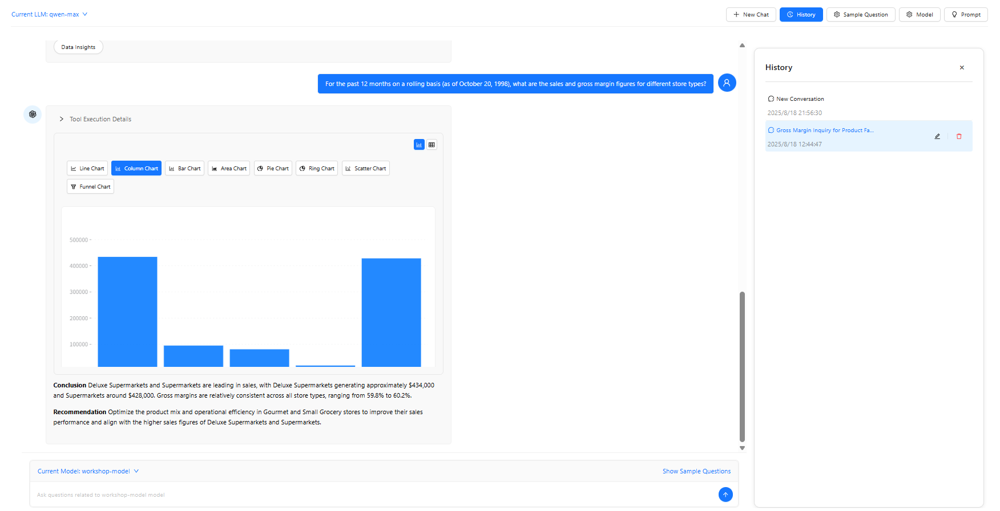
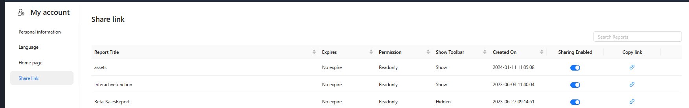
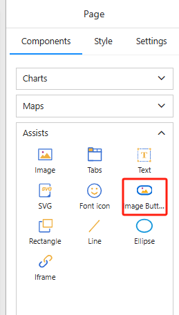
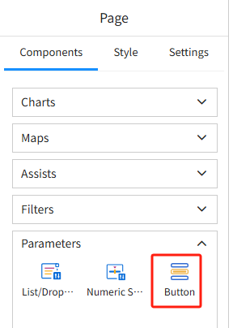
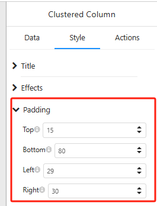
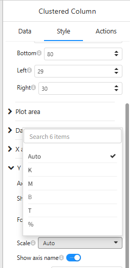

# v7.10 Release Notes

1. Added AI Agent (Preview)  

   

   [How to Enable the AI Feature](https://help.datafor.com.cn/documentation/AI-Agent/AI-Feature//)
   [LLM Configuration](https://help.datafor.com.cn/documentation/AI-Agent/LLM-Configuration/)

2. Unified management for share links  

   

3. Relative filtering supports "reference time" adjustment and linkage with date filter components  

   [Relative Date Filtering](https://help.datafor.com.cn/documentation/Analysis/Relative-Date-Filtering/#scenario-overview)

4. Added new Image Button component  

   

5. Added "Parameter Button Controller"  

   

6. Coordinate-based charts: added margin adjustments (top, bottom, left, right)  

   

7. Ratio bar/column charts: added axis spacing configuration  

8. Numeric axis: added quantization unit configuration  

   

9. Added aggregation types: Median, Variance, Population Variance, Standard Deviation, Population Standard Deviation  

10. Maps  

- New Marker Map: dimension field panel now supports renaming  
- Added tooltip field  
- Optimized bubble size algorithm and enabled new configuration in the style panel  