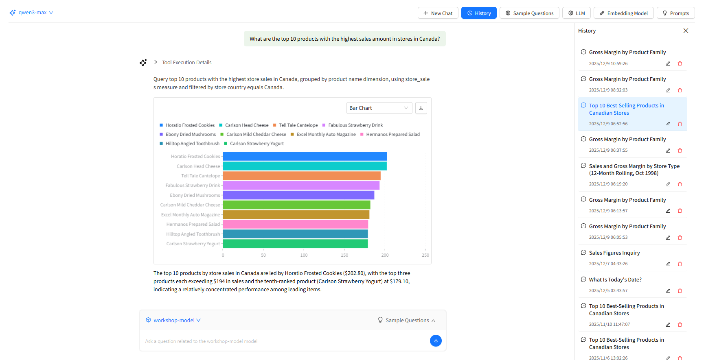
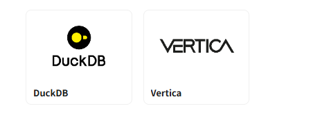
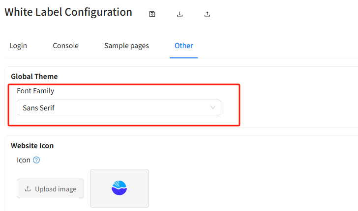

# **v7.20 Release Notes**

## **New Features**

### 1. AI conversation update

### **2. AI Vector Database (Vector Database for AI Agent)**

Introduces a built-in vector database for storing embedded vectors generated from model metadata and dimension text values. This enables the Datafor AI Agent to better understand business semantics and significantly improves the quality of natural-language queries.

[Preparing data for AI](https://help.datafor.com.cn/documentation/AI-Agent/Preparing-Data-for-AI/)

### **3. Insight Component for Dashboards (AI-Powered)**

A new Insight component can now be placed on dashboards. With a single click, the system automatically analyzes all visible dashboard data and generates a structured, professional insight report powered by AI—helping users quickly understand business trends.

[Dashboard Insight](https://help.datafor.com.cn/documentation/AI-Agent/Insight-Component/)

### **4. Text Box Component**

An enhanced version of the previous text component. It now supports inserting *measure* and *dimension* information directly into text, as well as rich text formatting.

[Text Box Component](https://help.datafor.com.cn/documentation/Visualization/TextBox/)

### **5. Bullet Chart Component**

Adds a new Bullet Chart to support KPI comparisons, including targets vs. actuals, offering richer visual expression for performance monitoring.

[Bullet Chart](https://help.datafor.com.cn/documentation/Visualization/Bullet-Chart/)

### **6. DuckDB and Vertica Support**

Expands data source connectivity with support for:

- **DuckDB** – a lightweight, high-performance analytical engine
- **Vertica** – an enterprise-grade column-oriented database

## **Enhancements**

### **7. New White-Labeling Options**

Introduces a redesigned white-labeling configuration, allowing organizations to customize branded visual themes and deliver a more unified embedded analytics experience.

### **8. Global Font Settings**

Adds global font configuration for consistent UI typography and improved brand alignment across the application.

### **9. Unified Session Timeout Prompt & Auto-Redirect**

When a session expires, a unified modal message is displayed and the user is automatically redirected to the login page—ensuring a smoother and more consistent interaction flow.

### **10. “Show No Data” Behavior Optimization**

Under non-hierarchical filter conditions, “Show No Data” no longer affects row-member filtering and now only impacts measure values, providing a more intuitive analytical experience.

### **11. Date Period-over-Period Calculations Optimization**

Improves the logic for year-over-year and period-over-period calculations by computing based on start and end points. Enhancements include significant performance improvements and correct support for leap years.

## **Permissions & Licensing Updates**

### **12. LLM Permission Management**

Adds fine-grained permission controls for LLM usage. Administrators can now authorize or restrict model invocation, enhancing security and governance.

[LLM Permission](https://help.datafor.com.cn/documentation/AI-Agent/LLM-Permission-Management/)

### **13. New Licensing Model**

The new license model is used starting from version 7.20.

