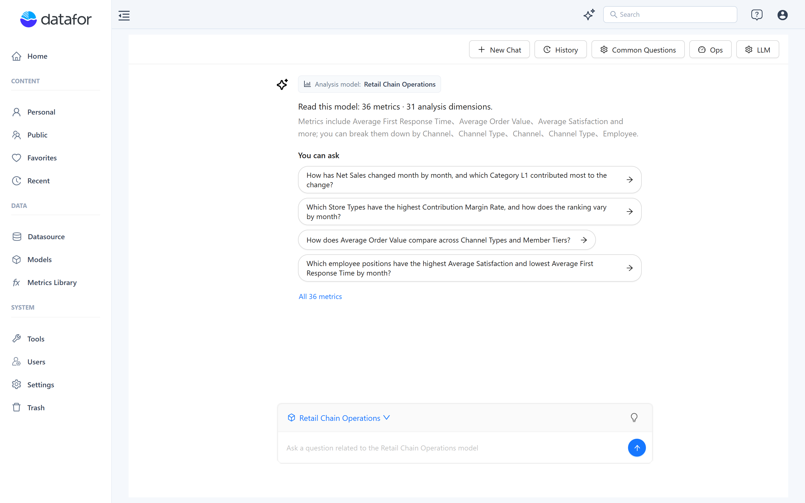
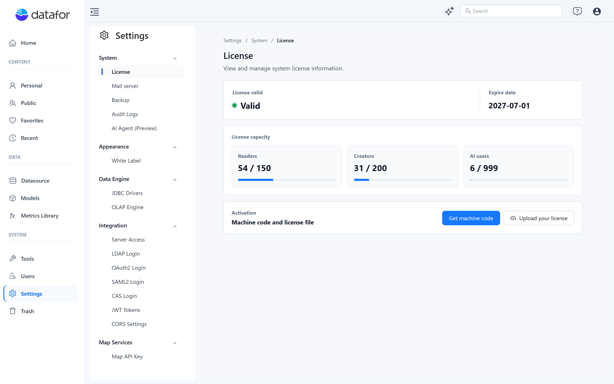
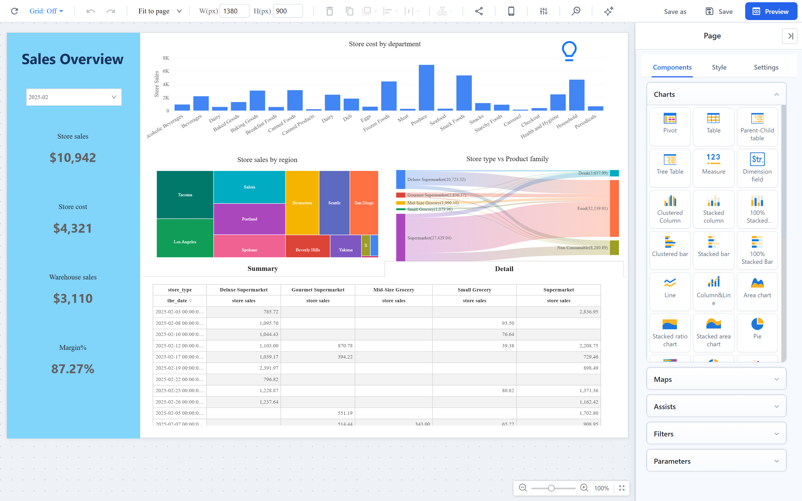
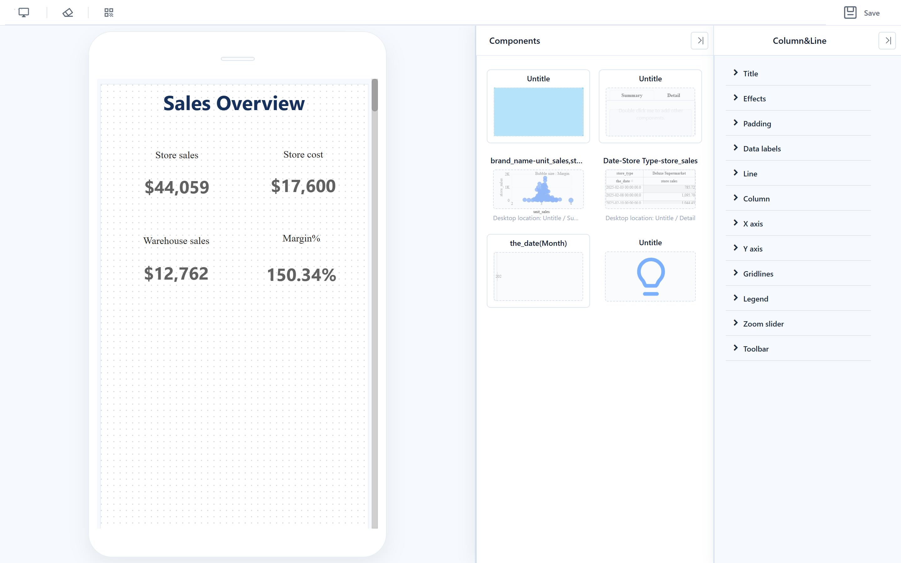
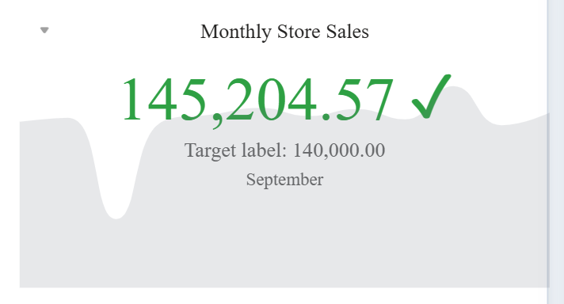
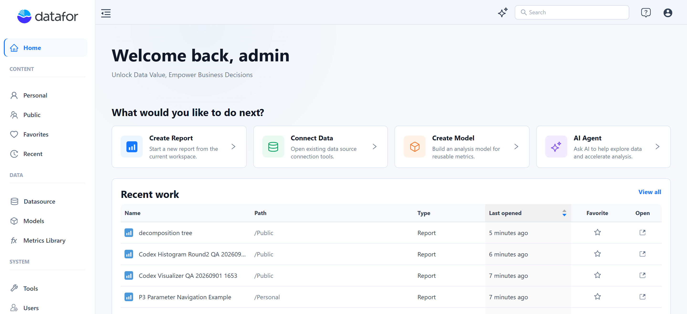

# **v9.00 Release Notes**

**Release date:** June 2026

Datafor 9.00 is a major release. It rebuilds the AI Assistant on a new agent runtime, redesigns the report editor and the management console, introduces AI user licensing, adds the KPI Trend Card, and delivers a large set of query-engine performance and stability improvements.

## Highlights

### 1. AI Assistant rebuilt on a new agent runtime

The conversational analysis preview introduced in 8.00 has been replaced by a new AI Assistant. It opens from the **AI Agent** card on Home and from the report editor toolbar.

What changes for users:

- **Streaming answers with visible progress.** Each stage of the analysis (understanding the question, matching it to the model, querying, concluding) is shown while it runs.
- **Multi-turn conversations.** Follow-up questions build on the previous result: "only East China", "break it down by month", "last year", "top 10", or "switch the metric". Suggested follow-up questions appear under each answer.
- **Clarification instead of guessing.** When a metric, filter value, or time field is ambiguous, the Assistant asks and offers candidates; the analysis resumes from your answer.
- **Complex questions.** A question that needs several queries is planned as a small set of steps. The result of every step is shown, and the conclusion is built only from those results.
- **Model welcome card.** After selecting an analysis model you see a model brief, the number of metrics and dimensions, and suggested questions. **Quick Actions** start guided analyses (metric check, trend, breakdown, comparison) without typing a question.
- **Better results.** Automatic chart recommendation, KPI cards for single-value results, stacked, funnel and line charts, percentage formatting, relative-time handling, and calculated-measure aware questions with shortcut calculation templates (growth, share, ratio).
- **History.** Conversations can be reopened and replayed.
- **Language.** Questions are understood in the user's language and answered in the same language.

For administrators, the new **Common Questions** page maintains the suggested questions of each model, and a **Semantic maintenance** workflow maintains business-friendly names, synonyms and descriptions of the dimension fields and business metrics the Assistant relies on.

[AI Assistant](https://help.datafor.com.cn/documentation/AI-Agent/AI-Chat/) · [Common Questions](https://help.datafor.com.cn/documentation/AI-Agent/Common-Questions/) · [Business Semantics for AI](https://help.datafor.com.cn/documentation/Model/Business-Semantics-for-AI/)

### 2. LLM management and metadata retrieval

- **Redesigned LLM configuration.** Multiple model profiles on OpenAI-compatible endpoints (including GPT-5.5 class models), a connection test, and default assignment of models to the agent's roles. Development and production use the same configuration model.
- **Hybrid metadata retrieval.** Model metadata is retrieved with vector search combined with business-term grounding, which reduces mismatches between the words in a question and the fields in the model.
- **Vector index management.** Indexes can be deleted and rebuilt from the AI Agent settings; embedding authentication failures are reported instead of failing silently.

[LLM Configuration](https://help.datafor.com.cn/documentation/AI-Agent/LLM-Configuration/) · [Preparing Data for AI](https://help.datafor.com.cn/documentation/AI-Agent/Preparing-Data-for-AI/)

### 3. AI user licensing

Licenses now carry an **AI users** capacity in addition to Creator and Reader seats; **Settings → System → License** shows the three capacities side by side. Administrators enable the AI Assistant per user with the **Enable AI Agent** switch in **Users**; the number of AI-enabled users is checked against the license, and AI features (assistant, insights) are only shown to enabled users. Multi-tenant deployments refresh the capacity per tenant.

**Upgrade note:** after upgrading, existing users are not AI-enabled. Enable the users who should have access to the AI Assistant.

### 4. Redesigned report editor

- New **Style**, **Data** and **Components** panels with consistent typography, faster rendering and single-column chart lists.
- Redesigned toolbar and unified dialogs (Save, Save As, confirmations).
- **Snap to grid** and **alignment guides** while dragging; cleaner selection outlines.
- **Fit to page** and automatic canvas fit to the window.
- Redesigned **Actions → Interactions** panel with a **Linked components** picker.
- The filter area can be resized by dragging.
- Components with auto-refresh show a reminder while the report is being edited.
- Interface translations updated for all supported languages.

### 5. Mobile layout designer

The mobile layout designer was rebuilt: a component list panel, free drag and resize on a device-width canvas, collapsible panels, and improved root-canvas zoom and drag.

[Mobile Layout View](https://help.datafor.com.cn/documentation/Visualization/Mobile-Layout-View/)

### 6. New component: KPI Trend Card

A card that shows the current value of a KPI, compares it with a target (a target measure or a static target), colors the status by direction (higher or lower is better, evaluated against the target or the previous value), and draws a trend area over a time or category dimension. Marker value, unit, status icon and fonts are configurable.

### 7. New management console

The web console was rebuilt with a new Home, login page and navigation.

- **Home** offers quick actions (Create Report, Connect Data, Create Model, AI Agent) and **Recent work**, which now includes analysis models. Models can be marked as favorites.
- **Settings** uses secondary navigation; the JDBC drivers, OAuth2, CORS and white-label pages were redesigned.
- **Users**: new create/edit dialog, user import with attachment validation, export of selected users.
- **Models**, **Datasource** and other resource lists use inline actions, fixed action columns, consistent loading states and dialogs.
- **Access control** layout was reworked; delete and cache-clearing actions ask for confirmation.

### 8. SDK and embedding

- `initialFilterValues` sets the default values of filter components when a report is embedded (read-only/preview mode).
- URL `default_` parameters can be injected into date pickers, date ranges and flat selectors; several SDK crashes were fixed.

[SDK Embedding](https://help.datafor.com.cn/documentation/SDK-Embedding/) · [Pass Parameters Through URL](https://help.datafor.com.cn/documentation/Pass-parameters-through-URL/)

## Model designer

- Refreshed layout and attribute panel; a minimap for large canvases.
- The model tree scrolls to the field selected on the canvas.
- Time levels of attributes are recognized and used as defaults for the default time field of measures.
- Annotation names were normalized (Datafor prefixes removed, values trimmed), producing cleaner metadata for AI.
- Excel import: date formats are recognized correctly, and a type change that fails is reported as a warning instead of blocking the import.

## Performance and stability

Query engine (Mondrian):

- Batched cell requests are deduplicated; pure-dimension table queries on multi-fact models are significantly faster.
- Relationship semantics (1:1, 1:n, n:1, m:n) are used when generating SQL. One-to-many and many-to-one joins no longer trigger whole-table `GROUP BY` subqueries; de-duplication is only applied to real many-to-many links.
- Fact Count is resolved from the measure group whose fact table is directly related to the dimensions on the axes.
- Memory: tuple cache retention is capped, native tuple materialization releases its references, and cell request keys are retained for a shorter time.
- Native aggregate and slicer constraints are preserved correctly (fixes wrong totals when aggregate requests are combined with filters); constant crossjoins get a fact anchor; calculated-member filter expansion is bounded.
- Time levels stored as epoch milliseconds are converted correctly; numeric native filters return a clear error message; schema relation loading is deterministic.
- A repeatable MDX regression suite guards these paths.

Platform:

- Metadata lists are cached per tenant user; license checks in `fetchUser` are faster; BouncyCastle is no longer required at runtime for license validation.
- Result cache: `datafor.query.cache.result.enable=true` no longer raises errors, and null values are no longer cached in dynamic queries.
- The simplified query API used by the AI Agent returns detailed error information and enforces row limits; annotations and measure expressions are exposed in metadata.

## Important bug fixes

- Excel/CSV export of custom components no longer returns "no data"; time-axis selections are restored when a report is reopened.
- Custom blocks: spacing, position offset, missing selection state and abrupt loading fixed.
- Clustered column data labels, color mapping and overflow scrolling in panels fixed.
- Character-set handling for JavaScript resources fixed (server configuration).
- First-screen "error code" flash, wrong "fit to screen" target, toolbar overlap and slider thumb alignment fixed.
- Report title shown white-on-white in the top bar, stale white-label logo cache, and user export fixed.
- File dataset Excel import: date recognition and type handling fixed.
- Version check failures no longer flood the log.
