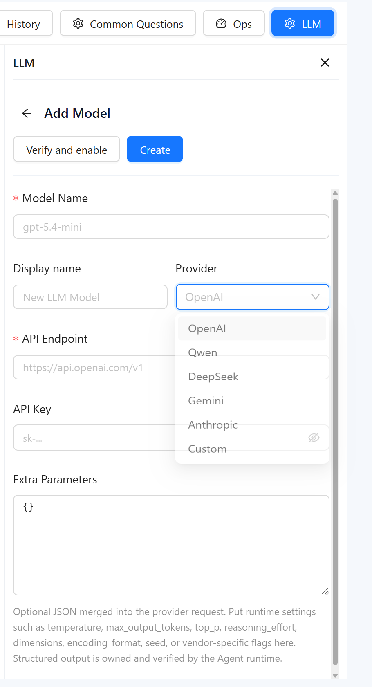

# **v9.01 Release Notes**

**Release date:** July 2026 (includes the hotfix builds 9.01.1 and 9.01.2)

Datafor 9.01 is a maintenance release for 9.00. It stabilizes the new report editor and mobile layout designer, connects more LLM providers, improves follow-up handling in the AI Assistant, and fixes a series of period-over-period (FilteredParallelPeriod) issues in the query engine.

## Feature enhancements

### AI Assistant

- **More LLM providers.** Model profiles can be created for additional providers through provider presets, in addition to OpenAI-compatible endpoints. Editing and testing a profile was fixed.
- Follow-up questions build on the previous result more reliably, and recommended questions are more relevant.
- Relative time phrases ("last month", "recent") are interpreted consistently.
- History replay is faster; production runtime defaults were tuned.
- The AI Agent icon on the report toolbar shows a tooltip.

[LLM Configuration](https://help.datafor.com.cn/documentation/AI-Agent/LLM-Configuration/)

### Reports and visualization

- Measure filters support the **not equal** operator (equals and not equals are also available through the API).
- Linked-component selection was optimized; axis ticks use "nice" numbers.
- Mobile layout: tab layout, root-canvas drag tracking and zoom, panel icons and labels.
- Save dialog and "Save and leave" behavior fixed; the Lock Position icon was fixed.

### Console

- Model and file lists show **Updated by**; **Recent** and **Favorites** include analysis models, and Home **Recent work** lists models.
- White-label default configuration is consistent across pages.
- Legacy Mondrian 3 models are validated when opened; the default cards of the sample page can be restored.
- Data-permission policies are stored with a consistent six-table strategy (internal change, no configuration needed).

## Performance and stability

- Metadata returned to clients only includes measures whose measure group is visible.
- Data source snapshots are stable per schema version.
- Stale entries in the authorization cache are cleaned correctly.

## Important bug fixes

- FilteredParallelPeriod: multi-filter detail rows, non-empty axes combined with time filters, all-member detail rows, duplicate aggregate-constraint SQL, duplicate pagination cache and non-empty scanning.
- Native slicer contexts with empty members no longer throw; totals of calculated members use the correct join context; numeric `BETWEEN` no longer uses the time mask.
- Tree table: last-level indentation and export fixed; nested scroll areas respond to the mouse wheel.
- Data panel flicker, Actions panel row misalignment, roles and backup list scrollbars, and recent-visits cache inconsistency fixed.
- Field types of the upload-file log configuration fixed.
