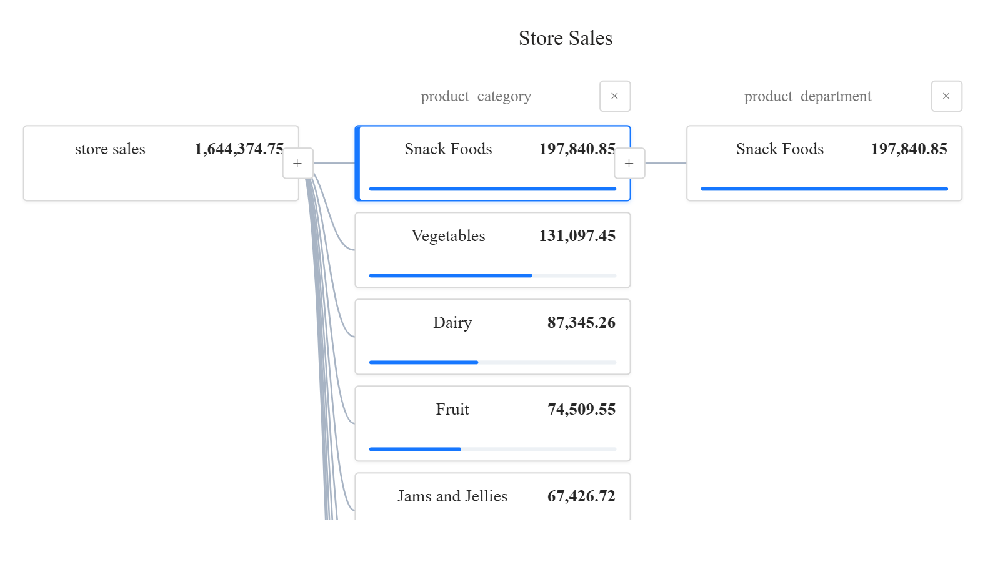
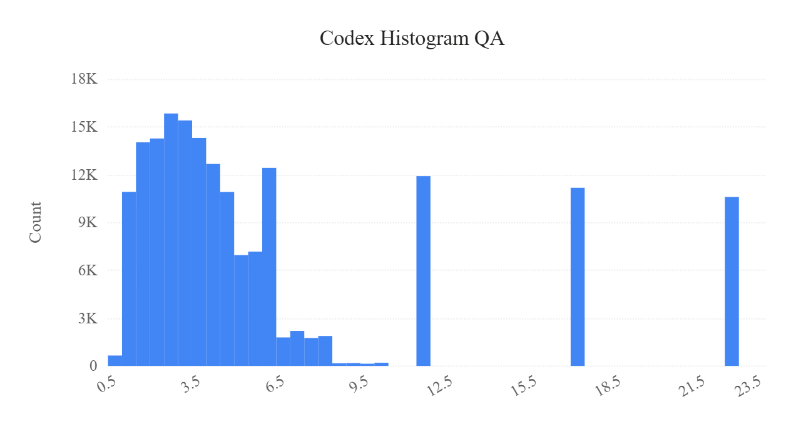
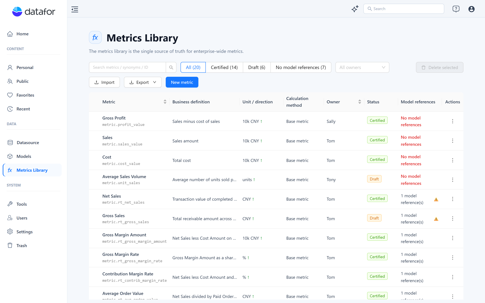
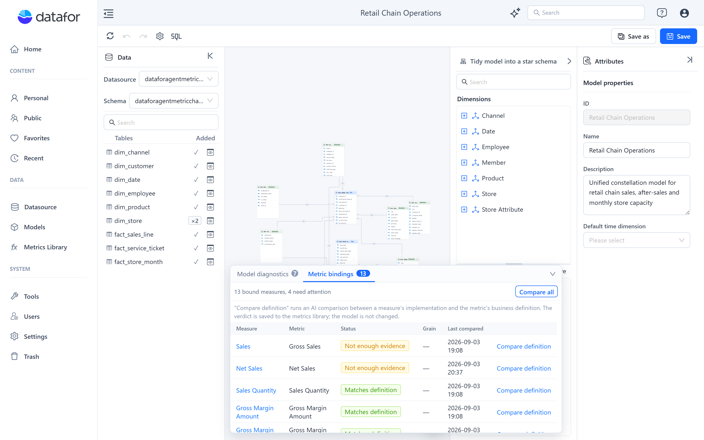
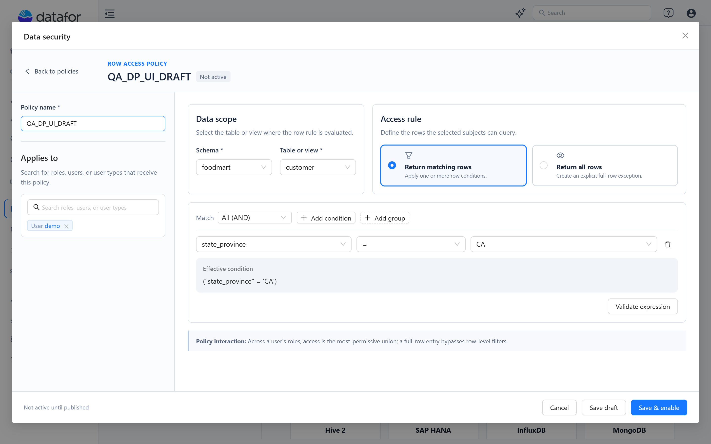
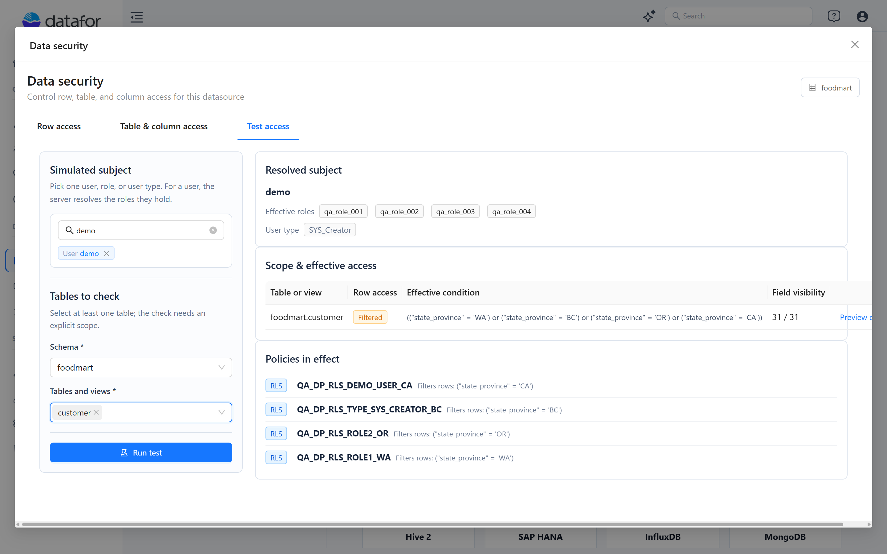
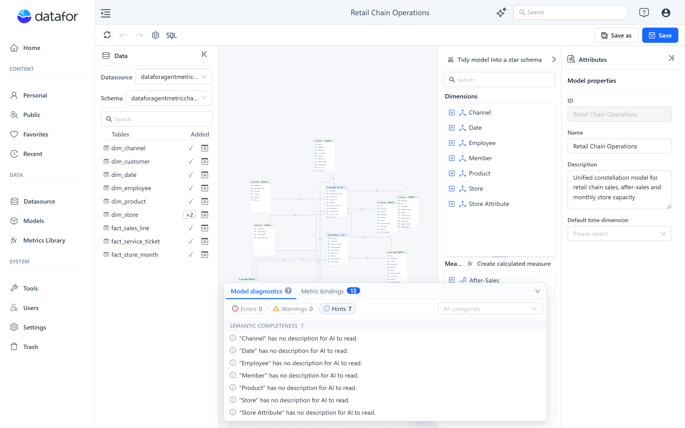
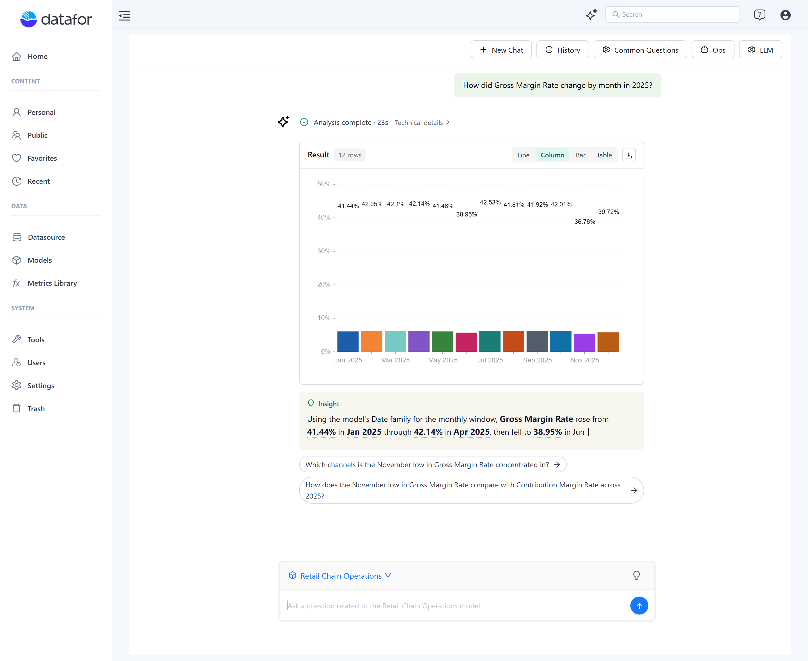
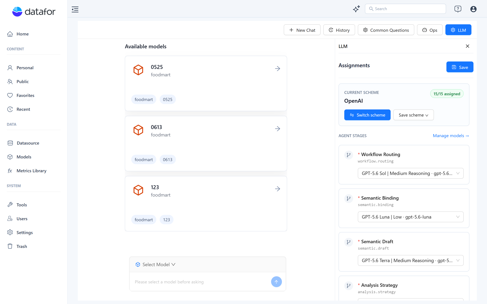
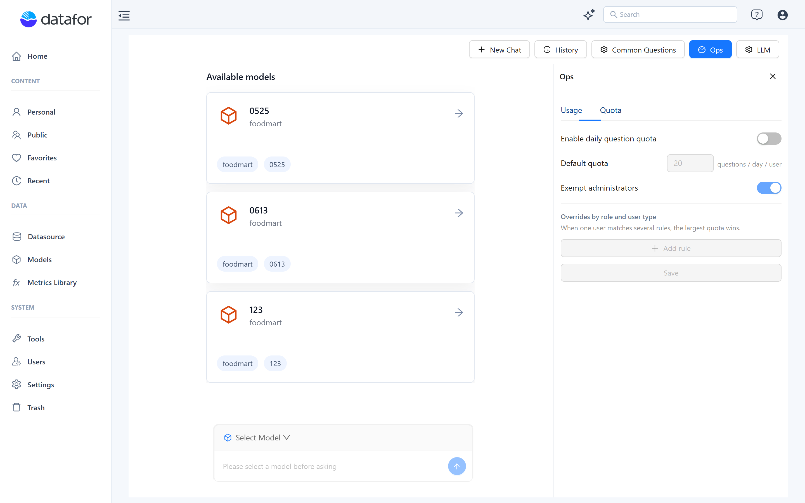

# **v9.04 Release Notes**

**Release date:** September 2026. This note also covers **9.02 (July 2026)** and **9.03 (August 2026)**; the version in which an item first shipped is given in brackets.

Datafor 9.02–9.04 add two new visualizations (Decomposition Tree and Histogram), the Metrics Library with governed metric bindings, a rebuilt Data Security editor, a major Model Designer update, and a new generation of the AI Agent query engine with stage-level LLM configuration, usage statistics and quotas.

## Highlights

### 1. Decomposition Tree (9.02)

A new chart for driver analysis. The root node shows the total of one measure; every level splits the selected node by a dimension. Users choose the next dimension manually, or let **Smart split** pick the highest or lowest contributor (absolute, or relative to the dimension average).

- Up to 50 **Explain by** dimensions, each queried independently instead of one large cross join; up to 10 members per level with data bars.
- The selected path is published to linked components and to drill-through and jump actions, so other charts follow the analysis.
- The path saved with the report is the default state; **Drill Reset** restores it.

[Decomposition Tree](https://help.datafor.com.cn/documentation/Visualization/Decomposition-Tree/)

### 2. Histogram (9.03)

A new chart that shows the distribution of a numeric field. Binning is computed in the database: **Auto** bins, a fixed **number of bins** (2–100) or a fixed **bin width**; the Y axis shows **Count** or **Percentage**; empty bins are kept; the tooltip always shows both count and share.

Clicking a bin filters linked components by its numeric range (several bins from the same histogram are combined with OR). Report filters, component filters and data permissions are applied. 9.04 fixes linked-filter write-back, axis labels, re-rendering after style changes and validation.

[Histogram](https://help.datafor.com.cn/documentation/Visualization/Histogram-Chart/)

### 3. Metrics Library and metric bindings (9.02 → 9.04)

**Data → Metrics Library** stores the governed definition of each enterprise metric: a stable Metric ID, business name, synonyms, definition, calculation relationship (Base metric, Ratio, Difference, Attainment rate or Custom formula), unit, direction, owner, and a **Draft / Certified** status. Libraries can be imported and exported as JSON or CSV.

In the Model Designer, a measure or calculated measure is bound to an enterprise metric under **Business semantics → Metric governance**, optionally with an effective grain. The **Metric bindings** panel lists every binding with its status. **Compare definition** (or **Compare all**) asks the AI to compare the model implementation with the business definition and records the verdict: *Matches definition*, *Possible drift*, *Needs comparison* or *Not enough evidence*. Duplicate, missing and stale bindings are reported by Model diagnostics.

The AI Assistant resolves a metric name or synonym in a question to the certified definition and warns when a definition is draft, unbound, ambiguous or drifting.

[Metrics Library](https://help.datafor.com.cn/documentation/Metrics-Library/Metrics-Library/)

### 4. Data Security rebuilt (9.02)

The Data security editor of a database datasource was rebuilt.

- **Row access** policies use a condition builder: field, operator and value per condition, AND/OR groups, an **Effective condition** preview and **Validate expression**; **Return all rows** creates an explicit exception.
- **Table & column access** policies hide selected tables or columns from selected subjects, or make them visible only to selected subjects.
- Policies target users, roles or user types through one mixed search box. **Save draft** keeps a policy inactive, **Save & enable** activates it; the policy list has an enable switch, search and filters.
- **Test access** simulates a user, role or user type and shows the resolved roles, the effective row condition, field visibility and the policies in effect, with a data preview of up to 50 rows.
- Uploading a model can overwrite its existing permissions; row permissions of system roles are applied correctly.

[Data Security](https://help.datafor.com.cn/documentation/Datasource/Data-Security/)

### 5. Model Designer update (9.03 → 9.04)

- A unified **property panel** with the same four sections for every object; format and unit are combo boxes that list the values already used in the model.
- A new **Insights** panel at the bottom of the designer with **Model diagnostics** (errors, warnings and hints for structure, references, semantics and metric governance; errors are reviewed when saving) and **Metric bindings**.
- **Tidy model into a star schema** proposes removing dimension or measure-group roles that conflict with the inferred star-schema role, with a preview before anything is changed.
- The model-level **Default time dimension** and the measure-level **Default time field** are separate settings; time semantic roles are assigned per attribute.
- Business semantics for AI: captions, descriptions, aliases, sample values, semantic roles, unit, direction and recommended dimensions on dimensions and measures.
- Four additional statistical aggregators for measures; distinct counts on levels.
- Datasource and schema are selected together; tables land where they are dropped; dimensions and measure groups can be deleted and re-added from the canvas table menu; context menus fixed; connector routing on the canvas redone (9.04).
- **SQL Views** with check-and-preview; the SQL of a modeling query can be displayed.
- File datasets: table structure and field type maintenance; failed imports no longer stay "in progress"; wide-table imports on PostgreSQL fixed; decimal precision follows the database dialect.

[Analysis Model Overview](https://help.datafor.com.cn/documentation/Model/Analysis-Model-Overview/) · [Model Diagnostics](https://help.datafor.com.cn/documentation/Model/Model-Diagnostics/) · [Tidy Model into a Star Schema](https://help.datafor.com.cn/documentation/Model/Tidy-Model-into-a-Star-Schema/) · [Business Semantics for AI](https://help.datafor.com.cn/documentation/Model/Business-Semantics-for-AI/) · [Time Semantics and Default Time Settings](https://help.datafor.com.cn/documentation/Model/Time-Dimensions-and-Time-Intelligence/) · [Creating SQL Views](https://help.datafor.com.cn/documentation/Model/Creating-SQL-Views/)

### 6. AI Agent: new query engine (9.02 → 9.04)

The Agent's query pipeline was rebuilt (9.03) around a verified semantic draft: the LLM proposes a structured query intent, Datafor proves it against the model metadata and executes it under the user's permissions. The AI never writes SQL or MDX.

What users notice:

- **Faster, more direct answers** and fewer unnecessary clarifications. The date basis is assumed and disclosed instead of asked; when a clarification is needed, the options can be answered in your own words.
- **More calculation types:** month-by-month year-over-year, period comparisons labelled by the actual windows, distinct counts ("how many customers"), ratios and averages, rankings along a time axis, filters on calculated measures, and unions of conditions.
- **Evidence and boundaries** with every answer: the time window used, data coverage, adopted member mappings and any limitation; citations link each conclusion to the exact cells.
- **Bounded multi-step analysis** for questions such as "where did the decline come from": a plan with a few steps, each with its own result; an incomplete answer is marked partial instead of failing.
- **Follow-ups** reuse the previous result (the table you were shown is the referent); the chart type can be switched without a new query; follow-up chips state the question they will ask.
- **Dashboard insights** stream as they are generated, explain only the data on the page and say when the page context is truncated; **Generate business brief** produces a management summary; the three insight entry points share one implementation (9.04).
- **Add to page** inserts the exact query the answer ran, including multi-step answers (9.04); charts and tables can be exported as image or Excel.
- History restores the model that was used; cancelled questions are labelled; failure explanations and insight text follow the language of the question (9.04).
- Unsupported operations are refused with an explanation rather than a silent failure; relationship questions (scatter and correlation) are supported.
- **MCP entry point:** ask Datafor from Claude Desktop, Claude Code and other MCP clients under the same permissions and rules.

[AI Assistant](https://help.datafor.com.cn/documentation/AI-Agent/AI-Chat/) · [AI Agent Overview and Roadmap](https://help.datafor.com.cn/documentation/Roadmap/AI-Agent-Overview-and-Roadmap/)

### 7. AI Agent administration (9.02 → 9.04)

- **LLM:** model profiles with provider presets (OpenAI, Qwen, DeepSeek, Gemini, Anthropic, custom), **Verify and enable** (a real structured-output verification before a model can be assigned), a model assignment for each of the 14 agent stages plus the embedding role, and **schemes** that can be saved, exported, imported and switched, with built-in templates for global and China-region providers. API keys are never exported. (Stage-level assignment 9.02; verification and schemes 9.03; panel clean-up 9.04.)

- **Ops → Usage** shows questions, success rate, response time and p95, and tokens per period. **Ops → Quota** sets a daily question quota per user with overrides by role and user type and an administrator exemption; submissions beyond the quota are refused. (9.03)

- **Vector indexes** show the embedding model used, status and progress; the chat shows a notice when the selected model has no index (9.04). Changing the embedding model requires a rebuild.
- Operations: `/ai/health` endpoint, background retention clean-up, multi-worker deployment on Linux, and a packaged runbook.

[LLM Configuration](https://help.datafor.com.cn/documentation/AI-Agent/LLM-Configuration/) · [AI Operations and Quotas](https://help.datafor.com.cn/documentation/AI-Agent/LLM-Permission-Management/) · [Preparing Data for AI](https://help.datafor.com.cn/documentation/AI-Agent/Preparing-Data-for-AI/)

## Query engine

- Filters on calculated measures are planned generically and pushed down safely, including calculated measures across several fact tables, partitioned filters and large sets (9.02–9.03).
- Query-level SQL levels and calculated levels are pushed down natively (this powers histogram binning and range filters); two-segment level queries; distinct-count auto measures on levels; native null filters on dimension SQL (9.03).
- Dimension and level annotations are loaded and passed through metadata, including shared dimensions (9.02).
- Multi-level member queries run in parallel and return normalized errors; empty-result pagination counts and `<=` boundary comparisons fixed (9.03).
- PostgreSQL regex literal escaping fixed; SQL member queries and MDX member enumeration no longer leak statements or connections (9.03).

## Console and platform

- Connection management follows the user's permissions (9.03); Portal login credentials are no longer persisted in plain text (9.03).
- Uploaded datasets: field management and append with field mapping (9.02).
- The vector index list labels the model as **Embedding model** (9.04); Metrics Library CSV import accepts headers in any supported interface language (9.04); export scope is the selected rows or the whole library (9.04).
- Report SDK resources carry a cache key so browsers load the new bundle after an upgrade (9.04).
- Front-end distribution: dependency clean-up, npm as the only package manager, third-party license notices included in the package (9.03).
- Toolbar size inputs are limited to 1–20000 and toolbar buttons have accessible two-state styling; invalid canvas sizes are rejected (9.04).

## Important bug fixes

- Metadata without annotations no longer renders a blank table; missing level information is handled (9.02).
- Collapsing the property panel no longer closes the AI Agent panel (9.02).
- Histogram: a linked filter replaces the previous range instead of accumulating; axis labels; re-render after panel changes; height of copied components; advanced-filter validation (9.04).
- Inserting an AI result into the canvas keeps the hierarchy level; panel configuration write-back crash and dialog style scoping fixed (9.04).
- Percentage functions with hidden named sets, legacy model metadata null pointer, model metadata resource inheritance and refresh API error messages (9.03).
- Simplified query API: silent aggregation downgrade, duplicate aggregation suffixes and parameter validation (9.03).
- Modeler: property panel horizontal scrollbar; renaming a measure migrates its metric binding; duplicate bindings reported as diagnostics; no preview for incomplete file imports; datasource page blank screen (9.04).
